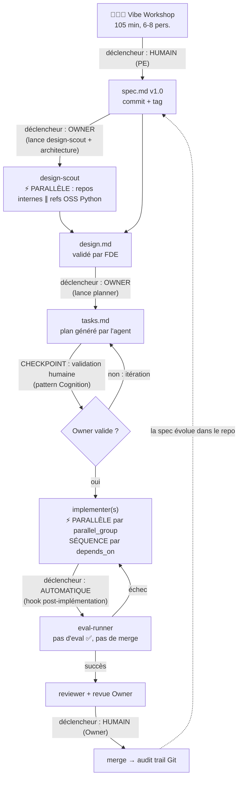

# Lab IA-natif — Workflow agentique

> Squelette de repo pour le lab LMFR × SFEIR. Chaque unité de travail produit trois artefacts markdown versionnés : `spec.md` (le QUOI), `design.md` (le COMMENT), `tasks.md` (le DO). Ils remplacent user stories, specs fonctionnelles et tickets.

## Structure du repo

```
lab-ia-natif/
├── CLAUDE.md                  # Contexte persistant chargé par les agents
├── README.md                  # Ce fichier : le workflow
├── templates/
│   ├── spec.md                # Template du contrat métier
│   ├── design.md              # Template d'architecture
│   └── tasks.md               # Template d'orchestration des agents
├── .claude/
│   ├── agents/                # Sous-agents spécialisés
│   │   ├── design-scout.md    # Collecte repos internes + références OSS
│   │   ├── planner.md         # Génère tasks.md depuis spec + design
│   │   ├── implementer.md     # Code une tâche contre la spec
│   │   ├── eval-runner.md     # Exécute les evals (merge gate)
│   │   └── reviewer.md        # Revue croisée spec ↔ code
│   └── skills/
│       └── vibe-workshop/     # Animation de l'atelier spec v1.0
└── examples/
    └── agent-douche/          # Les 3 artefacts remplis (Projet 1)
```

## Le pipeline : qui déclenche quoi



## Règles de déclenchement

| Étape | Qui déclenche | Mode | Validation |
|---|---|---|---|
| spec.md v1.0 | **Humain** — PE anime le Vibe Workshop, Claude médie | Séquentiel (point d'entrée) | Métier signe le contrat |
| design.md | **Owner** — lance `design-scout` puis la rédaction | Scout en **parallèle** (repos internes ∥ refs OSS) | FDE valide l'architecture |
| tasks.md | **Owner** — lance `planner` | Séquentiel (a besoin de spec + design) | **Checkpoint humain obligatoire** avant exécution |
| Implémentation | **Agent** — `implementer` par tâche | **Parallèle** entre `parallel_group`, **séquence** via `depends_on` | Aucune ligne manuelle sans justification |
| Evals | **Automatique** — hook après chaque tâche | Séquentiel par tâche | Gate binaire : pas d'eval verte, pas de merge |
| Merge | **Humain** — Owner, revu par Owner_N-1 | Séquentiel | Audit trail Git |

## Les 3 principes de parallélisation

1. **On parallélise la recherche, jamais la décision.** `design-scout` explore les repos internes et les références open source en parallèle ; la rédaction du design et sa validation sont séquentielles.
2. **On parallélise les tâches sans dépendance de fichier.** Deux tâches peuvent tourner en parallèle si leurs `files_touched` sont disjoints ET qu'aucune n'est `depends_on` de l'autre. Sinon : séquence stricte.
3. **Tout point de non-retour est un checkpoint humain.** Génération de plan, merge, déploiement : l'agent propose, l'humain dispose (pattern Cognition).

## Mode automatique — tout tourne en fond

Trois mécanismes câblés :

1. **Eval gate automatique** (`.claude/settings.json`) : hooks `Stop` + `SubagentStop` → dès qu'un agent veut terminer avec du code Python modifié, `make evals` s'exécute. Rouge = l'agent est renvoyé corriger automatiquement, avec la sortie d'erreur en contexte. Hook `PostToolUse` : ruff auto sur chaque fichier Python édité.
2. **Orchestrateur de fond** (`scripts/orchestrate.py`) : parse tasks.md, construit le DAG, exécute les vagues de tâches **en parallèle** via `claude -p` (headless), gate d'evals + commit auto après chaque tâche (max 3 itérations puis escalade), **pause à chaque checkpoint** avec notification macOS.
3. **Validation humaine** (`scripts/approve.sh`) : les checkpoints et le merge restent humains — c'est le contrat de la méthode (pattern Cognition), pas une limite technique.

```bash
# 1. Le plan doit être validé : status: approved dans le frontmatter de tasks.md
# 2. Voir le plan d'exécution sans rien lancer
python3 scripts/orchestrate.py work/ma-feature --dry-run

# 3. Lancer en fond (caffeinate empêche la mise en veille)
caffeinate -i python3 scripts/orchestrate.py work/ma-feature > .runs/run.log 2>&1 &

# 4. À chaque notification CHECKPOINT : revue, puis
scripts/approve.sh CP-1 work/ma-feature
```

Reprise sur incident : l'état est dans `<feature>/.runs/state.json` — relancer la même commande reprend où ça s'était arrêté. Prérequis : `claude` CLI authentifié, `uv` installé.

## Démarrer une unité de travail

```bash
cp templates/spec.md   work/<feature>/spec.md     # rempli en Vibe Workshop
cp templates/design.md work/<feature>/design.md   # rempli par Owner + design-scout
cp templates/tasks.md  work/<feature>/tasks.md    # généré par planner, validé par Owner
```

Puis dans Claude Code : `lis work/<feature>/spec.md et design.md, génère tasks.md selon templates/tasks.md, et attends ma validation avant d'exécuter.`
