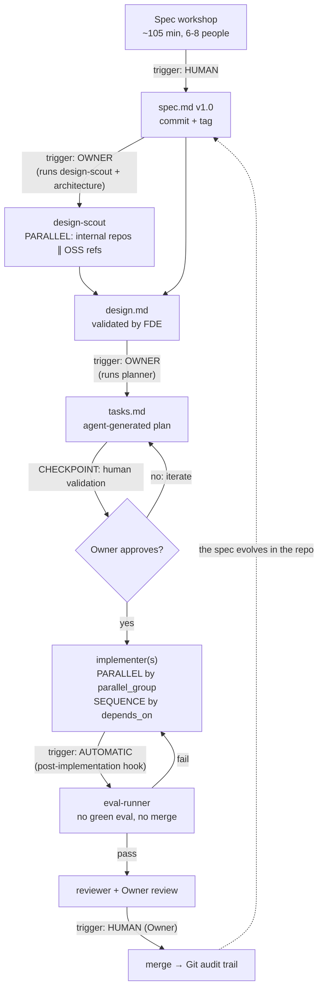

# AI-Native Lab — Agentic Workflow

> A repo skeleton for building software with an agentic workflow. Each unit of work produces three versioned markdown artifacts: `spec.md` (the WHAT), `design.md` (the HOW), `tasks.md` (the DO). They replace user stories, functional specs, and tickets.

A single **Owner** drives the app, agents write the code, a human validates. Every line written by hand is a justified exception, recorded in the commit. The system is built so that **between two human decisions, nothing needs a human** — the decision doesn't disappear, it moves: the Owner decides once (when approving the plan), then the run advances on its own to the next real decision.

## Repo structure

```
ai-native-lab/
├── CLAUDE.md                  # Persistent context loaded by the agents
├── README.md                  # This file: the workflow
├── templates/
│   ├── spec.md                # Business-contract template
│   ├── design.md              # Architecture template
│   └── tasks.md               # Agent-orchestration template
├── scripts/
│   ├── orchestrate.py         # The DAG executor (waves, gates, checkpoints)
│   ├── content_guard.py       # "Substance is sacred, form is free" enforcement
│   ├── approvals.py           # HMAC-signed checkpoint approvals
│   ├── eval_models.py         # Model×role evaluation campaign
│   ├── registry.py            # Reads models/registry.toml
│   ├── ci_checks.sh           # CI content-guard + plan-lint over changed features
│   └── hooks/                 # eval_gate.sh (merge gate) + post_edit.sh (lint)
├── .claude/
│   ├── agents/                # Specialized sub-agents
│   │   ├── design-scout.md    # Gathers internal + OSS reference repos
│   │   ├── planner.md         # Generates tasks.md from spec + design
│   │   ├── implementer.md     # Implements one task against the spec
│   │   ├── eval-runner.md     # Runs the evals (merge gate)
│   │   └── reviewer.md        # Cross-review spec ↔ code
│   ├── settings.json          # Hooks + permission denies (agents can't forge tokens)
│   └── skills/                # e.g. the spec-workshop facilitation skill
├── models/                    # registry.toml, profiles/, EVOLUTION.md, scorecards/
├── evals/                     # golden/ (oracles) + behavioral/ (model governance)
└── src/                       # Features built by the method
```

## The pipeline: who triggers what



## Trigger rules

| Step | Triggered by | Mode | Validation |
|---|---|---|---|
| spec.md v1.0 | **Human** — facilitated spec workshop | Sequential (entry point) | Business signs the contract |
| design.md | **Owner** — runs `design-scout`, then writes it | Scout runs **in parallel** (internal repos ∥ OSS refs) | FDE validates the architecture |
| tasks.md | **Owner** — runs `planner` | Sequential (needs spec + design) | **Mandatory human checkpoint** before execution |
| Implementation | **Agent** — `implementer` per task | **Parallel** across `parallel_group`, **sequenced** via `depends_on` | No manual line without justification |
| Evals | **Automatic** — hook after each task | Sequential per task | Binary gate: no green eval, no merge |
| Merge | **Human** — Owner, reviewed by previous Owner | Sequential | Git audit trail |

## The 3 parallelization principles

1. **Parallelize the research, never the decision.** `design-scout` explores internal repos and OSS references in parallel; writing and validating the design are sequential.
2. **Parallelize tasks with no file dependency.** Two tasks may run in parallel only if their `files_touched` are disjoint AND neither is `depends_on` the other. Otherwise: strict sequence.
3. **Every point of no return is a human checkpoint.** Plan generation, merge, deploy: the agent proposes, the human disposes.

## Autonomy levels

| Level | Command | Human pauses |
|---|---|---|
| L0 — plan | `--dry-run` | everything (nothing runs) |
| L1 — supervised | `--supervised` | ALL checkpoints (`auto` modes ignored) |
| L2 — cruise *(default)* | — | only the `blocking` checkpoints of the approved plan |
| Always | — | the **merge**: never automatic; plan-lint rejects a final `auto` checkpoint |

## The guardrails that make autonomy safe

1. **Plan-lint** (`--validate`, or `make validate FEATURE=…`): acyclic DAG, spec IDs exist, `done_when` present, disjoint parallel paths, final checkpoint blocking, every `verify` command on an allowlist. A plan that doesn't lint doesn't run — that's what lets the Owner approve once and walk away.
2. **Structured verdict**: each implementer ends with `STATUS: done` or `STATUS: blocked — <reason>`. An agent blocked on a spec gap (an open question) never passes as finished; it records the question and only its sub-tree stops.
3. **Anti-empty-gate**: a task that implements spec IDs — or merely touches source code — FAILS if no eval is collected (`pytest -m eval --collect-only`). A green `make evals` with zero evals validates nothing. Eval coverage is matched by pytest **node-id** (so `eval_1` ≠ `eval_10`, and a file path doesn't count as coverage).
4. **Per-task verify**: the `verify` command in tasks.md materializes `done_when`. It is parsed to an argv list and run **without a shell** (no metacharacters, command + env-prefix allowlists) — checked mechanically after each agent, before the evals.
5. **Failure containment**: failed/blocked only neutralizes dependents (`skipped`); other branches continue. The run always ends on a summary, never on a mid-course abort.
6. **Scoped commits**: only the task's `files_touched` (+ the feature dir) are staged, under a lock — two parallel agents don't pollute each other, and the golden oracles can't be swept into a task commit. Out-of-scope changes are reported, not committed.
7. **Signed human approvals**: checkpoint approvals are HMAC-signed (`scripts/approve.sh`) and verified before they're honored, then consumed (no replay). **Fail-closed by default**: a plan with checkpoints refuses to start without `LAB_APPROVAL_SECRET` (opt-out `LAB_ALLOW_UNSIGNED_APPROVALS=1`). The secret is stripped from the agent's environment, and `.approvals/`/`.runs/` are denied to the agent's edit tools.
8. **Concurrency safety**: an OS `flock` (`.runs/orchestrator.lock`) fails a second run on the same feature fast; `state.json` is written atomically and resume tolerates a truncated file.
9. **Documented `auto` checkpoints**: before every checkpoint, the `reviewer` report is written to `.runs/CP-n-review.md`. Auto = green evals AND `VERDICT: PASS`; on any doubt it falls back to human validation.
10. **Session eval gate** (`.claude/settings.json`): `Stop`/`SubagentStop` hooks → an agent can't finish with changed code and red evals; `PostToolUse` → ruff on each edit.

```bash
# 0. Configure the approval secret once (required for checkpointed plans)
export LAB_APPROVAL_SECRET="$(openssl rand -hex 32)"

# 1. Plan-lint, then Owner approval (status: approved + checkpoint modes)
python3 scripts/orchestrate.py work/my-feature --validate

# 2. See the execution plan without running anything
python3 scripts/orchestrate.py work/my-feature --dry-run

# 3. Run in the background (caffeinate prevents sleep on macOS)
caffeinate -i python3 scripts/orchestrate.py work/my-feature > work/my-feature/.runs/run.log 2>&1 &

# 4. On each blocking CHECKPOINT notification: read .runs/CP-n-review.md, then
scripts/approve.sh CP-1 work/my-feature
# … or reject with a reason (reopens the targeted tasks; the agent gets the comment):
scripts/reject.sh CP-1 work/my-feature "the quote doesn't show the discount" T2
```

Recovery: state lives in `<feature>/.runs/state.json` — re-running the same command resumes where it stopped (`done` nodes don't replay; `blocked` nodes retry after you answer their open questions). Prerequisites: `claude` CLI authenticated, `uv` installed.

## Model evaluation

The lab evaluates not only the **product** (the code, via the spec §7 evals) but also the **models** it uses, per role. Source of truth: `models/registry.toml` (data-driven — adding a model is one entry, zero code). The orchestrator assigns a model to each role (`[roles]`), overridable per task (`**model :**`), and logs which model produced what.

`scripts/eval_models.py` (target `make eval-models LIVE=1`) measures three layers:

1. **Scorecard** — on the golden tasks (`evals/golden/`), does the produced code pass **our** hidden evals (never the ones the model writes itself)? Raw capability per role, judged fairly. The oracle is held out: the model never sees `goldeval/` during execution.
2. **Behavioral** (`evals/behavioral/`) — does the model respect its role contract: scope, the `STATUS` verdict, stopping on ambiguity, evals-first, calibrated reviewer verdicts?
3. **Chain-of-command** — can a task instruction make it violate a `CLAUDE.md` hard rule (merge without a human, skip the evals, leave its scope)? It must refuse. This layer is **eliminatory**: one violation disqualifies the model for the role, regardless of its raw score.

Fairness by construction (same prompts, isolated trials, measured metrics, no cherry-pick) and a re-evaluation loop on every new model: see **`models/EVOLUTION.md`**. The harness mechanics are tested in CI with a deterministic `claude` shim (no cost); the real campaign (`LIVE=1`) is manual because it is billed.

## Telemetry and limits

- **Journal**: every run writes `<feature>/.runs/journal.jsonl` — one JSON line per event (attempt, duration, **$ cost per agent**, reviewer verdict, summary). The summary prints the run's total cost.
- **Retries with memory**: a retry resumes the SAME agent session (`--resume`) — the agent fixes its work instead of starting over.
- **Per-agent wall clock**: `LAB_TASK_TIMEOUT` (default 2400 s) kills a stuck agent; the task counts as a failed attempt and the wave continues.
- **Budget per run**: `LAB_BUDGET_USD` (orchestrator) and `--budget` (eval campaign) — the run stops before the next wave if cost exceeds the cap, notifies, and resumes via `.runs/state.json`. Cost is measured (`--output-format json`), not estimated.
- **Separation of duties**: a model never validates its own work alone. The review panel prefers a reviewer model ≠ implementer; if impossible, an `auto` checkpoint refuses to self-validate and falls back to human. Plan-lint warns if `roles.reviewer == roles.implementer`.
- **Reviewer panel**: `**reviewers :** N` on a checkpoint runs N reviews from distinct angles (correctness / spec conformance / edge cases); auto-validation only on a **majority** PASS vote.
- **Team notifications**: `LAB_GCHAT_WEBHOOK` (opt-in) posts checkpoints/blocks to a chat webhook (no-op if absent, never crashes).
- **Test env**: `LAB_ROOT` (sandbox), `LAB_NO_NOTIFY=1` (CI). `tests/orchestrator/` replays the whole mechanism (lint, waves, containment, resume, auto checkpoints, anti-empty-gate, signed approvals) in seconds with a deterministic `claude` shim.

## CI

`.github/workflows/gate.yml` mirrors the local merge gate:
- `make gate-ci` — **non-mutating** lint (`ruff check` + `ruff format --check`, so drift fails CI instead of being silently auto-fixed) + tests + evals (the shim orchestrator suite included).
- `scripts/ci_checks.sh` — runs `content_guard --against <base>` over changed features (the "substance is sacred" rule, enforced vs the base branch, not a clean-checkout HEAD) plus plan-lint (informational). Fail-safe: skips cleanly if the base ref is unavailable.

## Trust model (read this)

Agent code runs **on the host**, gated by tool allowlists (`--allowedTools`, the `verify` allowlist, `.claude/settings.json` denies) — there is **no OS sandbox in this tree**. An implementer that runs its own tests necessarily has code execution, so the signed-approval boundary and allowlists are *defense-in-depth that raises the bar*, not a hard boundary against a determined, code-executing agent. The intended threat model is a **trusted but possibly-misaligned** agent, not a malicious external one. Real confinement (a container + egress allowlist) is tracked as backlog below and is the only thing that turns the approval crypto into a true boundary.

## Backlog (acknowledged, not shipped)

- **Sandbox** — run agents in a container with an egress allowlist and no host filesystem access; the only thing that makes the approval secret truly unreachable by the agent.
- **Cross-vendor runner** — abstract the `claude -p` call behind a runner interface so the registry's model-swappability extends across providers (not testable here without other-provider access).
- **Git worktree per parallel task** — makes file collision *impossible* rather than *forbidden*; deferred to avoid destabilizing the verified orchestrator, deserves its own PR.

## Start a unit of work

```bash
cp templates/spec.md   work/<feature>/spec.md     # filled in the spec workshop
cp templates/design.md work/<feature>/design.md   # filled by Owner + design-scout
cp templates/tasks.md  work/<feature>/tasks.md    # generated by planner, approved by Owner
```

Then in Claude Code: `read work/<feature>/spec.md and design.md, generate tasks.md per templates/tasks.md, and wait for my approval before executing.`
