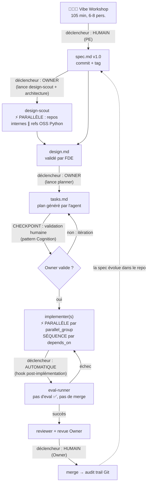

# Lab IA-natif — Workflow agentique

> Squelette de repo pour le lab LMFR × SFEIR. Chaque unité de travail produit trois artefacts markdown versionnés : `spec.md` (le QUOI), `design.md` (le COMMENT), `tasks.md` (le DO). Ils remplacent user stories, specs fonctionnelles et tickets.

## Structure du repo

```
lab-ia-natif/
├── CLAUDE.md                  # Contexte persistant chargé par les agents
├── README.md                  # Ce fichier : le workflow
├── templates/
│   ├── spec.md                # Template du contrat métier
│   ├── design.md              # Template d'architecture
│   └── tasks.md               # Template d'orchestration des agents
├── .claude/
│   ├── agents/                # Sous-agents spécialisés
│   │   ├── design-scout.md    # Collecte repos internes + références OSS
│   │   ├── planner.md         # Génère tasks.md depuis spec + design
│   │   ├── implementer.md     # Code une tâche contre la spec
│   │   ├── eval-runner.md     # Exécute les evals (merge gate)
│   │   └── reviewer.md        # Revue croisée spec ↔ code
│   └── skills/
│       └── vibe-workshop/     # Animation de l'atelier spec v1.0
└── examples/
    └── agent-douche/          # Les 3 artefacts remplis (Projet 1)
```

## Le pipeline : qui déclenche quoi



## Règles de déclenchement

| Étape | Qui déclenche | Mode | Validation |
|---|---|---|---|
| spec.md v1.0 | **Humain** — PE anime le Vibe Workshop, Claude médie | Séquentiel (point d'entrée) | Métier signe le contrat |
| design.md | **Owner** — lance `design-scout` puis la rédaction | Scout en **parallèle** (repos internes ∥ refs OSS) | FDE valide l'architecture |
| tasks.md | **Owner** — lance `planner` | Séquentiel (a besoin de spec + design) | **Checkpoint humain obligatoire** avant exécution |
| Implémentation | **Agent** — `implementer` par tâche | **Parallèle** entre `parallel_group`, **séquence** via `depends_on` | Aucune ligne manuelle sans justification |
| Evals | **Automatique** — hook après chaque tâche | Séquentiel par tâche | Gate binaire : pas d'eval verte, pas de merge |
| Merge | **Humain** — Owner, revu par Owner_N-1 | Séquentiel | Audit trail Git |

## Les 3 principes de parallélisation

1. **On parallélise la recherche, jamais la décision.** `design-scout` explore les repos internes et les références open source en parallèle ; la rédaction du design et sa validation sont séquentielles.
2. **On parallélise les tâches sans dépendance de fichier.** Deux tâches peuvent tourner en parallèle si leurs `files_touched` sont disjoints ET qu'aucune n'est `depends_on` de l'autre. Sinon : séquence stricte.
3. **Tout point de non-retour est un checkpoint humain.** Génération de plan, merge, déploiement : l'agent propose, l'humain dispose (pattern Cognition).

## Mode automatique — le run quasi-autonome

L'objectif : entre deux décisions humaines, **rien ne nécessite un humain**. La décision humaine ne
disparaît pas, elle se déplace : l'Owner décide UNE FOIS, à l'approbation du plan (quels checkpoints
sont `auto`, lesquels restent `blocking`), puis le run avance seul jusqu'à la prochaine vraie décision.

### Les niveaux d'autonomie

| Niveau | Commande | Pauses humaines |
|---|---|---|
| L0 — plan | `--dry-run` | tout (rien ne tourne) |
| L1 — supervisé | `--supervised` | TOUS les checkpoints (les modes `auto` sont ignorés) |
| L2 — croisière *(défaut)* | — | uniquement les checkpoints `blocking` du plan approuvé |
| Toujours | — | le **merge** : jamais automatique, le plan-lint refuse un CP final `auto` |

### Les garde-fous qui rendent l'autonomie sûre

1. **Plan-lint** (`--validate`, ou `make validate FEATURE=…`) : DAG acyclique, IDs de spec existants,
   `done_when` présents, chemins parallèles disjoints, CP final blocking. Un plan qui ne lint pas ne
   s'exécute pas — c'est ce qui permet à l'Owner d'approuver une fois et de laisser tourner.
2. **Verdict structuré** : chaque implementer termine par `STATUS: done` ou `STATUS: blocked — <raison>`.
   Un agent bloqué sur un trou de spec (OQ) ne passe jamais pour fini ; il note la question dans
   spec.md §8 et seul son sous-arbre s'arrête.
3. **Anti-gate-vide** : une tâche qui implémente des IDs de spec ÉCHOUE si aucune eval n'est collectée
   (`pytest -m eval --collect-only`). Un `make evals` vert avec zéro eval ne valide rien.
4. **Verify par tâche** : la commande `verify` de tasks.md matérialise le `done_when` — vérifiée
   mécaniquement après chaque agent, avant les evals.
5. **Confinement d'échec** : failed/blocked ne neutralise que les dépendants (`skipped`) ; les autres
   branches continuent. Le run se termine TOUJOURS sur un bilan, jamais sur un abandon à mi-course.
6. **Commits scopés** : seuls les `files_touched` de la tâche sont stagés (sous verrou) — deux agents
   parallèles ne se polluent pas ; le hors-scope est signalé, pas commité.
7. **Checkpoints `auto` documentés** : avant chaque checkpoint (auto ou non), le rapport `reviewer` est
   généré dans `.runs/CP-n-review.md`. Auto = evals vertes ET `VERDICT: PASS` ; au moindre doute,
   bascule en validation humaine.
8. **Eval gate de session** (`.claude/settings.json`) : hooks `Stop`/`SubagentStop` → un agent ne peut
   pas terminer avec du code modifié et des evals rouges ; `PostToolUse` → ruff sur chaque édition.

```bash
# 1. Plan-lint, puis approbation Owner (status: approved + modes des CP)
python3 scripts/orchestrate.py work/ma-feature --validate

# 2. Voir le plan d'exécution sans rien lancer
python3 scripts/orchestrate.py work/ma-feature --dry-run

# 3. Lancer en fond (caffeinate empêche la mise en veille)
caffeinate -i python3 scripts/orchestrate.py work/ma-feature > work/ma-feature/.runs/run.log 2>&1 &

# 4. À chaque notification CHECKPOINT blocking : lire .runs/CP-n-review.md, puis
scripts/approve.sh CP-1 work/ma-feature
```

Reprise sur incident : l'état est dans `<feature>/.runs/state.json` — relancer la même commande reprend
où ça s'était arrêté (les nœuds `done` ne rejouent pas ; les `blocked` retentent après ta réponse aux OQ).
Prérequis : `claude` CLI authentifié, `uv` installé.

### Télémétrie et limites

- **Journal** : chaque run écrit `<feature>/.runs/journal.jsonl` — une ligne JSON par événement
  (tentative, durée, **coût $ par agent**, verdict reviewer, bilan). C'est la source des métriques
  Twin Track (coût complet, part de code IA) ; le bilan affiche le Σ coût du run.
- **Retries avec mémoire** : un retry reprend la MÊME session agent (`--resume`) — l'agent corrige
  son travail au lieu de repartir de zéro.
- **Mur par agent** : `LAB_TASK_TIMEOUT` (défaut 2400 s) tue un agent coincé ; la tâche compte
  comme tentative échouée, la vague continue.
- **Env de test** : `LAB_ROOT` (sandbox), `LAB_NO_NOTIFY=1` (CI). La suite
  `tests/orchestrator/` rejoue toute la mécanique (lint, vagues, confinement, reprise,
  checkpoints auto, anti-gate-vide) en ~3 s avec un shim `claude` déterministe.

## Démarrer une unité de travail

```bash
cp templates/spec.md   work/<feature>/spec.md     # rempli en Vibe Workshop
cp templates/design.md work/<feature>/design.md   # rempli par Owner + design-scout
cp templates/tasks.md  work/<feature>/tasks.md    # généré par planner, validé par Owner
```

Puis dans Claude Code : `lis work/<feature>/spec.md et design.md, génère tasks.md selon templates/tasks.md, et attends ma validation avant d'exécuter.`
