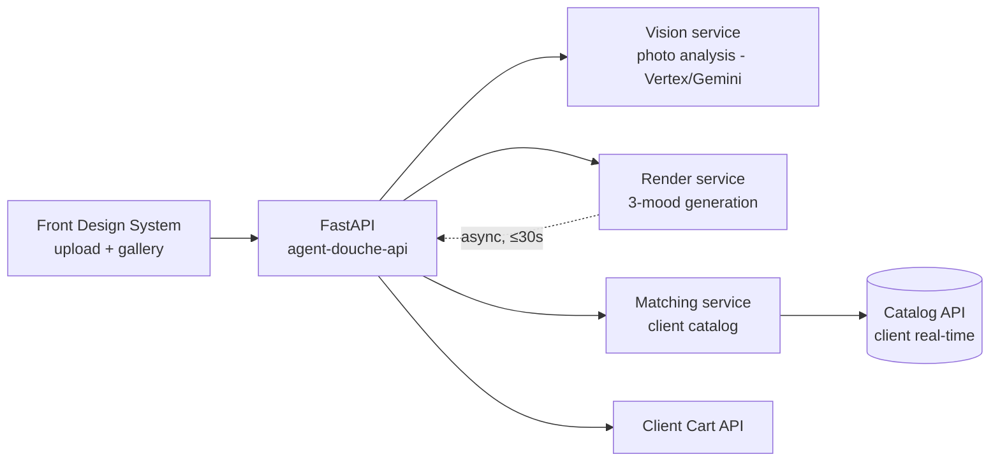

# Design — Agent Douche

> ⚠️ **Illustrative example**: the internal repos are to be collected on day 1 from the teams (it is the project's first action). The OSS references are real.

## 1. Architecture overview

Single FastAPI service in V1 (modular monolith), three business modules: `vision`, `render`, `matching`. Render generation is asynchronous (front-side polling). No photo data persisted beyond the session (INV-4).

## 2. Reference repositories

### 2.1 Internal reference repos *(to request from the teams — day-1 checklist)*

| Repo | Team / contact | Day-1 access? | What we reuse | What we leave aside |
|---|---|---|---|---|
| `<api-catalog>` | Catalog team | ☐ | products API contract, availability/stock model | — |
| `<api-cart>` | Checkout team | ☐ | cart creation + services contract | — |
| `<design-system-web>` + a front using it | Design System team | ☐ | upload, gallery, product-page components | — |
| `<pipeline-ci-reference>` | platform / Global Ready | ☐ | compliant CI, secrets, SAST | — |
| `<a recent GCP service>` | CTO office / AI COE | ☐ | GCP conventions, IAM, observability | legacy patterns |

**Questions for the teams:** contacts per repo, day-1 read access rights, catalog/cart test environment, API quota.

### 2.2 Python open-source references

| Problem | OSS reference | Borrowed pattern | Link |
|---|---|---|---|
| Service structure, settings, deps | `fastapi/full-stack-fastapi-template` | `src/app/` layout, Pydantic settings, test structure | github.com/fastapi/full-stack-fastapi-template |
| Product/variant/price modeling | `saleor/saleor` | product / variant / price-channel separation; availability handling | `saleor/product/models/` |
| Asynchronous tasks (renders ≤ 30 s) | `saleor/saleor` + Celery | render job queue, pollable status | `saleor/core/tasks.py` |
| Agent orchestration (vision → render → match) | `langchain-ai/langgraph` | step graph with checkpoints and retries | `langgraph/examples` examples |
| LLM evals (EVAL-3 llm-judge) | `openai/evals` / `promptfoo` | rubric structure, golden sets | evals repo |
| Feature flags / progressive rollout | `getsentry/sentry` | per-feature flags, kill-switch | `src/sentry/features/` |

## 3. Stack

| Layer | Choice | Justified by |
|---|---|---|
| Runtime | Python 3.12, FastAPI, Pydantic v2, uv, ruff | §2.2 full-stack-template; CLAUDE.md conventions |
| Vision & renders | Vertex AI (Gemini multimodal + image generation) | GCP partnership, the org's compliance; ADR-2 |
| Async jobs | Cloud Tasks + Cloud Run worker | V1 simplicity; Saleor pattern adapted to serverless |
| Data | Firestore (ephemeral sessions, TTL) — no SQL in V1 | INV-4: nothing to persist durably |
| Front | Design System (internal repo) | design system compliance |
| Infra | GCP Cloud Run, IaC of the reference pipeline | Global Ready |

## 4. ADRs

### ADR-1 — Modular monolith rather than microservices
- **Status:** accepted
- **Context:** 10 weeks, 1 Owner + agents; 3 business modules tightly coupled to the same flow.
- **Decision:** one FastAPI service, modules `vision/`, `render/`, `matching/`, boundary via Python interfaces.
- **Anchored on:** full-stack-fastapi-template (§2.2).
- **Alternatives considered:** 3 microservices (rejected: ops overhead with no benefit at this scale).
- **Consequences:** later split possible along the module interfaces.

### ADR-2 — Render generation via Vertex AI, no self-hosted model
- **Status:** accepted
- **Context:** photorealistic renders constrained by the room geometry; short deadline.
- **Decision:** Gemini multimodal for the analysis (BHV-1), Vertex image model for the renders (BHV-2), with a geometric-constraint prompt + EVAL-3 post-check.
- **Alternatives considered:** ComfyUI/SDXL self-hosted (rejected: ops + compliance), simple moodboard without render (rejected: kills the value proposition).
- **Consequences:** cost per render to monitor; kill-switch if it drifts (§7).

### ADR-3 — Product matching = structured search, not free RAG
- **Status:** proposed
- **Context:** INV-1 forbids any product hallucination.
- **Decision:** the LLM produces structured attributes (style, color, material, dimensions); matching is a deterministic query on the catalog API. The LLM never generates a product reference.
- **Anchored on:** Saleor product/variant pattern (§2.2).
- **Consequences:** matching quality depends on the richness of the catalog attributes → OQ-1.

## 5. Contracts & data

- API: `contracts/openapi.json` (CI snapshot) — endpoints: `POST /photos`, `GET /analyses/{id}`, `POST /renders`, `GET /renders/{id}`, `POST /cart`
- Session: Firestore document TTL 24 h `{session_id, analysis, renders[], selections[]}` — photo in an ephemeral bucket TTL 24 h (INV-4)
- Catalog & cart: contracts of the internal repos §2.1 (to be snapshotted as soon as access is granted)

## 6. Design System & Global Ready

- **Design System:** upload, 3-mood gallery, product card, cart CTA — standard components, zero fork.
- **Global Ready:** ☐ reference CI ☐ SAST/DAST ☐ secrets manager ☐ GDPR: face blurring (BHV-1c), TTL 24 h, consent ☐ a11y AA ☐ "generated image" notice (OQ-3).

## 7. Observability & rollout

- **Twin Track measures:** lead time, share of AI code, defects, full cost, NPS + cost per render, photo refusal rate, conversion per mood.
- **Rollout:** feature flag, internal → 5% traffic → projects fair. Global kill-switch (Sentry pattern §2.2).
- **SLO:** analysis p95 ≤ 10 s, renders p95 ≤ 30 s, availability 99.5%.

## 8. Risks

| Risk | Prob. | Impact | Mitigation |
|---|---|---|---|
| Catalog/cart API access delayed | M | H | the lab's "day-1 access" criterion; contractual mocks from week 1 |
| Insufficient render quality (EVAL-3 < 8) | M | H | bench of 50 photos from week 2, prompt iteration, moodboard fallback |
| Vertex cost per render | M | M | budget/day + kill-switch |
| Poor catalog attributes (ADR-3) | M | M | OQ-1 to settle at the T0 framing |

## 9. Changelog

| Version | Date | Author | Change |
|---|---|---|---|
| 0.1.0 | <date> | Owner + design-scout | Creation — pre-filled example |
| 0.1.1 | 2026-06-18 | translation | English translation (form only, no substance change) |
