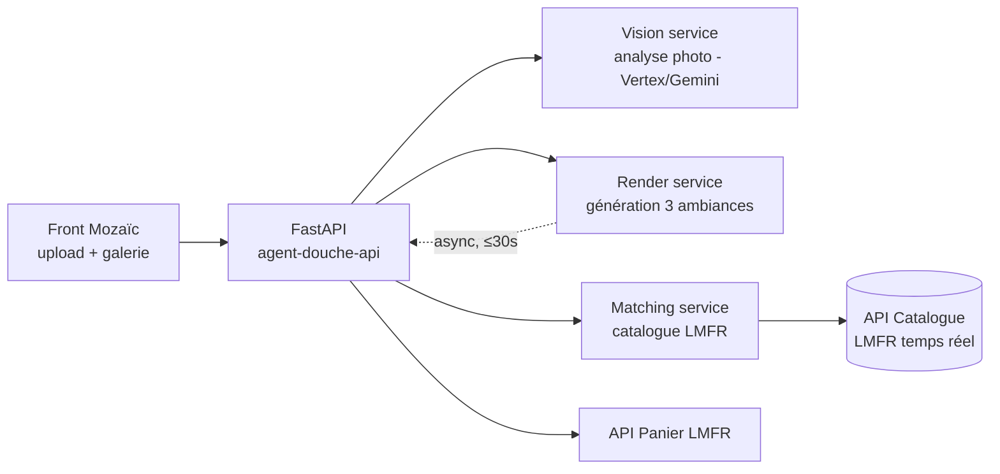

# Design — Agent Douche

> ⚠️ **Exemple illustratif** : les repos internes sont à collecter J1 auprès des équipes LMFR (c'est la première action du projet). Les références OSS sont réelles.

## 1. Architecture overview

Service FastAPI unique en V1 (monolithe modulaire), trois modules métier : `vision`, `render`, `matching`. La génération des rendus est asynchrone (polling côté front). Aucune donnée photo persistée hors session (INV-4).

## 2. Reference repositories

### 2.1 Repos internes LMFR *(à demander aux équipes — checklist J1)*

| Repo | Équipe / contact | Accès J1 ? | Ce qu'on reprend | Ce qu'on écarte |
|---|---|---|---|---|
| `<api-catalogue>` | équipe Catalogue | ☐ | contrat API produits, modèle dispo/stock | — |
| `<api-panier>` | équipe Checkout | ☐ | contrat création panier + services | — |
| `<mozaic-web>` + un front l'utilisant | équipe Design System | ☐ | composants upload, galerie, fiche produit | — |
| `<pipeline-ci-reference>` | platform / Adeo Global Ready | ☐ | CI conforme, secrets, SAST | — |
| `<un service GCP récent>` | office CTO / COE IA | ☐ | conventions GCP, IAM, observabilité | patterns legacy |

**Questions aux équipes :** contacts par repo, droits d'accès lecture J1, environnement de test catalogue/panier, quota API.

### 2.2 Références open source Python

| Problème | Référence OSS | Pattern emprunté | Lien |
|---|---|---|---|
| Structure du service, settings, deps | `fastapi/full-stack-fastapi-template` | layout `src/app/`, settings Pydantic, structure tests | github.com/fastapi/full-stack-fastapi-template |
| Modélisation produit/variante/prix | `saleor/saleor` | séparation produit / variante / canal de prix ; gestion dispo | `saleor/product/models/` |
| Tâches asynchrones (rendus ≤ 30 s) | `saleor/saleor` + Celery | file de jobs render, statut pollable | `saleor/core/tasks.py` |
| Orchestration de l'agent (vision → render → match) | `langchain-ai/langgraph` | graphe d'étapes avec checkpoints et retries | exemples `langgraph/examples` |
| Evals LLM (EVAL-3 llm-judge) | `openai/evals` / `promptfoo` | structure des rubriques, jeux d'or | repo evals |
| Feature flags / rollout progressif | `getsentry/sentry` | flags par feature, kill-switch | `src/sentry/features/` |

## 3. Stack

| Couche | Choix | Justifié par |
|---|---|---|
| Runtime | Python 3.12, FastAPI, Pydantic v2, uv, ruff | §2.2 full-stack-template ; conventions CLAUDE.md |
| Vision & rendus | Vertex AI (Gemini multimodal + génération d'images) | partenariat GCP, conformité Adeo ; ADR-2 |
| Jobs async | Cloud Tasks + worker Cloud Run | simplicité V1 ; pattern Saleor adapté serverless |
| Données | Firestore (sessions éphémères, TTL) — pas de SQL en V1 | INV-4 : rien à persister durablement |
| Front | Mozaïc (repo interne) | conformité design system |
| Infra | GCP Cloud Run, IAC du pipeline de référence | Adeo Global Ready |

## 4. ADRs

### ADR-1 — Monolithe modulaire plutôt que microservices
- **Status :** accepted
- **Context :** 10 semaines, 1 Owner + agents ; 3 modules métier fortement couplés au même flux.
- **Decision :** un service FastAPI, modules `vision/`, `render/`, `matching/`, frontière par interfaces Python.
- **Anchored on :** full-stack-fastapi-template (§2.2).
- **Alternatives considered :** 3 microservices (rejeté : overhead ops sans bénéfice à cette échelle).
- **Consequences :** découpage ultérieur possible le long des interfaces de modules.

### ADR-2 — Génération de rendus via Vertex AI, pas de modèle self-hosted
- **Status :** accepted
- **Context :** rendus photoréalistes contraints par la géométrie de la pièce ; échéance courte.
- **Decision :** Gemini multimodal pour l'analyse (BHV-1), modèle d'image Vertex pour les rendus (BHV-2), avec prompt de contrainte géométrique + post-check EVAL-3.
- **Alternatives considered :** ComfyUI/SDXL self-hosted (rejeté : ops + conformité), simple moodboard sans rendu (rejeté : tue la proposition de valeur).
- **Consequences :** coût par rendu à monitorer ; kill-switch si dérive (§7).

### ADR-3 — Matching produits = recherche structurée, pas RAG libre
- **Status :** proposed
- **Context :** INV-1 interdit toute hallucination de produit.
- **Decision :** le LLM produit des attributs structurés (style, couleur, matériau, dimensions) ; le matching est une requête déterministe sur l'API catalogue. Le LLM ne génère jamais une référence produit.
- **Anchored on :** pattern Saleor produit/variante (§2.2).
- **Consequences :** qualité du matching dépend de la richesse des attributs catalogue → OQ-1.

## 5. Contracts & data

- API : `contracts/openapi.json` (snapshot CI) — endpoints : `POST /photos`, `GET /analyses/{id}`, `POST /renders`, `GET /renders/{id}`, `POST /cart`
- Session : document Firestore TTL 24 h `{session_id, analysis, renders[], selections[]}` — photo en bucket éphémère TTL 24 h (INV-4)
- Catalogue & panier : contrats des repos internes §2.1 (à snapshotter dès accès)

## 6. Mozaïc & Adeo Global Ready

- **Mozaïc :** upload, galerie 3 ambiances, carte produit, CTA panier — composants standards, zéro fork.
- **Adeo Global Ready :** ☐ CI référence ☐ SAST/DAST ☐ secrets manager ☐ RGPD : floutage visages (BHV-1c), TTL 24 h, consentement ☐ a11y AA ☐ mention « image générée » (OQ-3).

## 7. Observability & rollout

- **Mesures Twin Track :** lead time, part de code IA, défauts, coût complet, NPS + coût par rendu, taux de refus photo, conversion par ambiance.
- **Rollout :** feature flag, interne → 5 % trafic → fête des projets. Kill-switch global (pattern Sentry §2.2).
- **SLO :** analyse p95 ≤ 10 s, rendus p95 ≤ 30 s, dispo 99,5 %.

## 8. Risks

| Risque | Prob. | Impact | Mitigation |
|---|---|---|---|
| Accès API catalogue/panier retardé | M | H | critère « accès J1 » du lab ; mocks contractuels dès S1 |
| Qualité rendus insuffisante (EVAL-3 < 8) | M | H | banc de 50 photos dès S2, itération prompt, fallback moodboard |
| Coût Vertex par rendu | M | M | budget/jour + kill-switch |
| Attributs catalogue pauvres (ADR-3) | M | M | OQ-1 à trancher au cadrage T0 |

## 9. Changelog

| Version | Date | Auteur | Changement |
|---|---|---|---|
| 0.1.0 | <date> | Owner + design-scout | Création — exemple pré-rempli |
