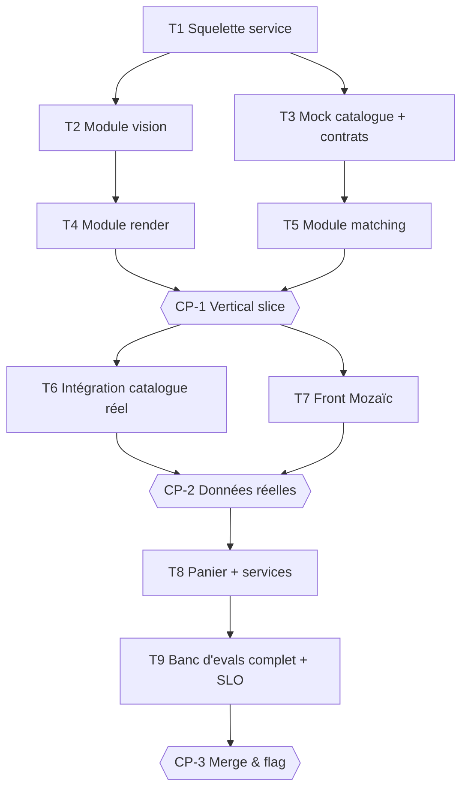

# Tasks — Agent Douche

> ⚠️ **Exemple illustratif** du plan que `planner` génèrerait. Statut `proposed` : rien ne s'exécute avant validation Owner.

## Execution graph

## Tasks

### T1 — Initialiser le squelette du service
- **agent :** implementer · **depends_on :** — · **parallel_group :** A
- **implements :** [—, socle] · **anchored_on :** ADR-1, full-stack-fastapi-template
- **files_touched :** `src/app/`, `pyproject.toml`, `.github/`, `tests/`
- **prompt :** Initialise le service selon design.md ADR-1 : layout src/app avec modules vision/render/matching vides, settings Pydantic, CI du pipeline de référence, `make evals` branché sur `pytest -m eval`.
- **done_when :** CI verte, healthcheck déployé sur env de dev
- **verify :** `make -s test`

### T2 — Module vision : analyse de la photo
- **agent :** implementer · **depends_on :** [T1] · **parallel_group :** B
- **implements :** [BHV-1, BHV-1a, BHV-1b, BHV-1c, INV-4, INV-6, EVAL-4]
- **anchored_on :** ADR-2 · **files_touched :** `src/app/vision/`, `tests/vision/`
- **prompt :** Implémente l'analyse photo via Gemini : détection pièce/éléments, refus hors-sujet (INV-6), floutage visages (BHV-1c), stockage éphémère TTL 24 h (INV-4). Tests d'abord, dont les 30 images pièges d'EVAL-4.
- **done_when :** tests vision verts + EVAL-4 verte + latence p95 ≤ 10 s sur banc local
- **verify :** `uv run pytest -q tests/vision`

### T3 — Contrats catalogue/panier + mocks
- **agent :** implementer · **depends_on :** [T1] · **parallel_group :** B *(∥ T2 : fichiers disjoints)*
- **implements :** [INV-1, INV-3 — préparation] · **anchored_on :** ADR-3, repos internes §2.1
- **files_touched :** `src/app/clients/`, `contracts/`, `tests/clients/`
- **prompt :** Modélise les clients API catalogue et panier depuis les contrats des repos internes (ou contrats supposés si accès manquant — à flagger). Mocks contractuels pour le dev.
- **done_when :** contrats snapshotés, mocks utilisables par T5

### T4 — Module render : 3 ambiances
- **agent :** implementer · **depends_on :** [T2] · **parallel_group :** C
- **implements :** [BHV-2, INV-2, EVAL-2, EVAL-6] · **anchored_on :** ADR-2, pattern jobs async Saleor
- **files_touched :** `src/app/render/`, `tests/render/`
- **prompt :** Génération asynchrone des 3 rendus (Cloud Tasks + worker), contrainte géométrique dans le prompt, statut pollable. EVAL-2 et EVAL-6 en local.
- **done_when :** EVAL-2 verte, p95 ≤ 30 s sur banc de 50 photos

### T5 — Module matching : produits réels
- **agent :** implementer · **depends_on :** [T3] · **parallel_group :** C *(∥ T4)*
- **implements :** [BHV-3, BHV-3a, INV-1, INV-3, EVAL-1, EVAL-5] · **anchored_on :** ADR-3
- **files_touched :** `src/app/matching/`, `tests/matching/`
- **prompt :** LLM → attributs structurés ; matching = requête déterministe catalogue (jamais de réf générée). Substitution produit indisponible (BHV-3a).
- **done_when :** EVAL-1 verte sur mocks, EVAL-5 verte

### CP-1 — CHECKPOINT : vertical slice de bout en bout
- **trigger :** auto quand [T4, T5] done · **validator :** Owner
- **mode :** blocking *(démo à un humain — candidat `auto` une fois le banc d'evals visuel fiabilisé)*
- **reviews :** démo photo → 3 ambiances → produits (sur mocks), diff complet, rapport reviewer, EVAL-1/2/4/5
- **on_reject :** retour tâches concernées ; trou de spec → amender spec.md d'abord

### T6 — Intégration catalogue/panier réels
- **agent :** implementer · **depends_on :** [CP-1] · **parallel_group :** D
- **implements :** [INV-1, INV-3] · **files_touched :** `src/app/clients/`, config env
- **done_when :** EVAL-1 et EVAL-5 vertes sur API réelles (env de test LMFR)

### T7 — Front Mozaïc
- **agent :** implementer · **depends_on :** [CP-1] · **parallel_group :** D *(∥ T6)*
- **implements :** [BHV-1, BHV-2, BHV-3 — UI] · **anchored_on :** repo Mozaïc §2.1
- **files_touched :** `front/`
- **done_when :** parcours complet cliquable, a11y AA, composants Mozaïc standards

### CP-2 — CHECKPOINT : données réelles
- **trigger :** auto quand [T6, T7] done · **validator :** Owner + métier
- **mode :** blocking *(donnée réelle + métier dans la boucle : jamais auto)*
- **reviews :** démo sur catalogue réel, EVAL-3 (llm-judge ≥ 8/10), coût par rendu vs budget

### T8 — Panier + services (livraison, pose, devis)
- **agent :** implementer · **depends_on :** [CP-2]
- **implements :** [BHV-4, INV-5] · **files_touched :** `src/app/checkout/`, `front/checkout/`
- **done_when :** panier créé sur env de test, devis marqué « estimation » (INV-5)

### T9 — Banc d'evals complet + SLO + flag
- **agent :** implementer puis eval-runner · **depends_on :** [T8]
- **implements :** [EVAL-3, §7 complet] · **files_touched :** `evals/`, monitoring, feature flag
- **done_when :** EVAL-1→6 vertes en CI, dashboards Twin Track en place, kill-switch testé

### CP-3 — CHECKPOINT : merge & rollout
- **trigger :** auto quand T9 done · **validator :** Owner (revu par Owner_N-1)
- **mode :** blocking *(merge : le plan-lint refuse `auto` ici)*
- **reviews :** evals complètes, audit trail, checklist Adeo Global Ready, plan rollout 5 %
- **on_accept :** merge (humain) + flag interne — **jamais automatique**

## Trigger table

| Événement | Déclencheur | Action |
|---|---|---|
| tasks.md approuvé | Owner | lance T1 |
| T1 done + evals vertes | auto (hook) | lance T2 ∥ T3 (groupe B) |
| T2/T3 done | auto | lance T4 ∥ T5 (groupe C) |
| [T4, T5] done | auto | CP-1 : pause + notification Owner |
| CP-1 validé | Owner | lance T6 ∥ T7 (groupe D) |
| Eval rouge (toute tâche) | auto | retour implementer, max 3 itérations puis escalade |
| CP-3 validé | Owner | merge + rollout flag |

## Run log

| Date | Tâche | Agent | Résultat | Commit |
|---|---|---|---|---|
| | | | | |
