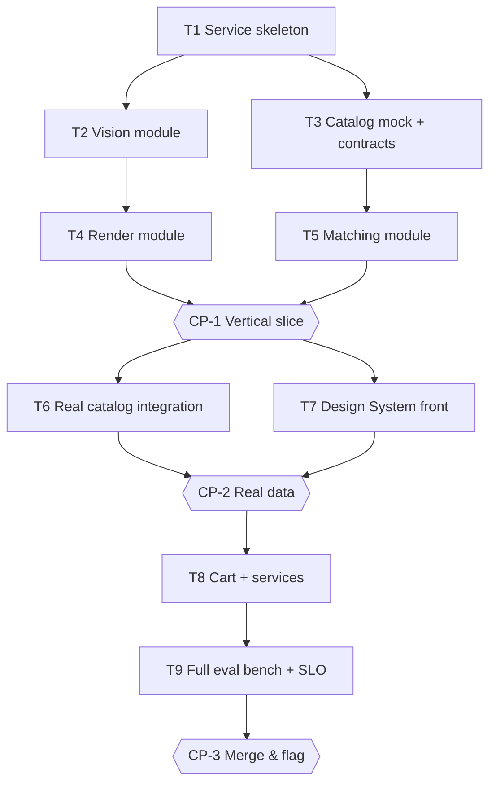

# Tasks — Agent Douche

> ⚠️ **Illustrative example** of the plan `planner` would generate. Status `proposed`: nothing runs before Owner validation.

## Execution graph

## Tasks

### T1 — Initialize the service skeleton
- **agent :** implementer · **depends_on :** — · **parallel_group :** A
- **implements :** [—, foundation] · **anchored_on :** ADR-1, full-stack-fastapi-template
- **files_touched :** `src/app/`, `pyproject.toml`, `.github/`, `tests/`
- **prompt :** Initialize the service per design.md ADR-1: src/app layout with empty vision/render/matching modules, Pydantic settings, CI of the reference pipeline, `make evals` wired to `pytest -m eval`.
- **done_when :** CI green, healthcheck deployed on the dev env
- **verify :** `make -s test`

### T2 — Vision module: photo analysis
- **agent :** implementer · **depends_on :** [T1] · **parallel_group :** B
- **implements :** [BHV-1, BHV-1a, BHV-1b, BHV-1c, INV-4, INV-6, EVAL-4]
- **anchored_on :** ADR-2 · **files_touched :** `src/app/vision/`, `tests/vision/`
- **prompt :** Implement photo analysis via Gemini: room/element detection, off-topic refusal (INV-6), face blurring (BHV-1c), ephemeral storage TTL 24 h (INV-4). Tests first, including the 30 trap images of EVAL-4.
- **done_when :** vision tests green + EVAL-4 green + p95 latency ≤ 10 s on local bench
- **verify :** `uv run pytest -q tests/vision`

### T3 — Catalog/cart contracts + mocks
- **agent :** implementer · **depends_on :** [T1] · **parallel_group :** B *(∥ T2: disjoint files)*
- **implements :** [INV-1, INV-3 — preparation] · **anchored_on :** ADR-3, internal repos §2.1
- **files_touched :** `src/app/clients/`, `contracts/`, `tests/clients/`
- **prompt :** Model the catalog and cart API clients from the contracts of the internal repos (or assumed contracts if access is missing — to be flagged). Contractual mocks for development.
- **done_when :** contracts snapshotted, mocks usable by T5

### T4 — Render module: 3 moods
- **agent :** implementer · **depends_on :** [T2] · **parallel_group :** C
- **implements :** [BHV-2, INV-2, EVAL-2, EVAL-6] · **anchored_on :** ADR-2, Saleor async jobs pattern
- **files_touched :** `src/app/render/`, `tests/render/`
- **prompt :** Asynchronous generation of the 3 renders (Cloud Tasks + worker), geometric constraint in the prompt, pollable status. EVAL-2 and EVAL-6 locally.
- **done_when :** EVAL-2 green, p95 ≤ 30 s on a bench of 50 photos

### T5 — Matching module: real products
- **agent :** implementer · **depends_on :** [T3] · **parallel_group :** C *(∥ T4)*
- **implements :** [BHV-3, BHV-3a, INV-1, INV-3, EVAL-1, EVAL-5] · **anchored_on :** ADR-3
- **files_touched :** `src/app/matching/`, `tests/matching/`
- **prompt :** LLM → structured attributes; matching = deterministic catalog query (never a generated ref). Substitution of unavailable product (BHV-3a).
- **done_when :** EVAL-1 green on mocks, EVAL-5 green

### CP-1 — CHECKPOINT: end-to-end vertical slice
- **trigger :** auto when [T4, T5] done · **validator :** Owner
- **mode :** blocking *(demo to a human — `auto` candidate once the visual eval bench is hardened)*
- **reviews :** demo photo → 3 moods → products (on mocks), full diff, reviewer report, EVAL-1/2/4/5
- **on_reject :** back to the relevant tasks; spec gap → amend spec.md first

### T6 — Real catalog/cart integration
- **agent :** implementer · **depends_on :** [CP-1] · **parallel_group :** D
- **implements :** [INV-1, INV-3] · **files_touched :** `src/app/clients/`, env config
- **done_when :** EVAL-1 and EVAL-5 green on the real APIs (the client's test env)

### T7 — Design System front
- **agent :** implementer · **depends_on :** [CP-1] · **parallel_group :** D *(∥ T6)*
- **implements :** [BHV-1, BHV-2, BHV-3 — UI] · **anchored_on :** Design System repo §2.1
- **files_touched :** `front/`
- **done_when :** full clickable journey, a11y AA, standard Design System components

### CP-2 — CHECKPOINT: real data
- **trigger :** auto when [T6, T7] done · **validator :** Owner + business
- **mode :** blocking *(real data + business in the loop: never auto)*
- **reviews :** demo on the real catalog, EVAL-3 (llm-judge ≥ 8/10), cost per render vs budget

### T8 — Cart + services (delivery, installation, quote)
- **agent :** implementer · **depends_on :** [CP-2]
- **implements :** [BHV-4, INV-5] · **files_touched :** `src/app/checkout/`, `front/checkout/`
- **done_when :** cart created on the test env, quote marked "estimate" (INV-5)

### T9 — Full eval bench + SLO + flag
- **agent :** implementer then eval-runner · **depends_on :** [T8]
- **implements :** [EVAL-3, §7 complete] · **files_touched :** `evals/`, monitoring, feature flag
- **done_when :** EVAL-1→6 green in CI, Twin Track dashboards in place, kill-switch tested

### CP-3 — CHECKPOINT: merge & rollout
- **trigger :** auto when T9 done · **validator :** Owner (reviewed by Owner_N-1)
- **mode :** blocking *(merge: plan-lint rejects `auto` here)*
- **reviews :** complete evals, audit trail, Global Ready checklist, 5% rollout plan
- **on_accept :** merge (human) + internal flag — **never automatic**

## Trigger table

| Event | Trigger | Action |
|---|---|---|
| tasks.md approved | Owner | launches T1 |
| T1 done + evals green | auto (hook) | launches T2 ∥ T3 (group B) |
| T2/T3 done | auto | launches T4 ∥ T5 (group C) |
| [T4, T5] done | auto | CP-1: pause + Owner notification |
| CP-1 validated | Owner | launches T6 ∥ T7 (group D) |
| Eval red (any task) | auto | back to implementer, max 3 iterations then escalation |
| CP-3 validated | Owner | merge + rollout flag |

## Run log

| Date | Task | Agent | Result | Commit |
|---|---|---|---|---|
| | | | | |
