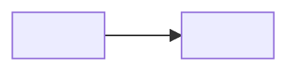

# Design — <Feature name>

> **The HOW. The architecture.** Founding principle: **we don't invent architecture, we lean on existing one**.
> Every technical choice must point either to an internal reference repo, or to a large
> open source Python application that has proven the pattern in production. The agent that implements cites the reference
> pattern (repo + file path) in its code review.

## 1. Architecture overview

*Diagram (mermaid) + 5-10 lines. The bounded contexts, the main flows, what is synchronous/asynchronous.*

## 2. Reference repositories — the foundation

### 2.1 Internal reference repos *(to collect BEFORE any decision — Owner checklist)*

*Ask the teams for their existing repos on the scope. For each repo: what we reuse from it (conventions, patterns, API contracts) and what we do NOT reuse. The `design-scout` agent produces this analysis.*

| Repo | Team / contact | Access on day 1? | What we reuse | What we drop |
|---|---|---|---|---|
| `<org>/<repo>` | <team> | ☐ | <pattern, contract, convention> | <legacy, anti-pattern> |

**Collection checklist:**
- ☐ Repos of the business domain concerned (the existing code IS the documentation of the current behavior)
- ☐ Repo of the API contracts / event schemas of the information system
- ☐ Design System repo + existing integration examples
- ☐ Reference CI/CD pipelines (Global Ready)
- ☐ Team conventions: lint, structure, naming

### 2.2 Open source Python references *(the patterns proven at scale)*

*For each architecture problem, we identify THE large OSS Python app that solved it in production, and we borrow its pattern — not its code. Example pools: **FastAPI full-stack-template** (service structure), **Django** (ORM, migrations, admin), **Sentry** (Python monorepo at scale, feature flags), **Saleor** (e-commerce, catalog, checkout), **PostHog** (product + analytics, plugin system), **Airflow** (DAG orchestration), **LangGraph/agents** (agentic workflows).*

| Problem | OSS reference | Borrowed pattern | Link (specific file/module) |
|---|---|---|---|
| <e.g. service structure> | `fastapi/full-stack-fastapi-template` | <src/ layout, deps, Pydantic settings> | <URL or path> |
| <e.g. catalog model> | `saleor/saleor` | <product/variant modeling> | <URL or path> |

## 3. Stack

| Layer | Choice | Justified by (ref §2) |
|---|---|---|
| Runtime | Python 3.12, FastAPI, Pydantic v2 | <ref> |
| Data | <PostgreSQL / BigQuery / …> | <ref> |
| AI | <Vertex AI / Claude API, models, fallbacks> | <ref> |
| Front | <Design System + …> | internal Design System repo |
| Infra | GCP: <Cloud Run / GKE / …> | Global Ready pipeline |

## 4. ADRs — Architecture Decision Records

*One ADR per structural decision. Short format, versioned here (no external doc).*

### ADR-1 — <title of the decision>
- **Status:** accepted | proposed | superseded by ADR-n
- **Context:** <the problem, in 2-3 lines>
- **Decision:** <what we do>
- **Anchored on:** <reference repo §2 + pattern>
- **Alternatives considered:** <option B (rejected because…), option C (rejected because…)>
- **Consequences:** <what it implies, accepted debts>

## 5. Contracts & data

*API contracts (OpenAPI generated by FastAPI), event schemas, data model. Point to the files, do not duplicate.*

- API: `src/<service>/api/` — generated contract, snapshot committed in `contracts/openapi.json`
- Events: <schemas + topic(s)>
- Data: <diagram or link to migrations>

## 6. Design System & Global Ready

- **Design System:** components used, tokens, any deviations (to be validated).
- **Global Ready:** ☐ compliant CI ☐ SAST/DAST ☐ secrets management ☐ i18n ☐ GDPR/personal data ☐ accessibility.

## 7. Observability & rollout

- **Metrics:** lead time, share of AI-written code, defects, full cost (cf. Twin Track).
- **Rollout:** <feature flag, % of traffic, rollback plan>.
- **SLO:** <p95 latency, availability, error budget>.

## 8. Risks

| Risk | Probability | Impact | Mitigation |
|---|---|---|---|
| <risk> | L/M/H | L/M/H | <action> |

## 9. Changelog

| Version | Date | Author | Change |
|---|---|---|---|
| 0.1.0 | <date> | <Owner> + design-scout | Created |
