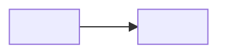

# Design — <Nom de la feature>

> **Le COMMENT. L'architecture.** Principe fondateur : **on n'invente pas d'architecture, on s'adosse**.
> Tout choix technique doit pointer soit vers un repo interne LMFR, soit vers une grande application
> open source Python qui a prouvé le pattern en production. L'agent qui implémente cite le pattern
> de référence (repo + chemin de fichier) dans son code review.

## 1. Architecture overview

*Schéma (mermaid) + 5-10 lignes. Les bounded contexts, les flux principaux, ce qui est synchrone/asynchrone.*

## 2. Reference repositories — la fondation

### 2.1 Repos internes LMFR *(à collecter AVANT toute décision — checklist Owner)*

*Demander aux équipes LMFR leurs repos existants sur le périmètre. Pour chaque repo : ce qu'on en reprend (conventions, patterns, contrats d'API) et ce qu'on ne reprend PAS. L'agent `design-scout` produit cette analyse.*

| Repo | Équipe / contact | Accès J1 ? | Ce qu'on reprend | Ce qu'on écarte |
|---|---|---|---|---|
| `<org>/<repo>` | <équipe> | ☐ | <pattern, contrat, convention> | <legacy, anti-pattern> |

**Checklist de collecte :**
- ☐ Repos du domaine métier concerné (le code existant EST la doc du comportement actuel)
- ☐ Repo des contrats d'API / schémas d'événements du SI LMFR
- ☐ Repo Mozaïc + exemples d'intégration existants
- ☐ Pipelines CI/CD de référence (Adeo Global Ready)
- ☐ Conventions de l'équipe : lint, structure, nommage

### 2.2 Références open source Python *(les patterns éprouvés à grande échelle)*

*Pour chaque problème d'architecture, on identifie LA grande app OSS Python qui l'a résolu en production, et on emprunte son pattern — pas son code. Exemples de viviers : **FastAPI full-stack-template** (structure service), **Django** (ORM, migrations, admin), **Sentry** (monorepo Python à l'échelle, feature flags), **Saleor** (e-commerce, catalogue, checkout), **PostHog** (produit + analytics, plugin system), **Airflow** (orchestration DAG), **LangGraph/agents** (workflows agentiques).*

| Problème | Référence OSS | Pattern emprunté | Lien (fichier/module précis) |
|---|---|---|---|
| <ex : structure du service> | `fastapi/full-stack-fastapi-template` | <layout src/, deps, settings Pydantic> | <URL ou chemin> |
| <ex : modèle catalogue> | `saleor/saleor` | <modélisation produit/variante> | <URL ou chemin> |

## 3. Stack

| Couche | Choix | Justifié par (réf §2) |
|---|---|---|
| Runtime | Python 3.12, FastAPI, Pydantic v2 | <réf> |
| Données | <PostgreSQL / BigQuery / …> | <réf> |
| IA | <Vertex AI / Claude API, modèles, fallbacks> | <réf> |
| Front | <Mozaïc + …> | repo Mozaïc interne |
| Infra | GCP : <Cloud Run / GKE / …> | pipeline Adeo Global Ready |

## 4. ADRs — Architecture Decision Records

*Une ADR par décision structurante. Format court, versionné ici (pas de doc externe).*

### ADR-1 — <titre de la décision>
- **Status :** accepted | proposed | superseded by ADR-n
- **Context :** <le problème, en 2-3 lignes>
- **Decision :** <ce qu'on fait>
- **Anchored on :** <repo de référence §2 + pattern>
- **Alternatives considered :** <option B (rejetée car…), option C (rejetée car…)>
- **Consequences :** <ce que ça implique, dettes acceptées>

## 5. Contracts & data

*Contrats d'API (OpenAPI généré par FastAPI), schémas d'événements, modèle de données. Pointer les fichiers, ne pas dupliquer.*

- API : `src/<service>/api/` — contrat généré, snapshot commité dans `contracts/openapi.json`
- Événements : <schémas + topic(s)>
- Données : <diagramme ou lien vers migrations>

## 6. Mozaïc & Adeo Global Ready

- **Mozaïc :** composants utilisés, tokens, écarts éventuels (à faire valider).
- **Adeo Global Ready :** ☐ CI conforme ☐ SAST/DAST ☐ gestion des secrets ☐ i18n ☐ RGPD/données perso ☐ accessibilité.

## 7. Observability & rollout

- **Mesures :** lead time, part de code IA, défauts, coût complet (cf. Twin Track).
- **Rollout :** <feature flag, % de trafic, plan de rollback>.
- **SLO :** <latence p95, dispo, budget erreur>.

## 8. Risks

| Risque | Probabilité | Impact | Mitigation |
|---|---|---|---|
| <risque> | L/M/H | L/M/H | <action> |

## 9. Changelog

| Version | Date | Auteur | Changement |
|---|---|---|---|
| 0.1.0 | <date> | <Owner> + design-scout | Création |
