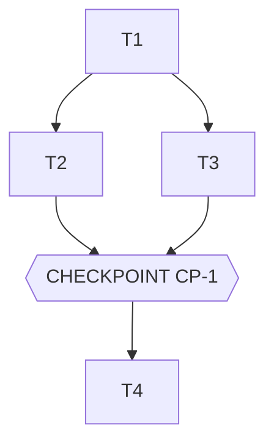

# Tasks — <Nom de la feature>

> **Le DO. L'orchestration des agents.** Généré par `planner` à partir de spec.md + design.md,
> validé par l'Owner AVANT toute exécution. Règles d'orchestration :
> 1. **Séquence** = `depends_on`. Une tâche ne démarre que si toutes ses dépendances sont `done` et evals vertes.
> 2. **Parallèle** = même `parallel_group` ET `files_touched` disjoints. En cas de doute : séquence.
> 3. **Checkpoint** = arrêt obligatoire, validation humaine. Jamais contourné par un agent.
> 4. Chaque tâche référence les IDs de spec qu'elle implémente → traçabilité commit ↔ contrat.

## Execution graph

## Tasks

### T1 — <titre impératif court>
- **agent :** implementer
- **depends_on :** — *(point d'entrée)*
- **parallel_group :** A
- **implements :** [BHV-1, INV-1] *(IDs de spec.md)*
- **anchored_on :** <pattern de design.md §2, ex : ADR-1>
- **files_touched :** `src/<module>/…` *(sert au calcul de parallélisme)*
- **prompt :**
  > Implémente <quoi> conformément à spec.md [BHV-1, INV-1] et design.md [ADR-1].
  > Contraintes : <précisions>. Écris les tests AVANT le code. Ne touche pas à <fichiers>.
- **done_when :** `pytest tests/<module>` vert + EVAL-1 verte
- **status :** ☐ pending → ☐ running → ☐ done

### T2 — <titre>
- **agent :** implementer
- **depends_on :** [T1]
- **parallel_group :** B *(parallélisable avec T3 : fichiers disjoints)*
- ...

### CP-1 — CHECKPOINT : <ce que l'humain valide>
- **trigger :** automatique quand [T2, T3] sont done
- **validator :** Owner
- **reviews :** démo locale, diff complet, evals [EVAL-1..3], écarts spec éventuels
- **on_reject :** retour aux tâches concernées avec commentaire ; si trou de spec → amender spec.md d'abord

### T4 — ...

## Trigger table — qui déclenche quoi

| Événement | Déclencheur | Action |
|---|---|---|
| tasks.md approuvé | **Owner** (humain) | lance le groupe A |
| Tâche done + evals vertes | **automatique** (hook) | débloque les tâches dépendantes ; lance le groupe parallèle suivant |
| Eval rouge | **automatique** | la tâche repasse `running`, l'agent corrige (max 3 itérations, puis escalade Owner) |
| Toutes tâches d'un checkpoint done | **automatique** | notifie l'Owner, exécution EN PAUSE |
| Checkpoint validé | **Owner** (humain) | reprise de l'exécution |
| Dernier checkpoint validé | **Owner** (humain) | merge — jamais automatique |

## Run log

*Rempli au fil de l'eau par les agents. Audit trail complémentaire du Git log.*

| Date | Tâche | Agent | Résultat | Commit |
|---|---|---|---|---|
| | | | | |
