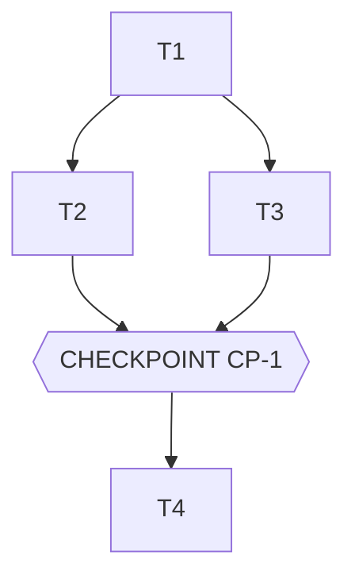

# Tasks — <Nom de la feature>

> **Le DO. L'orchestration des agents.** Généré par `planner` à partir de spec.md + design.md,
> validé par l'Owner AVANT toute exécution. Règles d'orchestration :
> 1. **Séquence** = `depends_on`. Une tâche ne démarre que si toutes ses dépendances sont `done` et evals vertes.
> 2. **Parallèle** = même `parallel_group` ET `files_touched` disjoints. En cas de doute : séquence.
> 3. **Checkpoint** = arrêt obligatoire. `mode: blocking` (défaut) = validation humaine. `mode: auto` =
>    auto-validé si evals vertes ET reviewer PASS, sinon bascule en humain. Le mode est choisi par
>    l'Owner À L'APPROBATION DU PLAN — c'est là que vit la décision humaine. Merge : toujours blocking.
> 4. Chaque tâche référence les IDs de spec qu'elle implémente → traçabilité commit ↔ contrat.
> 5. **Confinement d'échec** : une tâche failed/blocked ne neutralise que son sous-arbre de dépendants ;
>    les autres branches du DAG continuent. Le run se termine toujours avec un bilan.
> 6. **Plan-lint obligatoire** : `python3 scripts/orchestrate.py <feature> --validate` doit être vert
>    avant de proposer le plan à l'Owner (DAG acyclique, IDs de spec existants, chemins parallèles
>    disjoints, done_when présents). Un plan qui ne parse pas ne s'exécute pas.

## Execution graph

## Tasks

### T1 — <titre impératif court>
- **agent :** implementer
- **depends_on :** — *(point d'entrée)*
- **parallel_group :** A
- **implements :** [BHV-1, INV-1] *(IDs de spec.md)*
- **anchored_on :** <pattern de design.md §2, ex : ADR-1>
- **files_touched :** `src/<module>/…` *(sert au calcul de parallélisme)*
- **prompt :**
  > Implémente <quoi> conformément à spec.md [BHV-1, INV-1] et design.md [ADR-1].
  > Contraintes : <précisions>. Écris les tests AVANT le code. Ne touche pas à <fichiers>.
- **done_when :** `pytest tests/<module>` vert + EVAL-1 verte
- **verify :** `uv run pytest -q tests/<module>` *(commande exécutable — l'orchestrateur la lance après l'agent ; sans verify, le done_when n'est vérifié que par les evals globales)*
- **status :** ☐ pending → ☐ running → ☐ done

### T2 — <titre>
- **agent :** implementer
- **depends_on :** [T1]
- **parallel_group :** B *(parallélisable avec T3 : fichiers disjoints)*
- ...

### CP-1 — CHECKPOINT : <ce que l'humain valide>
- **trigger :** automatique quand [T2, T3] sont done
- **validator :** Owner
- **mode :** blocking *(défaut — `auto` UNIQUEMENT pour une vérification mécanique : evals + revue agent
  suffisent à trancher. Toute décision, intégration externe, donnée réelle ou merge = blocking.)*
- **reviews :** démo locale, diff complet, evals [EVAL-1..3], écarts spec éventuels — le rapport
  `reviewer` est généré automatiquement dans `.runs/CP-n-review.md` avant chaque checkpoint
- **on_reject :** `scripts/reject.sh CP-n <feature> "raison" [Tn …]` — les tâches visées (défaut : toutes
  celles du checkpoint) sont réouvertes avec la raison transmise à l'agent, le checkpoint se re-présente
  (max 2 rejets, ensuite arrêt). Si trou de spec → amender spec.md d'abord (commit séparé).

### T4 — ...

## Trigger table — qui déclenche quoi

| Événement | Déclencheur | Action |
|---|---|---|
| tasks.md approuvé (modes des CP compris) | **Owner** (humain) | lance le groupe A |
| Tâche done + verify + evals vertes | **automatique** (hook) | commit scopé ; débloque les dépendants ; vague suivante |
| Eval rouge ou verify rouge | **automatique** | la tâche repasse `running`, l'agent corrige (max 3 itérations, puis escalade Owner) |
| Agent répond `STATUS: blocked` (trou de spec) | **automatique** | pause du sous-arbre, OQ-n notée dans spec.md §8, notification Owner — les autres branches continuent |
| Tâche failed/blocked | **automatique** | dépendants `skipped` (confinement), le reste du DAG continue |
| Checkpoint `auto` atteint | **automatique** | rapport reviewer ; PASS + evals vertes = validé ; sinon bascule blocking |
| Checkpoint `blocking` atteint | **automatique** | rapport reviewer généré, notification Owner, exécution EN PAUSE |
| Checkpoint validé (`approve.sh`) | **Owner** (humain) | reprise de l'exécution |
| Checkpoint rejeté (`reject.sh` + raison) | **Owner** (humain) | réouverture des tâches visées avec le commentaire, re-présentation du checkpoint (max 2 rejets) |
| Dernier checkpoint validé | **Owner** (humain) | merge — jamais automatique, plan-lint le garantit |

## Run log

*Rempli au fil de l'eau par les agents. Audit trail complémentaire du Git log.*

| Date | Tâche | Agent | Résultat | Commit |
|---|---|---|---|---|
| | | | | |
