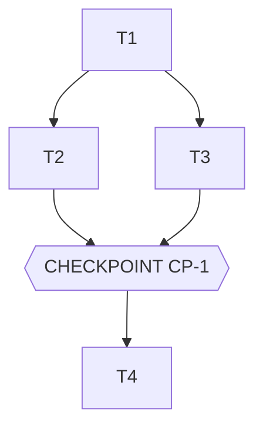

# Tasks — <Feature name>

> **The DO. The orchestration of the agents.** Generated by `planner` from spec.md + design.md,
> validated by the Owner BEFORE any execution. Orchestration rules:
> 1. **Sequence** = `depends_on`. A task only starts if all its dependencies are `done` and evals green.
> 2. **Parallel** = same `parallel_group` AND disjoint `files_touched`. When in doubt: sequence.
> 3. **Checkpoint** = mandatory stop. `mode: blocking` (default) = human validation. `mode: auto` =
>    auto-validated if evals green AND reviewer PASS, otherwise it falls back to human. The mode is chosen by
>    the Owner AT PLAN APPROVAL TIME — that is where the human decision lives. Merge: always blocking.
> 4. Each task references the spec IDs it implements → commit ↔ contract traceability.
> 5. **Failure containment**: a failed/blocked task only neutralizes its own sub-tree of dependents;
>    the other branches of the DAG continue. The run always ends with a summary.
> 6. **Mandatory plan-lint**: `python3 scripts/orchestrate.py <feature> --validate` must be green
>    before proposing the plan to the Owner (acyclic DAG, existing spec IDs, disjoint parallel paths,
>    done_when present). A plan that does not parse does not execute.

## Execution graph

## Tasks

### T1 — <short imperative title>
- **agent:** implementer
- **depends_on:** — *(entry point)*
- **parallel_group:** A
- **implements:** [BHV-1, INV-1] *(spec.md IDs)*
- **anchored_on:** <pattern from design.md §2, e.g. ADR-1>
- **files_touched:** `src/<module>/…` *(used for parallelism computation)*
- **prompt:**
  > Implement <what> in accordance with spec.md [BHV-1, INV-1] and design.md [ADR-1].
  > Constraints: 
. Write the tests BEFORE the code. Do not touch <files>.
- **done_when:** `pytest tests/<module>` green + EVAL-1 green
- **verify:** `uv run pytest -q tests/<module>` *(executable command — the orchestrator runs it after the agent; without verify, done_when is only checked by the global evals)*
- **status:** ☐ pending → ☐ running → ☐ done

### T2 — <title>
- **agent:** implementer
- **depends_on:** [T1]
- **parallel_group:** B *(parallelizable with T3: disjoint files)*
- ...

### CP-1 — CHECKPOINT: <what the human validates>
- **trigger:** automatic when [T2, T3] are done
- **validator:** Owner
- **mode:** blocking *(default — `auto` ONLY for a mechanical check: evals + agent review
  are enough to decide. Any decision, external integration, real data, or merge = blocking.)*
- **reviews:** local demo, full diff, evals [EVAL-1..3], any spec deviations — the
  `reviewer` report is generated automatically in `.runs/CP-n-review.md` before each checkpoint
- **on_reject:** `scripts/reject.sh CP-n <feature> "reason" [Tn …]` — the targeted tasks (default: all
  of those in the checkpoint) are reopened with the reason passed to the agent, the checkpoint re-presents
  itself (max 2 rejects, then stop). If there is a spec gap → amend spec.md first (separate commit).

### T4 — ...

## Trigger table — who triggers what

| Event | Trigger | Action |
|---|---|---|
| tasks.md approved (CP modes included) | **Owner** (human) | launches group A |
| Task done + verify + evals green | **automatic** (hook) | scoped commit; unblocks the dependents; next wave |
| Eval red or verify red | **automatic** | the task goes back to `running`, the agent fixes (max 3 iterations, then escalate to Owner) |
| Agent replies `STATUS: blocked` (spec gap) | **automatic** | sub-tree paused, OQ-n noted in spec.md §8, Owner notified — the other branches continue |
| Task failed/blocked | **automatic** | dependents `skipped` (containment), the rest of the DAG continues |
| `auto` checkpoint reached | **automatic** | reviewer report; PASS + evals green = validated; otherwise falls back to blocking |
| `blocking` checkpoint reached | **automatic** | reviewer report generated, Owner notified, execution PAUSED |
| Checkpoint validated (`approve.sh`) | **Owner** (human) | execution resumes |
| Checkpoint rejected (`reject.sh` + reason) | **Owner** (human) | targeted tasks reopened with the comment, checkpoint re-presented (max 2 rejects) |
| Last checkpoint validated | **Owner** (human) | merge — never automatic, plan-lint guarantees it |

## Run log

*Filled in as we go by the agents. Audit trail complementary to the Git log.*

| Date | Task | Agent | Result | Commit |
|---|---|---|---|---|
| | | | | |
