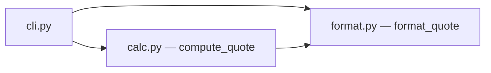

# Design — Bathroom installation quote

> Simulation scope: pure functions + CLI, zero network I/O. The goal is to
> validate the orchestrated pipeline (plan-lint → parallel waves → evals → checkpoints),
> not to produce the target architecture of Agent Douche.

## 1. Architecture overview

Three modules under `src/devis/`: `calc.py` (pure domain), `format.py` (pure presentation),
`cli.py` (argparse entry). `format_quote` consumes the dict produced by `compute_quote`
(contract = keys of the spec's Examples).

## 2. Reference repositories

| Problem | OSS reference | Borrowed pattern | Link |
|---|---|---|---|
| Testable pure domain | `cosmicpython/code` | domain functions without I/O, tested by examples | ch. 1, `model.py` |
| Monetary rounding | Python stdlib | `round(x, 2)` is enough for the simulation (EUR, 2 dec.) | — |

## 3. Stack

| Layer | Choice | Justified by |
|---|---|---|
| Runtime | Python 3.12, stdlib only | simulation: zero runtime dependency |
| Tests/evals | pytest (marker `eval`), uv | lab conventions (CLAUDE.md) |

## 4. ADRs

### ADR-1 — Computation in pure functions, amounts as floats rounded to 2 decimals
- **Status:** accepted
- **Context:** short simulation; the real Agent Douche will use Decimal on the prod side.
- **Decision:** `compute_quote(products_subtotal_eur: float, surface_m2: float) -> dict`,
  `round(x, 2)` at the boundaries.
- **Anchored on:** cosmicpython — pure domain.
- **Alternatives considered:** Decimal (rejected: over-engineered for the simulation).
- **Consequences:** debt assumed as NG on the real prod side.

## 5. Contracts & data

`compute_quote` contract = exact keys of the Examples: `products_eur`, `installation_eur`,
`total_eur`, `is_estimate`. This is the input contract of `format_quote`.

## 6. Design System & Global Ready

N/A in simulation (no front end).

## 7. Observability & rollout

N/A in simulation.

## 8. Risks

| Risk | Probability | Impact | Mitigation |
|---|---|---|---|
| Floats → rounding errors | M | L | EVAL-1 verifies to the euro on the Examples |

## 9. Changelog

| Version | Date | Author | Change |
|---|---|---|---|
| 1.0.0 | 2026-06-10 | simulation | Creation |
| 1.0.1 | 2026-06-18 | translation | English translation (form only, no substance change) |
