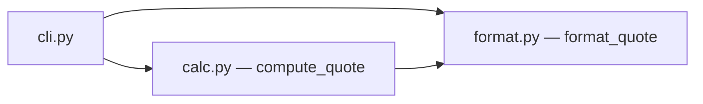

# Design — Devis de pose salle de bain

> Périmètre de simulation : fonctions pures + CLI, zéro I/O réseau. L'objectif est de
> valider le pipeline orchestré (plan-lint → vagues parallèles → evals → checkpoints),
> pas de produire l'architecture cible d'Agent Douche.

## 1. Architecture overview

Trois modules sous `src/devis/` : `calc.py` (domaine pur), `format.py` (présentation pure),
`cli.py` (entrée argparse). `format_quote` consomme le dict produit par `compute_quote`
(contrat = clés des Examples de la spec).

## 2. Reference repositories

| Problème | Référence OSS | Pattern emprunté | Lien |
|---|---|---|---|
| Domaine pur testable | `cosmicpython/code` | fonctions de domaine sans I/O, testées par exemples | chap. 1, `model.py` |
| Arrondi monétaire | stdlib Python | `round(x, 2)` suffisant en simulation (EUR, 2 déc.) | — |

## 3. Stack

| Couche | Choix | Justifié par |
|---|---|---|
| Runtime | Python 3.12, stdlib uniquement | simulation : zéro dépendance runtime |
| Tests/evals | pytest (marker `eval`), uv | conventions du lab (CLAUDE.md) |

## 4. ADRs

### ADR-1 — Calcul en fonctions pures, montants en float arrondis à 2 décimales
- **Status :** accepted
- **Context :** simulation courte ; le vrai Agent Douche utilisera Decimal côté prod.
- **Decision :** `compute_quote(products_subtotal_eur: float, surface_m2: float) -> dict`,
  arrondis `round(x, 2)` aux frontières.
- **Anchored on :** cosmicpython — domaine pur.
- **Alternatives considered :** Decimal (rejeté : sur-dimensionné pour la simulation).
- **Consequences :** dette assumée NG côté prod réelle.

## 5. Contracts & data

Contrat de `compute_quote` = clés exactes des Examples : `products_eur`, `installation_eur`,
`total_eur`, `is_estimate`. C'est le contrat d'entrée de `format_quote`.

## 6. Design System & Global Ready

N/A en simulation (pas de front).

## 7. Observability & rollout

N/A en simulation.

## 8. Risks

| Risque | Probabilité | Impact | Mitigation |
|---|---|---|---|
| Flottants → erreurs d'arrondi | M | L | EVAL-1 vérifie à l'euro près sur les Examples |

## 9. Changelog

| Version | Date | Auteur | Changement |
|---|---|---|---|
| 1.0.0 | 2026-06-10 | simulation | Création |
