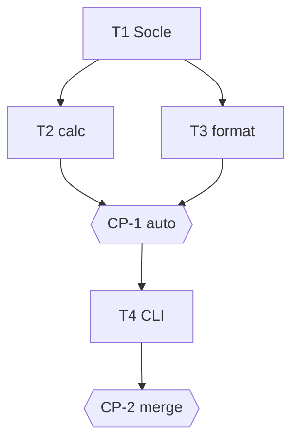

# Tasks — Devis de pose

## Execution graph

## Tasks

### T1 — Socle Python du repo
- **agent :** implementer · **depends_on :** — · **parallel_group :** A
- **implements :** [socle]
- **files_touched :** `pyproject.toml`, `src/devis/`, `tests/`
- **prompt :**
  > Crée le socle : `pyproject.toml` (projet `devis-lab`, requires-python >=3.12, dépendance dev pytest,
  > marker `eval` déclaré dans `[tool.pytest.ini_options]` avec `pythonpath = ["src"]`), package vide
  > `src/devis/__init__.py`, et UN test non-eval `tests/test_smoke.py` qui importe `devis`.
  > N'écris AUCUN test eval ici (ils arrivent avec le code qu'ils testent, T2/T3).
  > Vérifie : `uv run pytest -q -m "not eval"` vert et `make -s evals` vert.
- **done_when :** `uv run pytest -q -m "not eval"` vert
- **verify :** `uv run pytest -q -m "not eval"`

### T2 — Module calc : compute_quote
- **agent :** implementer · **depends_on :** [T1] · **parallel_group :** B
- **implements :** [INV-1, INV-2, INV-3, BHV-1, BHV-1a, BHV-2, BHV-2a, EX-1, EX-2, EX-3, EVAL-1, EVAL-2]
- **anchored_on :** ADR-1
- **files_touched :** `src/devis/calc.py`, `tests/devis_calc/`
- **prompt :**
  > Implémente `compute_quote(products_subtotal_eur: float, surface_m2: float) -> dict` selon
  > spec.md (INV-1..3, BHV-1, BHV-2 et leurs edge cases, contrat de clés = Examples).
  > Tests d'abord. Écris les evals dans `tests/devis_calc/test_evals.py` :
  > `test_eval_1_exemples_exacts` (EX-1, EX-2, EX-3 à l'euro près) et
  > `test_eval_2_proprietes` (total ≥ 0 et is_estimate sur une grille d'entrées générées),
  > toutes deux marquées `@pytest.mark.eval`.
- **done_when :** `uv run pytest -q tests/devis_calc` vert (evals comprises)
- **verify :** `uv run pytest -q tests/devis_calc`

### T3 — Module format : format_quote
- **agent :** implementer · **depends_on :** [T1] · **parallel_group :** B *(∥ T2 : fichiers disjoints)*
- **implements :** [BHV-3, EVAL-3]
- **anchored_on :** ADR-1
- **files_touched :** `src/devis/format.py`, `tests/devis_format/`
- **prompt :**
  > Implémente `format_quote(quote: dict) -> str` selon BHV-3 : mention « estimation », total à
  > 2 décimales, lignes produits / pose séparées. Le dict d'entrée respecte le contrat des Examples
  > (design.md §5) — ne dépends PAS du module calc (T2 tourne en parallèle).
  > Écris `tests/devis_format/test_evals.py::test_eval_3_format_ex2` marquée `@pytest.mark.eval`
  > (vérifie « estimation », « 3275.00 », lignes distinctes sur les données d'EX-2).
- **done_when :** `uv run pytest -q tests/devis_format` vert
- **verify :** `uv run pytest -q tests/devis_format`

### CP-1 — CHECKPOINT : modules domaine validés
- **trigger :** auto quand [T2, T3] done
- **validator :** Owner
- **mode :** auto *(vérification mécanique : EVAL-1..3 + rapport reviewer suffisent)*
- **reviews :** evals EVAL-1..3 vertes, traçabilité commits ↔ IDs, conformité ADR-1
- **on_reject :** retour aux tâches concernées

### T4 — CLI devis
- **agent :** implementer · **depends_on :** [CP-1] · **parallel_group :** C
- **implements :** [BHV-1, BHV-3]
- **anchored_on :** ADR-1
- **files_touched :** `src/devis/cli.py`, `tests/devis_cli/`
- **prompt :**
  > Implémente `src/devis/cli.py` : argparse `--products-eur` et `--surface-m2`, qui enchaîne
  > `compute_quote` puis `format_quote` et imprime le résultat. Un test non-eval
  > `tests/devis_cli/test_cli.py` vérifie la sortie sur EX-1 (capsys ou subprocess).
- **done_when :** `uv run pytest -q tests/devis_cli` vert
- **verify :** `uv run pytest -q tests/devis_cli`

### CP-2 — CHECKPOINT : merge
- **trigger :** auto quand T4 done
- **validator :** Owner
- **mode :** blocking
- **reviews :** evals complètes, diff de bout en bout, rapport reviewer, décision de merge
- **on_reject :** retour aux tâches concernées

## Trigger table

| Événement | Déclencheur | Action |
|---|---|---|
| tasks.md approuvé | Owner | lance T1 |
| T1 done | auto | lance T2 ∥ T3 |
| [T2, T3] done | auto | CP-1 : reviewer + auto-validation si PASS |
| CP-1 validé | auto/Owner | lance T4 |
| T4 done | auto | CP-2 : pause, validation humaine |
| CP-2 validé | Owner | merge humain |

## Run log

| Date | Tâche | Agent | Résultat | Commit |
|---|---|---|---|---|
| 2026-06-10 10:37 | T1 | implementer | done, evals vertes (t1) | |
| 2026-06-10 10:38 | T3 | implementer | done, evals vertes (t1) | |
