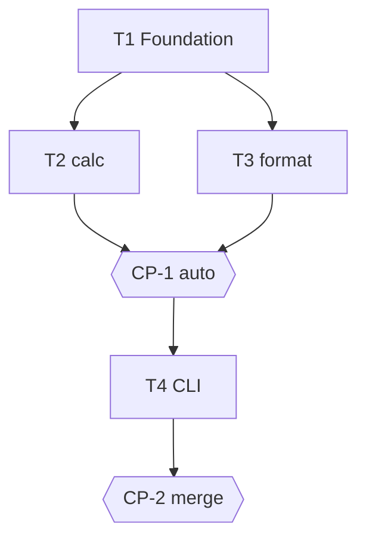

# Tasks — Installation quote

## Execution graph

## Tasks

### T1 — Python foundation of the repo
- **agent :** implementer · **depends_on :** — · **parallel_group :** A
- **implements :** [foundation]
- **files_touched :** `pyproject.toml`, `src/devis/`, `tests/`
- **prompt :**
  > Create the foundation: `pyproject.toml` (project `devis-lab`, requires-python >=3.12, dev dependency pytest,
  > marker `eval` declared in `[tool.pytest.ini_options]` with `pythonpath = ["src"]`), empty package
  > `src/devis/__init__.py`, and ONE non-eval test `tests/test_smoke.py` that imports `devis`.
  > Write NO eval test here (they come with the code they test, T2/T3).
  > Verify: `uv run pytest -q -m "not eval"` green and `make -s evals` green.
- **done_when :** `uv run pytest -q -m "not eval"` green
- **verify :** `uv run pytest -q -m "not eval"`

### T2 — calc module: compute_quote
- **agent :** implementer · **depends_on :** [T1] · **parallel_group :** B
- **implements :** [INV-1, INV-2, INV-3, BHV-1, BHV-1a, BHV-2, BHV-2a, EX-1, EX-2, EX-3, EVAL-1, EVAL-2]
- **anchored_on :** ADR-1
- **files_touched :** `src/devis/calc.py`, `tests/devis_calc/`
- **prompt :**
  > Implement `compute_quote(products_subtotal_eur: float, surface_m2: float) -> dict` per
  > spec.md (INV-1..3, BHV-1, BHV-2 and their edge cases, key contract = Examples).
  > Tests first. Write the evals in `tests/devis_calc/test_evals.py`:
  > `test_eval_1_exemples_exacts` (EX-1, EX-2, EX-3 to the euro) and
  > `test_eval_2_proprietes` (total ≥ 0 and is_estimate over a grid of generated inputs),
  > both marked `@pytest.mark.eval`.
- **done_when :** `uv run pytest -q tests/devis_calc` green (evals included)
- **verify :** `uv run pytest -q tests/devis_calc`

### T3 — format module: format_quote
- **agent :** implementer · **depends_on :** [T1] · **parallel_group :** B *(∥ T2: disjoint files)*
- **implements :** [BHV-3, EVAL-3]
- **anchored_on :** ADR-1
- **files_touched :** `src/devis/format.py`, `tests/devis_format/`
- **prompt :**
  > Implement `format_quote(quote: dict) -> str` per BHV-3: "estimate" mention, total to
  > 2 decimals, separate products / installation lines. The input dict respects the Examples
  > contract (design.md §5) — do NOT depend on the calc module (T2 runs in parallel).
  > Write `tests/devis_format/test_evals.py::test_eval_3_format_ex2` marked `@pytest.mark.eval`
  > (checks "estimate", "3275.00", distinct lines on the EX-2 data).
- **done_when :** `uv run pytest -q tests/devis_format` green
- **verify :** `uv run pytest -q tests/devis_format`

### CP-1 — CHECKPOINT: domain modules validated
- **trigger :** auto when [T2, T3] done
- **validator :** Owner
- **mode :** auto *(mechanical check: EVAL-1..3 + reviewer report are enough)*
- **reviews :** evals EVAL-1..3 green, commit ↔ ID traceability, ADR-1 compliance
- **on_reject :** back to the relevant tasks

### T4 — quote CLI
- **agent :** implementer · **depends_on :** [CP-1] · **parallel_group :** C
- **implements :** [BHV-1, BHV-3]
- **anchored_on :** ADR-1
- **files_touched :** `src/devis/cli.py`, `tests/devis_cli/`
- **prompt :**
  > Implement `src/devis/cli.py`: argparse `--products-eur` and `--surface-m2`, which chains
  > `compute_quote` then `format_quote` and prints the result. A non-eval test
  > `tests/devis_cli/test_cli.py` checks the output on EX-1 (capsys or subprocess).
- **done_when :** `uv run pytest -q tests/devis_cli` green
- **verify :** `uv run pytest -q tests/devis_cli`

### CP-2 — CHECKPOINT: merge
- **trigger :** auto when T4 done
- **validator :** Owner
- **mode :** blocking
- **reviews :** complete evals, end-to-end diff, reviewer report, merge decision
- **on_reject :** back to the relevant tasks

## Trigger table

| Event | Trigger | Action |
|---|---|---|
| tasks.md approved | Owner | launches T1 |
| T1 done | auto | launches T2 ∥ T3 |
| [T2, T3] done | auto | CP-1: reviewer + auto-validation if PASS |
| CP-1 validated | auto/Owner | launches T4 |
| T4 done | auto | CP-2: pause, human validation |
| CP-2 validated | Owner | human merge |

## Run log

| Date | Task | Agent | Result | Commit |
|---|---|---|---|---|
| 2026-06-10 10:37 | T1 | implementer | done, evals green (t1) | |
| 2026-06-10 10:38 | T3 | implementer | done, evals green (t1) | |
| 2026-06-10 10:39 | T2 | eval-runner | FAIL (t1) | |
| 2026-06-10 10:42 | T2 | implementer | done, evals green (t2) | |
| 2026-06-10 15:07 | CP-1 | owner | checkpoint validated | |
| 2026-06-10 15:08 | T4 | implementer | done, evals green (t1) | |
| 2026-06-10 15:15 | CP-2 | owner | checkpoint validated | |
