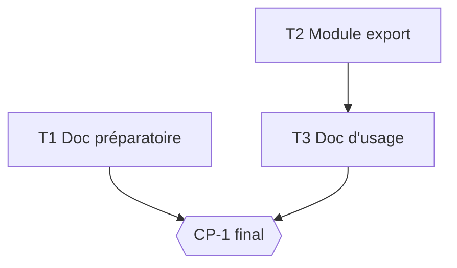

# Tasks — Export du devis

## Execution graph

## Tasks

### T1 — Doc préparatoire export (branche indépendante)
- **agent :** implementer · **depends_on :** — · **parallel_group :** A
- **implements :** [doc]
- **files_touched :** `docs/export-notes.md`
- **prompt :**
  > Rédige `docs/export-notes.md` : 10 lignes max, l'état du sujet export (OQ-1 ouverte,
  > options PDF/CSV, critères de décision pour le métier). Pur markdown, aucun code.
- **done_when :** le fichier existe et mentionne OQ-1
- **verify :** `grep -q "OQ-1" docs/export-notes.md`

### T2 — Module export (BLOQUÉ ATTENDU : OQ-1 ouverte)
- **agent :** implementer · **depends_on :** — · **parallel_group :** A *(∥ T1 : fichiers disjoints)*
- **implements :** [BHV-1, INV-1, EVAL-1]
- **files_touched :** `src/devis/export.py`, `tests/devis_export/`
- **prompt :**
  > Implémente l'export du devis selon spec.md BHV-1 et INV-1, avec l'eval EVAL-1
  > (`tests/devis_export/test_evals.py`, marquée @pytest.mark.eval).
- **done_when :** `uv run pytest -q tests/devis_export` vert
- **verify :** `uv run pytest -q tests/devis_export`

### T3 — Doc d'usage de l'export
- **agent :** implementer · **depends_on :** [T2] · **parallel_group :** B
- **implements :** [doc]
- **files_touched :** `docs/export-usage.md`
- **prompt :**
  > Documente l'usage du module export livré en T2.
- **done_when :** le fichier existe
- **verify :** `test -f docs/export-usage.md`

### CP-1 — CHECKPOINT : revue finale
- **trigger :** auto quand [T1, T3] done
- **validator :** Owner
- **mode :** blocking
- **reviews :** diff complet, rapport reviewer
- **on_reject :** retour aux tâches

## Run log

| Date | Tâche | Agent | Résultat | Commit |
|---|---|---|---|---|
| 2026-06-10 15:17 | T2 | implementer | BLOCKED — OQ-1 (format contractuel d'export non décidé par le métier ; BHV-1/EVAL-1 non implémentables sans cette décision) | |
| 2026-06-10 15:18 | T1 | implementer | done, evals vertes (t1) | |
