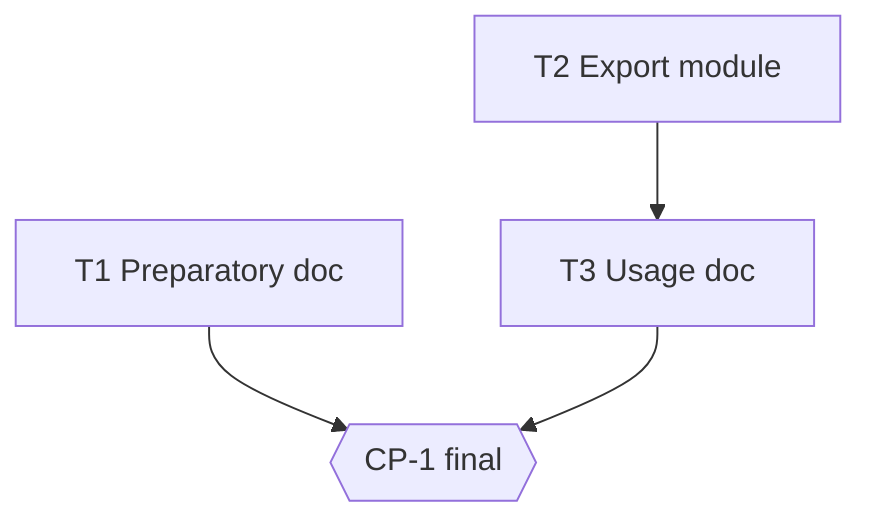

# Tasks — Quote export

## Execution graph

## Tasks

### T1 — Preparatory export doc (independent branch)
- **agent :** implementer · **depends_on :** — · **parallel_group :** A
- **implements :** [doc]
- **files_touched :** `docs/export-notes.md`
- **prompt :**
  > Write `docs/export-notes.md`: 10 lines max, the state of the export topic (OQ-1 open,
  > PDF/CSV options, decision criteria for the business). Pure markdown, no code.
- **done_when :** the file exists and mentions OQ-1
- **verify :** `grep -q "OQ-1" docs/export-notes.md`

### T2 — Export module (EXPECTED BLOCKED: OQ-1 open)
- **agent :** implementer · **depends_on :** — · **parallel_group :** A *(∥ T1: disjoint files)*
- **implements :** [BHV-1, INV-1, EVAL-1]
- **files_touched :** `src/devis/export.py`, `tests/devis_export/`
- **prompt :**
  > Implement the quote export per spec.md BHV-1 and INV-1, with the eval EVAL-1
  > (`tests/devis_export/test_evals.py`, marked @pytest.mark.eval).
- **done_when :** `uv run pytest -q tests/devis_export` green
- **verify :** `uv run pytest -q tests/devis_export`

### T3 — Export usage doc
- **agent :** implementer · **depends_on :** [T2] · **parallel_group :** B
- **implements :** [doc]
- **files_touched :** `docs/export-usage.md`
- **prompt :**
  > Document the usage of the export module delivered in T2.
- **done_when :** the file exists
- **verify :** `test -f docs/export-usage.md`

### CP-1 — CHECKPOINT: final review
- **trigger :** auto when [T1, T3] done
- **validator :** Owner
- **mode :** blocking
- **reviews :** full diff, reviewer report
- **on_reject :** back to the tasks

## Run log

| Date | Task | Agent | Result | Commit |
|---|---|---|---|---|
| 2026-06-10 15:17 | T2 | implementer | BLOCKED — OQ-1 (contractual export format not decided by the business; BHV-1/EVAL-1 not implementable without that decision) | |
| 2026-06-10 15:18 | T1 | implementer | done, evals green (t1) | |
| 2026-06-10 15:21 | T2 | implementer | done, evals green (t1) | |
| 2026-06-10 15:22 | T3 | implementer | done, evals green (t1) | |
| 2026-06-10 15:26 | CP-1 | owner | checkpoint validated | |
