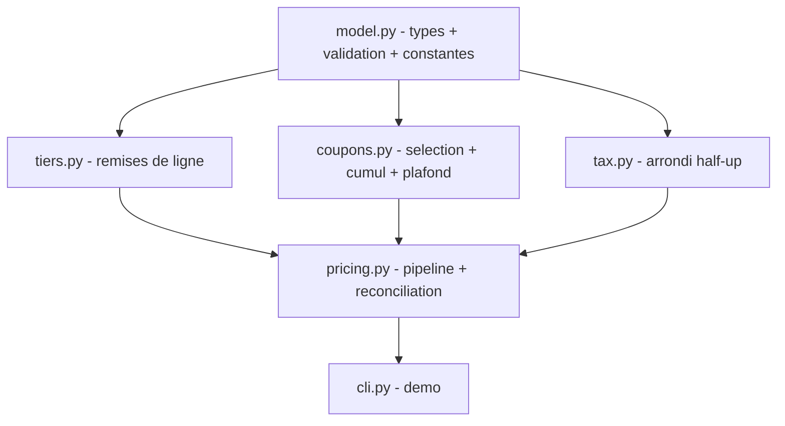

# Design — Moteur de tarification de panier

> **Le COMMENT.** Cœur de calcul pur, sans I/O. On découpe le pipeline en **modules à
> responsabilité unique et indépendants** (remises de ligne, coupons, TVA) au-dessus d'un
> modèle de données partagé, composés par un orchestrateur de calcul. On s'adosse au pattern
> « domaine pur + fonctions sans effet de bord » (cosmicpython, *Architecture Patterns with
> Python*, chap. 1-2) et à la **discipline arithmétique entière** (montants en centimes,
> taux en bps) éprouvée sur les golden tasks `remise-paliers` / `arrondi-comptable` du lab.
> *(Pour une vraie feature LMFR : design-scout sur les repos réels — caisse / pricing.)*

## 1. Architecture overview



Six modules sous `src/pricing/` :

- `model.py` — **fondation partagée**. Dataclasses `Line`, `Coupon`, `Context`, `Breakdown` ;
  validation des entrées (qty/prix ≥ 0, types de coupon connus) ; **constantes du contrat**
  (barème des paliers §4, plafond de remise). Aucune logique de calcul de prix. C'est la seule
  dépendance commune des trois modules de calcul — ce qui les rend implémentables **en parallèle**.
- `tiers.py` — `line_discount(line) -> int` : remise d'**une** ligne selon le barème §4
  (arrondi vers le bas). Pur, ne dépend que de `model`.
- `coupons.py` — `resolve_coupons(goods_after_lines, coupons, current_day) -> CouponOutcome` :
  filtre la validité (BHV-8), dédoublonne par `code` (INV-6), applique la règle de cumul
  (BHV-6a/6b), plafonne (BHV-5/INV-4). Retourne `(coupon_discounts, applied_codes, free_shipping)`.
  Pur, ne dépend que de `model`.
- `tax.py` — `round_half_up(numerator, denominator) -> int` + `compute_tax(taxable_base, tax_bps)
  -> int` : TVA arrondie half-up **une seule fois** (INV-7). Pur, ne dépend que de `model`
  (ou de rien). **Isolé exprès** pour que la règle d'arrondi soit testable seule.
- `pricing.py` — `price(cart, coupons, context) -> dict` : **compose** tiers + coupons + tax dans
  l'ordre canonique (INV-5), calcule le port + franco (BHV-7), assemble la ventilation et
  **garantit la réconciliation** (INV-3) par construction.
- `cli.py` — argparse minimal pour une démo manuelle (panier + coupons en JSON → ventilation).

## 2. Reference repositories

| Problème | Référence | Pattern emprunté | Lien |
|---|---|---|---|
| Domaine pur + fonctions sans I/O | `cosmicpython/code` | entités/règles testables sans infra | chap. 1-2 |
| Arithmétique monétaire entière | golden `arrondi-comptable` (lab) | tout en cents/bps, jamais de float | `evals/golden/arrondi-comptable` |
| Remises par paliers | golden `remise-paliers` (lab) | barème = donnée, `floor(montant*bps//10000)` | `evals/golden/remise-paliers` |
| Arrondi half-up entier | technique standard | `(num*2 + den)//(den*2)` ou `(num + den//2)//den` | — |

## 3. Stack

| Couche | Choix | Justifié par |
|---|---|---|
| Runtime | Python 3.12, stdlib uniquement | feature pure, zéro dépendance runtime (NG-1) |
| Données | dataclasses + dict en entrée/sortie | contrat JSON-able (§3 spec), pas de Pydantic ici (pas d'I/O) |
| Tests/evals | pytest (marker `eval`), `random.Random(seed)` fixe pour EVAL-2 | conventions du lab, déterminisme (INV-5) |

## 4. ADRs

### ADR-1 — Tout en entiers : centimes (montants) et bps (taux)
- **Status :** accepted
- **Context :** INV-1 (aucun float ne sort), INV-3 (réconciliation exacte), KPI 0 écart.
- **Decision :** montants en `int` cents, taux en `int` bps. Remise = `montant * bps // 10000`
  (division entière = arrondi **vers le bas**, BHV-3/BHV-4). Aucun `float` dans le chemin de calcul.
- **Anchored on :** golden `arrondi-comptable` + `remise-paliers`.
- **Consequences :** zéro dérive de virgule flottante ; l'arrondi n'existe **que** pour la TVA (ADR-3).

### ADR-2 — Pipeline à ordre canonique figé, modules composés
- **Status :** accepted
- **Context :** INV-5 exige un ordre déterministe et une indépendance à l'ordre du tableau `coupons`.
- **Decision :** `pricing.price` applique strictement : (1) remises de ligne via `tiers` →
  (2) coupons via `coupons` (qui trie en interne par `priority` puis `code`) → (3) port + franco →
  (4) TVA via `tax`. Les trois modules de calcul sont **purs et indépendants** ; seul `pricing`
  connaît l'ordre. Le tri interne des coupons rend le résultat indépendant de l'ordre d'entrée.
- **Anchored on :** cosmicpython (composition de fonctions pures).
- **Consequences :** chaque module est testable isolément ; `pricing` est le seul point où la
  réconciliation est vérifiable → c'est là que vivent EVAL-2 (property) et EVAL-3 (déterminisme).

### ADR-3 — Arrondi TVA half-up, une seule fois, isolé dans `tax.py`
- **Status :** accepted
- **Context :** INV-7 (half-up, pas de double arrondi), BHV-10 (TVA sur `goods_final + shipping`).
- **Decision :** `round_half_up(num, den) = (num + den // 2) // den` pour `den` pair ; appliqué
  **une fois** sur `taxable_base * tax_bps` avec `den = 10000`. Jamais d'arrondi par ligne.
- **Anchored on :** technique d'arrondi entier standard ; golden `arrondi-comptable`.
- **Consequences :** la règle d'arrondi est une fonction unique, testable seule (EVAL-4) ; tout
  changement de politique d'arrondi est localisé.

### ADR-4 — Plafond de remise appliqué à chaque étape (jamais négatif)
- **Status :** accepted
- **Context :** INV-2 / INV-4 / BHV-5 (FIXED plafonné, goods_final ≥ 0).
- **Decision :** dans `coupons`, chaque remise est `min(remise_calculée, marchandise_courante)` et
  la marchandise courante ne descend jamais sous 0 ; `coupon_discounts` cumulé ≤ marchandise après
  remises de ligne. `pricing` ne facture le port/TVA que sur des bases ≥ 0.
- **Consequences :** un coupon FIXED géant laisse `goods_final = 0`, mais port + TVA restent dus
  (EX-6) → `total > 0`.

## 5. Contracts & data (signatures — pinnées pour le parallélisme)

> Ces signatures sont le **contrat d'intégration** entre les modules construits en parallèle
> (`tiers`, `coupons`, `tax`) et l'orchestrateur (`pricing`). À respecter à l'identique.

```python
# model.py
TIER_SCHEDULE = ((50, 1000), (20, 500))   # (qty_min, bps), testé du plus haut au plus bas
COUPON_TYPES = ("PERCENT", "FIXED", "FREE_SHIPPING")

@dataclass(frozen=True)
class Line:    sku: str; qty: int; unit_price_cents: int
@dataclass(frozen=True)
class Coupon:  code: str; type: str; value: int; stackable: bool; priority: int; valid_from: int; valid_to: int
@dataclass(frozen=True)
class Context: shipping_cents: int; free_shipping_threshold_cents: int; tax_bps: int; current_day: int

def parse_cart(cart: dict) -> list[Line]: ...        # valide qty>=0, unit_price_cents>=0
def parse_coupons(raw: list[dict]) -> list[Coupon]: ...  # valide type in COUPON_TYPES
def parse_context(ctx: dict) -> Context: ...

# tiers.py
def tier_bps(qty: int) -> int: ...                   # 1000 / 500 / 0 selon §4
def line_discount(line: Line) -> int: ...            # floor(qty*unit * tier_bps / 10000)

# coupons.py
@dataclass(frozen=True)
class CouponOutcome: coupon_discounts: int; applied_codes: list[str]; free_shipping: bool
def resolve_coupons(goods_after_lines: int, coupons: list[Coupon], current_day: int) -> CouponOutcome: ...

# tax.py
def round_half_up(numerator: int, denominator: int) -> int: ...
def compute_tax(taxable_base_cents: int, tax_bps: int) -> int: ...   # round_half_up(base*bps, 10000)

# pricing.py
def price(cart: dict, coupons: list[dict], context: dict) -> dict: ...  # la ventilation §3 spec
```

`Breakdown` peut être un dataclass interne, mais `price` **retourne un `dict`** aux clés exactes
de spec §3 (`applied_coupons` est une `list[str]`, triée dans l'ordre d'application).

## 6. Mozaïc & Adeo Global Ready

N/A en test E2E (cœur de calcul, pas de front).

## 7. Observability & rollout

N/A en test E2E. (En vrai : `price` est pur → loguer l'entrée/sortie suffit à rejouer tout incident.)

## 8. Risks

| Risque | Prob. | Impact | Mitigation |
|---|---|---|---|
| Double arrondi TVA (par ligne puis total) | M | H | ADR-3 + EVAL-4 (arrondi isolé, testé seul) |
| Dérive entre modules parallèles (signatures) | M | H | §5 signatures pinnées + CP-1 sur la fondation `model.py` |
| Règle de cumul exclusif mal interprétée (BHV-6b) | H | M | EX-7 + EVAL-1, revue au CP de composition |
| Remise rendant un total négatif | M | H | ADR-4 (plafond à chaque étape) + EVAL-2 (INV-2) |
| Réconciliation cassée par un chemin oublié | M | H | EVAL-2 (INV-3 sur 1000 paniers) au niveau `pricing` |

## 9. Changelog

| Version | Date | Auteur | Changement |
|---|---|---|---|
| 1.0.0 | 2026-06-15 | technique (simulé) + design-scout | Création |
