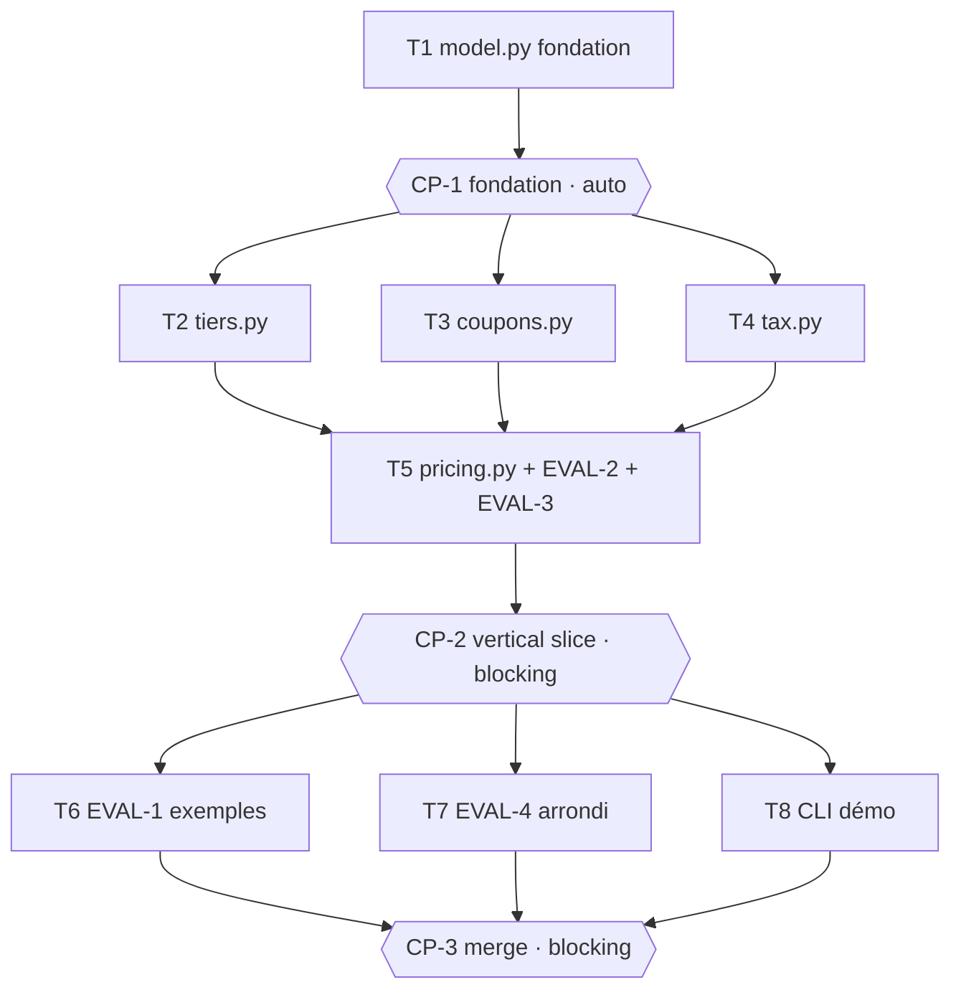

# Tasks — Moteur de tarification de panier

> **Le DO.** Généré par `planner` à partir de spec.md v1.0.0 + design.md v1.0.0, à valider par
> l'Owner AVANT exécution. La topologie suit le design §1 : `model.py` est la **fondation partagée**
> (aucune dépendance) ; au-dessus, **trois modules de calcul purs et mutuellement indépendants**
> (`tiers`, `coupons`, `tax`) dont les signatures sont pinnées (design §5) tournent en **une vague
> parallèle** (chemins source ET tests disjoints, jamais deux `test_*` homonymes — collision pytest
> connue). `pricing.py` les **compose** dans l'ordre canonique (ADR-2) : c'est le SEUL niveau où la
> réconciliation (INV-3) est exerçable de bout en bout → il porte EVAL-2 (property 1000 paniers, seed
> fixe) et EVAL-3 (déterminisme/idempotence). Restent EVAL-1 (exemples), EVAL-4 (arrondi half-up) et
> la CLI, indépendants entre eux → dernière vague parallèle. Trois checkpoints : un après la fondation,
> un après la composition (vertical slice complet), un de merge final.

## Execution graph

## Tasks

### T1 — Fondation partagée : model.py (types + validation + constantes)
- **agent :** implementer · **depends_on :** — · **parallel_group :** A *(point d'entrée, aucune dépendance)*
- **implements :** [INV-1, INV-2]
- **anchored_on :** ADR-1 (tout en entiers : cents + bps) + design §5 (signatures pinnées)
- **files_touched :** `src/pricing/__init__.py`, `src/pricing/model.py`, `tests/pricing_model/`
- **prompt :**
  > Implémente la fondation partagée `src/pricing/model.py` conformément à spec.md (INV-1, INV-2) et
  > design.md §5 (ADR-1). C'est la seule dépendance commune des trois modules de calcul : ses signatures
  > sont un CONTRAT, respecte-les À L'IDENTIQUE. Tests AVANT code, sous `tests/pricing_model/`.
  > - Constantes du contrat : `TIER_SCHEDULE = ((50, 1000), (20, 500))` (barème §4, testé du plus haut
  >   palier au plus bas) ; `COUPON_TYPES = ("PERCENT", "FIXED", "FREE_SHIPPING")`.
  > - Dataclasses `frozen=True` : `Line(sku, qty, unit_price_cents)`, `Coupon(code, type, value,
  >   stackable, priority, valid_from, valid_to)`, `Context(shipping_cents, free_shipping_threshold_cents,
  >   tax_bps, current_day)`. Tous les montants/taux sont des `int` (INV-1, aucun float).
  > - Parseurs/validation : `parse_cart(cart: dict) -> list[Line]` (rejette `qty < 0` ou
  >   `unit_price_cents < 0`), `parse_coupons(raw: list[dict]) -> list[Coupon]` (rejette un `type`
  >   absent de `COUPON_TYPES`), `parse_context(ctx: dict) -> Context`. La garde anti-négatif sert
  >   INV-2 en amont du calcul. AUCUNE logique de calcul de prix ici (pas de remise, pas de TVA).
  > - Écris les tests unitaires des bornes/validation (qty négatif rejeté, type de coupon inconnu
  >   rejeté, dataclasses bien gelées). `import pricing.model` doit marcher (pytest.ini `pythonpath=["src"]`).
  > Ne touche à aucun autre fichier (tiers/coupons/tax/pricing/cli sont d'autres tâches).
- **done_when :** `uv run pytest -q tests/pricing_model` vert (validation des entrées + dataclasses gelées)
- **verify :** `uv run pytest -q tests/pricing_model`
- **status :** ☐ pending → ☐ running → ☐ done

### CP-1 — CHECKPOINT : fondation model.py
- **trigger :** auto quand [T1] done
- **validator :** Owner
- **mode :** auto *(vérification mécanique : la fondation n'embarque aucune décision métier ni intégration
  externe ni donnée réelle (NG-1) — uniquement des types, des constantes du contrat et des gardes de
  validation, vérifiés par les tests unitaires de T1 + le rapport reviewer (conformité des signatures
  pinnées design §5). Si panel ≠ PASS ou tests rouges, bascule automatiquement en blocking.)*
- **reviews :** diff complet de `src/pricing/model.py`, conformité ADR-1 + signatures design §5, gardes
  INV-1/INV-2, écarts spec éventuels — rapport `reviewer` généré dans `.runs/CP-1-review.md`
- **on_reject :** `scripts/reject.sh CP-1 work/panier-pricing "raison" [T1]` — T1 rouvre avec la raison,
  le checkpoint se re-présente (max 2 rejets). Trou de spec → amender spec.md d'abord (commit séparé).

### T2 — tiers.py : remise de ligne par palier de quantité
- **agent :** implementer · **depends_on :** [CP-1] · **parallel_group :** B *(∥ T3, T4 : fichiers source ET tests disjoints)*
- **implements :** [BHV-3, BHV-3a, BHV-3b]
- **anchored_on :** ADR-1 (`floor(montant * bps // 10000)`) + golden `remise-paliers` (design §2)
- **files_touched :** `src/pricing/tiers.py`, `tests/pricing_tiers/`
- **prompt :**
  > Implémente `src/pricing/tiers.py` conformément à spec.md (BHV-3, BHV-3a, BHV-3b, barème §4) et
  > design.md §5 (ADR-1). Pur, ne dépend QUE de `pricing.model` (`Line`, `TIER_SCHEDULE`). Tests AVANT
  > code, sous `tests/pricing_tiers/` (noms uniques, ex. `test_tiers_palier.py` — jamais homonymes des
  > autres modules). Signatures pinnées à respecter :
  > - `tier_bps(qty: int) -> int` : 1000 si `qty >= 50`, 500 si `qty >= 20`, sinon 0. Le palier le plus
  >   élevé atteint l'emporte (parcourir `TIER_SCHEDULE` du plus haut au plus bas). Bornes INCLUSES :
  >   `qty == 20` → 500 (BHV-3a), `qty == 50` → 1000 (BHV-3b).
  > - `line_discount(line: Line) -> int` : `floor(line.qty * line.unit_price_cents * tier_bps(qty) / 10000)`
  >   via division entière `//` (arrondi VERS LE BAS, ADR-1). Aucun float.
  > - Tests unitaires : qty=19 → 0, qty=20 → 5 %, qty=49 → 5 %, qty=50 → 10 %, et un cas de troncature
  >   `//` (montant non divisible). N'écris que ce module et ses tests.
- **done_when :** `uv run pytest -q tests/pricing_tiers` vert (paliers + bornes 20/50 incluses + troncature)
- **verify :** `uv run pytest -q tests/pricing_tiers`
- **status :** ☐ pending → ☐ running → ☐ done

### T3 — coupons.py : validité, dédoublonnage, cumul, plafond
- **agent :** implementer · **depends_on :** [CP-1] · **parallel_group :** B *(∥ T2, T4 : fichiers source ET tests disjoints)*
- **implements :** [BHV-4, BHV-5, BHV-6, BHV-6a, BHV-6b, BHV-8, BHV-9, INV-4, INV-6]
- **anchored_on :** ADR-4 (plafond à chaque étape, jamais négatif) + ADR-2 (tri canonique interne)
- **files_touched :** `src/pricing/coupons.py`, `tests/pricing_coupons/`
- **prompt :**
  > Implémente `src/pricing/coupons.py` conformément à spec.md (BHV-4, BHV-5, BHV-6, BHV-6a, BHV-6b,
  > BHV-8, BHV-9, INV-4, INV-6) et design.md §5 (ADR-4, ADR-2). Pur, ne dépend QUE de `pricing.model`
  > (`Coupon`). Tests AVANT code, sous `tests/pricing_coupons/` (noms uniques, ex. `test_coupons_cumul.py`).
  > Signatures pinnées :
  > - `@dataclass(frozen=True) class CouponOutcome: coupon_discounts: int; applied_codes: list[str]; free_shipping: bool`
  > - `resolve_coupons(goods_after_lines: int, coupons: list[Coupon], current_day: int) -> CouponOutcome`.
  > Pipeline interne : (1) filtrer la validité `valid_from <= current_day <= valid_to`, bornes incluses
  > (BHV-8 : hors fenêtre = ignoré, jamais dans `applied_codes`) ; (2) dédoublonner par `code` — deux
  > entrées de même code = une seule (INV-6, BHV-9) ; (3) règle de cumul DÉTERMINISTE : si TOUS les
  > coupons valides sont `stackable: true`, les appliquer TOUS dans l'ordre canonique `priority` croissant
  > puis `code` alphabétique, chacun sur la marchandise courante (BHV-6a) ; si au moins un coupon valide
  > est `stackable: false`, n'appliquer QU'UN SEUL coupon — celui produisant la plus GROSSE remise parmi
  > tous les valides, égalité tranchée par `priority` le plus bas puis `code` (BHV-6b). `FREE_SHIPPING`
  > ne touche pas `coupon_discounts` mais positionne `free_shipping=True`.
  > - Montants : `PERCENT` → `floor(goods_courants * value // 10000)` ; `FIXED` → `value` cents.
  >   Chaque remise est PLAFONNÉE à la marchandise courante `min(remise, marchandise)` et la marchandise
  >   ne descend jamais sous 0 (ADR-4, BHV-5, INV-2) ; `coupon_discounts` cumulé ≤ `goods_after_lines`
  >   (INV-4). `applied_codes` est trié dans l'ordre d'application.
  > - Tests unitaires : PERCENT cumulable (BHV-4), FIXED plafonné laissant marchandise à 0 (BHV-5),
  >   tous stackables appliqués en ordre canonique (BHV-6a), exclusif battant le cumulable (BHV-6b),
  >   coupon hors fenêtre ignoré (BHV-8), doublon = une occurrence (BHV-9/INV-6), indifférence à l'ordre
  >   d'entrée du tableau. N'écris que ce module et ses tests.
- **done_when :** `uv run pytest -q tests/pricing_coupons` vert (validité + dédoublonnage + cumul 6a/6b + plafond)
- **verify :** `uv run pytest -q tests/pricing_coupons`
- **status :** ☐ pending → ☐ running → ☐ done

### T4 — tax.py : arrondi half-up isolé + calcul de TVA
- **agent :** implementer · **depends_on :** [CP-1] · **parallel_group :** B *(∥ T2, T3 : fichiers source ET tests disjoints)*
- **implements :** [INV-7, BHV-10]
- **anchored_on :** ADR-3 (half-up `(num + den // 2) // den`, une seule fois) + golden `arrondi-comptable` (design §2)
- **files_touched :** `src/pricing/tax.py`, `tests/pricing_tax/`
- **prompt :**
  > Implémente `src/pricing/tax.py` conformément à spec.md (INV-7, BHV-10) et design.md §5 (ADR-3).
  > Pur, ne dépend que de `pricing.model` (ou de rien). Isolé exprès pour que la règle d'arrondi soit
  > testable seule. Tests AVANT code, sous `tests/pricing_tax/` (noms uniques, ex. `test_tax_halfup.py`).
  > Signatures pinnées :
  > - `round_half_up(numerator: int, denominator: int) -> int` : arrondi au plus proche, la demie
  >   arrondit VERS LE HAUT — `(numerator + denominator // 2) // denominator` (INV-7). Entiers uniquement.
  > - `compute_tax(taxable_base_cents: int, tax_bps: int) -> int` : `round_half_up(taxable_base_cents *
  >   tax_bps, 10000)` — arrondi appliqué UNE SEULE FOIS sur la base totale, jamais par ligne (INV-7,
  >   BHV-10 : la base taxable est `goods_final + shipping`, mais la composition est faite par `pricing`,
  >   pas ici ; `tax.py` ne reçoit que la base déjà assemblée).
  > - Tests unitaires : un cas tombant sur `x.5` centime → `x+1` (half-up), un cas `x.49` → `x` (arrondi
  >   bas), TVA 20 % de 2500 = 500 (cas EX-2). N'écris que ce module et ses tests.
- **done_when :** `uv run pytest -q tests/pricing_tax` vert (half-up sur la demie + arrondi unique)
- **verify :** `uv run pytest -q tests/pricing_tax`
- **status :** ☐ pending → ☐ running → ☐ done

### T5 — pricing.py : composition, port/franco, réconciliation (+ EVAL-2 + EVAL-3)
- **agent :** implementer · **depends_on :** [T2, T3, T4] · **parallel_group :** C *(composition — dépend des trois modules)*
- **implements :** [INV-3, INV-5, BHV-1, BHV-2, BHV-7, BHV-7a, BHV-11, EVAL-2, EVAL-3]
- **anchored_on :** ADR-2 (ordre canonique figé, modules composés) + ADR-4 (bases ≥ 0 pour port/TVA)
- **files_touched :** `src/pricing/pricing.py`, `tests/pricing_pipeline/`
- **prompt :**
  > Implémente `src/pricing/pricing.py` — l'orchestrateur de calcul — conformément à spec.md (INV-3,
  > INV-5, BHV-1, BHV-2, BHV-7, BHV-7a, BHV-11) et design.md §5 (ADR-2, ADR-4). COMPOSE les modules
  > livrés en T2/T3/T4 ; ne RÉIMPLÉMENTE aucune de leurs règles (réutilise `tiers.line_discount`,
  > `coupons.resolve_coupons`, `tax.compute_tax`). Tests AVANT code, sous `tests/pricing_pipeline/`.
  > Signature pinnée : `price(cart: dict, coupons: list[dict], context: dict) -> dict`.
  > Ordre canonique FIGÉ (INV-5, ADR-2), indépendant de l'ordre du tableau `coupons` en entrée (le tri
  > vit dans `coupons.resolve_coupons`) : (1) `goods_subtotal` = somme `qty*unit_price_cents` ;
  > (2) `line_discounts` = somme de `tiers.line_discount` par ligne ; (3) `coupon_discounts` via
  > `resolve_coupons` sur la marchandise après remises de ligne ; (4) `goods_final = goods_subtotal -
  > line_discounts - coupon_discounts` (≥ 0, ADR-4) ; (5) port : `shipping = 0` si `goods_final >=
  > free_shipping_threshold_cents` (seuil INCLUS, BHV-7a) OU si un `FREE_SHIPPING` valide est appliqué,
  > sinon `context.shipping_cents` (BHV-7) ; (6) `tax = compute_tax(goods_final + shipping, tax_bps)`.
  > `total = goods_final + shipping + tax` (BHV-11). Panier vide : tout à zéro, AUCUN port facturé,
  > `applied_coupons == []` (BHV-1). La sortie est un `dict` aux clés EXACTES de spec §3 (`goods_subtotal,
  > line_discounts, coupon_discounts, goods_final, shipping, tax, total, applied_coupons`), tous entiers,
  > `applied_coupons` = `list[str]` triée dans l'ordre d'application.
  > La RÉCONCILIATION (INV-3) est garantie par construction. Écris :
  > - EVAL-2 (`tests/pricing_pipeline/test_eval_2_property.py`, `@pytest.mark.eval`, fonctions dont le
  >   nom contient `eval_2`) : `random.Random(<seed fixe>)` génère 1000 paniers (lignes, coupons, context
  >   variés) ; pour CHAQUE panier vérifier INV-1 (toutes les valeurs de sortie sont `int`), INV-2
  >   (`total >= 0` et `goods_final >= 0`), INV-3 (`total == goods_final + shipping + tax`), INV-4
  >   (`line_discounts + coupon_discounts <= goods_subtotal`).
  > - EVAL-3 (`tests/pricing_pipeline/test_eval_3_determinism.py`, `@pytest.mark.eval`, noms contenant
  >   `eval_3`) : (a) deux appels identiques → ventilation identique ; (b) permuter l'ordre du tableau
  >   `coupons` → même résultat (INV-5) ; (c) dupliquer un coupon → même résultat qu'une occurrence
  >   (INV-6, BHV-9).
  > Écris aussi les tests des cas BHV-1/BHV-2/BHV-7/BHV-7a sous `tests/pricing_pipeline/`. Ne touche pas
  > à model/tiers/coupons/tax ni à leurs tests (CLI et EVAL-1/EVAL-4 sont d'autres tâches).
- **done_when :** `uv run pytest -q -m eval tests/pricing_pipeline` vert (EVAL-2 + EVAL-3 collectées et vertes) ET `uv run pytest -q tests/pricing_pipeline` vert
- **verify :** `uv run pytest -q -m eval tests/pricing_pipeline`
- **status :** ☐ pending → ☐ running → ☐ done

### CP-2 — CHECKPOINT : vertical slice complet (composition + réconciliation)
- **trigger :** auto quand [T5] done
- **validator :** Owner
- **mode :** blocking *(le pipeline complet matérialise les décisions métier les plus sensibles — règle de
  cumul exclusif BHV-6b (risque H, design §8), réconciliation INV-3 (KPI « 0 écart »), franco BHV-7 — et
  c'est le premier point où la ventilation de bout en bout est démontrable à un humain. Décision métier +
  démo = blocking, pas une simple vérif mécanique.)*
- **reviews :** diff complet de `src/pricing/`, démo locale d'un calcul de panier, EVAL-2 (property 1000
  paniers) + EVAL-3 (déterminisme/idempotence) vertes, conformité ADR-2/ADR-4, BHV-6b et INV-3 vérifiés,
  écarts spec éventuels — rapport `reviewer` généré dans `.runs/CP-2-review.md`
- **on_reject :** `scripts/reject.sh CP-2 work/panier-pricing "raison" [T5]` — T5 rouvre avec la raison
  (ou cibler T2/T3/T4 si la dérive vient d'un module composé), le checkpoint se re-présente (max 2 rejets).
  Trou de spec → amender spec.md d'abord (commit séparé).

### T6 — EVAL-1 : exemples EX-1 à EX-8 (déterministe)
- **agent :** implementer · **depends_on :** [CP-2] · **parallel_group :** D *(∥ T7, T8 : fichiers disjoints)*
- **implements :** [EVAL-1, BHV-1, BHV-2, BHV-3, BHV-3a, BHV-3b, BHV-4, BHV-5, BHV-6, BHV-6b, BHV-7, BHV-8, BHV-10, BHV-11]
- **anchored_on :** ADR-2 (pipeline canonique vérifié de bout en bout)
- **files_touched :** `tests/pricing_evals/test_eval_1_examples.py`
- **prompt :**
  > Écris EVAL-1 (`@pytest.mark.eval`, fonctions dont le nom contient `eval_1`, ex.
  > `test_eval_1_ex2_ligne_simple`) qui vérifie EXACTEMENT les exemples EX-1 à EX-8 de spec.md §7 contre
  > `pricing.price` (livré en T5), avec le contexte par défaut de spec §7 (`shipping_cents=500`,
  > `free_shipping_threshold_cents=5000`, `tax_bps=2000`, `current_day=10`) sauf override d'exemple.
  > Compare TOUTES les clés de la ventilation à l'identique (valeurs ET `applied_coupons`) : EX-1 panier
  > vide (BHV-1), EX-2 ligne simple (BHV-2/BHV-10/BHV-11), EX-3 palier 5 % à qty=20 inclus + franco
  > (BHV-3/BHV-3a/BHV-7), EX-4 palier 10 % à qty=50 inclus (BHV-3b/BHV-7), EX-5 coupon PERCENT cumulable
  > (BHV-4), EX-6 FIXED plafonné total>0 (BHV-5/BHV-11), EX-7 exclusif bat le cumulable (BHV-6/BHV-6b),
  > EX-8 coupon expiré ignoré (BHV-8). N'écris que ce fichier.
- **done_when :** EVAL-1 collectée + verte à 100 % (`uv run pytest -q -m eval tests/pricing_evals/test_eval_1_examples.py`)
- **verify :** `uv run pytest -q -m eval tests/pricing_evals/test_eval_1_examples.py`
- **status :** ☐ pending → ☐ running → ☐ done

### T7 — EVAL-4 : arrondi half-up & absence de double arrondi (déterministe)
- **agent :** implementer · **depends_on :** [CP-2] · **parallel_group :** D *(∥ T6, T8 : fichiers disjoints)*
- **implements :** [EVAL-4, INV-7, BHV-10]
- **anchored_on :** ADR-3 (arrondi isolé, une seule fois)
- **files_touched :** `tests/pricing_evals/test_eval_4_rounding.py`
- **prompt :**
  > Écris EVAL-4 (`@pytest.mark.eval`, noms contenant `eval_4`, ex. `test_eval_4_halfup`) contre
  > `pricing.price` (livré en T5) conformément à spec.md (EVAL-4, INV-7, BHV-10) : (a) construis un panier
  > dont la TVA tombe EXACTEMENT sur `x.5` centime (base taxable telle que `base * tax_bps / 10000` ait une
  > partie fractionnaire de `0.5`) et vérifie qu'elle arrondit à `x+1` (half-up) ; (b) vérifie l'ABSENCE de
  > double arrondi : la TVA d'un panier MULTI-LIGNES est égale à la TVA calculée UNE SEULE FOIS sur la base
  > totale (`goods_final + shipping`), pas à la somme d'arrondis par ligne. N'écris que ce fichier.
- **done_when :** EVAL-4 collectée + verte à 100 % (`uv run pytest -q -m eval tests/pricing_evals/test_eval_4_rounding.py`)
- **verify :** `uv run pytest -q -m eval tests/pricing_evals/test_eval_4_rounding.py`
- **status :** ☐ pending → ☐ running → ☐ done

### T8 — CLI de démo manuelle
- **agent :** implementer · **depends_on :** [CP-2] · **parallel_group :** D *(∥ T6, T7 : fichiers disjoints)*
- **implements :** [INV-5]
- **anchored_on :** ADR-1 (le temps reste une donnée d'entrée — `current_day` en argument, jamais `now()`)
- **files_touched :** `src/pricing/cli.py`
- **prompt :**
  > Implémente `src/pricing/cli.py` : argparse minimal (design.md §1) au-dessus de `pricing.price` livré
  > en T5, pour une démo manuelle (panier + coupons en JSON sur l'entrée/les arguments → ventilation
  > affichée). Aucune NOUVELLE règle métier, aucun I/O persistant (NG-1). Le temps est un argument
  > (`--current-day`), jamais `now()` (INV-5, déterminisme). Lancement : `PYTHONPATH=src uv run python -m
  > pricing.cli --help` doit sortir en code 0. Ne touche pas à model/tiers/coupons/tax/pricing ni aux tests.
- **done_when :** `PYTHONPATH=src uv run python -m pricing.cli --help` sort en code 0
- **verify :** `PYTHONPATH=src uv run python -m pricing.cli --help`
- **status :** ☐ pending → ☐ running → ☐ done

### CP-3 — CHECKPOINT : revue finale & merge
- **trigger :** auto quand [T6, T7, T8] sont done
- **validator :** Owner
- **mode :** blocking *(merge — toujours humain, le plan-lint refuse un CP final auto. Revue de la suite
  d'évals complète EVAL-1..EVAL-4 et de la traçabilité commits ↔ IDs de spec avant intégration.)*
- **reviews :** diff complet, démo CLI locale, suite d'évals EVAL-1/EVAL-2/EVAL-3/EVAL-4 vertes,
  traçabilité commits ↔ IDs de spec, KPI « 0 écart de réconciliation » (INV-3) confirmé, écarts spec
  éventuels — rapport `reviewer` dans `.runs/CP-3-review.md`
- **on_reject :** `scripts/reject.sh CP-3 work/panier-pricing "raison" [T6 T7 T8]` — les tâches visées
  rouvrent avec la raison, le checkpoint se re-présente (max 2 rejets, puis arrêt).

## Trigger table — qui déclenche quoi

| Événement | Déclencheur | Action |
|---|---|---|
| tasks.md approuvé (modes des CP compris) | **Owner** | lance T1 |
| Tâche done + verify + evals vertes | **automatique** | commit scopé ; débloque les dépendants ; vague suivante |
| Eval/verify rouge | **automatique** | la tâche repasse `running`, l'agent corrige (max 3, puis escalade) |
| `STATUS: blocked` (trou de spec) | **automatique** | pause du sous-arbre, OQ-n dans spec.md §10, notif Owner |
| CP-1 atteint (auto) | **automatique** | reviewer ; PASS + tests verts = validé ; sinon bascule blocking |
| CP-2 atteint (blocking) | **automatique** | rapport reviewer généré, notif Owner, exécution EN PAUSE |
| CP-3 atteint (blocking) | **automatique** | rapport reviewer généré, notif Owner, exécution EN PAUSE |
| Checkpoint validé (`approve.sh`) | **Owner** | reprise / merge (CP-3 — jamais automatique) |
| Checkpoint rejeté (`reject.sh` + raison) | **Owner** | réouverture des tâches visées, re-présentation (max 2 rejets) |

## Run log

*Rempli au fil de l'eau par les agents. Audit trail complémentaire du Git log.*

| Date | Tâche | Agent | Résultat | Commit |
|---|---|---|---|---|
| | | | | |
