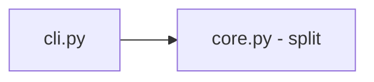

# Design — Répartition d'un montant en parts entières

> **Le COMMENT.** Cœur pur, sans I/O. Une seule fonction arithmétique entière + une CLI de
> démo. On s'adosse au pattern « domaine pur, sans effet de bord » (cosmicpython, chap. 1-2)
> et à la discipline d'arithmétique entière des golden tasks `arrondi-comptable` du lab
> (jamais de flottant). *(Pour une vraie feature LMFR : design-scout sur les repos réels.)*

## 1. Architecture overview



Deux modules sous `src/repartition/` :
- `core.py` — `split(total, parts) -> list[int]` : valide les entrées (INV → ValueError),
  calcule `base = total // parts` et `r = total % parts`, renvoie `r` fois `base+1` puis
  `parts-r` fois `base`. Aucune I/O, aucun aléa.
- `cli.py` — argparse minimal pour une démo manuelle (`--total`, `--parts`).

## 2. Reference repositories

| Problème | Référence | Pattern emprunté | Lien |
|---|---|---|---|
| Domaine pur sans I/O | `cosmicpython/code` | fonction pure testable sans infra | chap. 1-2 |
| Arithmétique entière | golden `arrondi-comptable` (lab) | `//` et `%`, jamais de float | `evals/golden/arrondi-comptable` |

## 3. Stack

| Couche | Choix | Justifié par |
|---|---|---|
| Runtime | Python 3.12, stdlib uniquement | feature pure, zéro dépendance (NG-1) |
| Tests/evals | pytest (marker `eval`), `random.Random(seed)` fixe pour EVAL-2 | conventions du lab, déterminisme (INV-3) |

## 4. ADRs

### ADR-1 — Reste distribué aux premières parts, tout en entiers
- **Status :** accepted
- **Context :** INV-1 (conservation), INV-2 (équilibre), INV-3 (déterminisme), BHV-2.
- **Decision :** `base, r = divmod(total, parts)` ; résultat = `[base + 1] * r + [base] * (parts - r)`.
  Distribution du reste aux `r` premières parts → déterministe et `max-min ≤ 1` par construction.
- **Anchored on :** golden `arrondi-comptable` (entiers), algorithme de répartition standard.
- **Consequences :** aucune perte/création d'unité ; liste en ordre décroissant-ou-égal.

### ADR-2 — Entrées invalides → `ValueError`, validées en tête
- **Status :** accepted
- **Context :** BHV-4 (`parts<=0`, `total<0`).
- **Decision :** garde en début de `split` : `if parts <= 0 or total < 0: raise ValueError(...)`.
- **Consequences :** contrat d'erreur clair, testable (EVAL-3).

## 5. Contracts & data (signatures — pinnées)

```python
# core.py
def split(total: int, parts: int) -> list[int]: ...   # len == parts, sum == total, max-min <= 1

# cli.py
def main(argv: list[str] | None = None) -> int: ...    # argparse --total --parts, jamais de now()
```

## 6. Mozaïc & Adeo Global Ready

N/A en test E2E (pas de front).

## 7. Observability & rollout

N/A en test E2E. (`split` est pur → rejouer une entrée suffit à reproduire tout incident.)

## 8. Risks

| Risque | Prob. | Impact | Mitigation |
|---|---|---|---|
| Reste mal distribué (somme ≠ total) | M | H | ADR-1 + EVAL-2 (INV-1 sur 1000 cas) |
| Déséquilibre > 1 | L | M | EVAL-2 (INV-2) |
| Entrée invalide non gérée | M | M | ADR-2 + EVAL-3 |

## 9. Changelog

| Version | Date | Auteur | Changement |
|---|---|---|---|
| 1.0.0 | 2026-06-15 | technique (simulé) + design-scout | Création |
