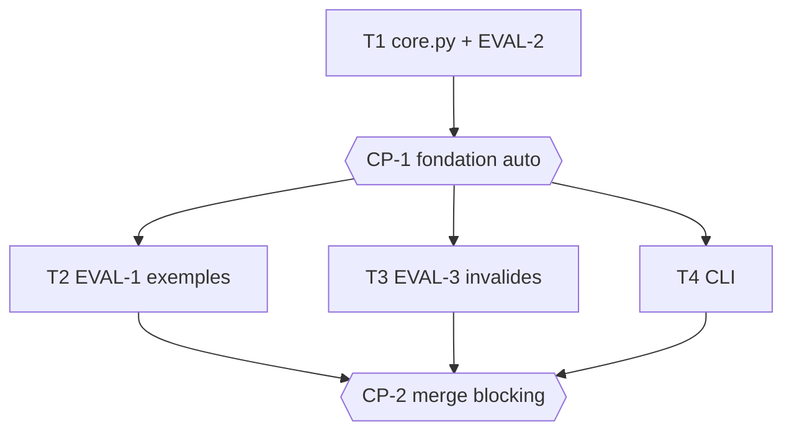

# Tasks — Répartition d'un montant en parts entières

> **Le DO.** `core.py` est la fondation (split + EVAL-2 property). Une fois auto-gaté (CP-1),
> EVAL-1 (exemples), EVAL-3 (invalides/déterminisme) et la CLI sont indépendants (fichiers
> disjoints) → une vague parallèle 3-wide. CP-2 = merge (blocking).

## Execution graph

## Tasks

### T1 — core.py : split + EVAL-2 (property)
- **agent :** implementer · **depends_on :** — · **parallel_group :** A
- **implements :** [INV-1, INV-2, INV-3, INV-4, BHV-1, BHV-2, BHV-3, BHV-3a, BHV-4, EVAL-2]
- **anchored_on :** ADR-1 (divmod, entiers) + ADR-2 (ValueError) + design §5
- **files_touched :** `src/repartition/__init__.py`, `src/repartition/core.py`, `tests/repartition_core/`
- **prompt :**
  > Implémente `src/repartition/core.py` conformément à spec.md (INV-1..INV-4, BHV-1..BHV-4) et
  > design.md §5 (ADR-1, ADR-2). Tests AVANT code, sous `tests/repartition_core/`.
  > Signature pinnée : `split(total: int, parts: int) -> list[int]`. `base, r = divmod(total, parts)` ;
  > retourne `[base + 1] * r + [base] * (parts - r)`. Garde d'entrée : `parts <= 0` ou `total < 0`
  > → `raise ValueError`. Aucun float, aucun `now()`, aucun aléa dans le code.
  > EVAL-2 (`tests/repartition_core/test_eval_2_property.py`, `@pytest.mark.eval`, noms contenant
  > `eval_2`) : `random.Random(<seed fixe>)` génère 1000 couples `(total in [0,10000], parts in
  > [1,100])` ; pour chacun vérifier INV-1 (`sum == total`), INV-2 (`max - min <= 1`), INV-4
  > (`len == parts`), et que tous les éléments sont des `int`. Écris aussi les tests unitaires des
  > bornes (division exacte, reste, total<parts, total=0, entrées invalides). N'écris que ces fichiers.
- **done_when :** `uv run pytest -q tests/repartition_core` vert ET EVAL-2 collectée + verte (`-m eval`)
- **verify :** `uv run pytest -q tests/repartition_core`
- **status :** ☐ pending → ☐ running → ☐ done

### CP-1 — CHECKPOINT : fondation core
- **trigger :** auto quand [T1] done
- **validator :** Owner
- **mode :** auto *(vérification mécanique : domaine pur entièrement gaté par EVAL-2 (property 1000
  cas) + rapport reviewer ; aucune décision métier, aucune donnée réelle (NG-1). Bascule blocking si
  panel ≠ PASS ou evals rouges.)*
- **reviews :** diff de `src/repartition/`, conformité ADR-1/ADR-2 + signatures design §5, EVAL-2 —
  rapport `reviewer` dans `.runs/CP-1-review.md`
- **on_reject :** `scripts/reject.sh CP-1 work/repartition "raison" [T1]` (max 2 rejets).

### T2 — EVAL-1 : exemples EX-1 à EX-5 (déterministe)
- **agent :** implementer · **depends_on :** [CP-1] · **parallel_group :** B *(∥ T3, T4 : fichiers disjoints)*
- **implements :** [EVAL-1, BHV-1, BHV-2, BHV-3, BHV-3a]
- **anchored_on :** ADR-1
- **files_touched :** `tests/repartition_evals/test_eval_1_examples.py`
- **prompt :**
  > Écris EVAL-1 (`@pytest.mark.eval`, fonctions dont le nom contient `eval_1`) qui vérifie EXACTEMENT
  > les exemples EX-1 à EX-5 de spec.md §6 contre `repartition.core.split` (livré en T1) : EX-1 [3,3,3],
  > EX-2 [4,3,3], EX-3 [4,3], EX-4 [1,1,0,0,0], EX-5 [0,0,0]. Valeurs identiques. N'écris que ce fichier.
- **done_when :** EVAL-1 collectée + verte à 100 % (`uv run pytest -q -m eval tests/repartition_evals/test_eval_1_examples.py`)
- **verify :** `uv run pytest -q -m eval tests/repartition_evals/test_eval_1_examples.py`
- **status :** ☐ pending → ☐ running → ☐ done

### T3 — EVAL-3 : entrées invalides + déterminisme
- **agent :** implementer · **depends_on :** [CP-1] · **parallel_group :** B *(∥ T2, T4 : fichiers disjoints)*
- **implements :** [EVAL-3, BHV-4, INV-3]
- **anchored_on :** ADR-2
- **files_touched :** `tests/repartition_evals/test_eval_3_invalides.py`
- **prompt :**
  > Écris EVAL-3 (`@pytest.mark.eval`, noms contenant `eval_3`) contre `repartition.core.split` : (a)
  > `parts <= 0` et `total < 0` lèvent `ValueError` (BHV-4) — utilise `pytest.raises` ; (b) déterminisme
  > (INV-3) : deux appels identiques renvoient une liste identique. N'écris que ce fichier.
- **done_when :** EVAL-3 collectée + verte à 100 % (`uv run pytest -q -m eval tests/repartition_evals/test_eval_3_invalides.py`)
- **verify :** `uv run pytest -q -m eval tests/repartition_evals/test_eval_3_invalides.py`
- **status :** ☐ pending → ☐ running → ☐ done

### T4 — CLI de démo
- **agent :** implementer · **depends_on :** [CP-1] · **parallel_group :** B *(∥ T2, T3 : fichiers disjoints)*
- **implements :** [INV-3]
- **anchored_on :** ADR-1 (le calcul reste pur ; entrées en arguments, jamais `now()`)
- **files_touched :** `src/repartition/cli.py`
- **prompt :**
  > Implémente `src/repartition/cli.py` : argparse minimal (`--total`, `--parts`) au-dessus de
  > `repartition.core.split` (livré en T1), affiche la répartition. Aucune nouvelle règle métier, aucun
  > I/O persistant (NG-1), jamais `now()`. `PYTHONPATH=src uv run python -m repartition.cli --help`
  > sort en code 0. Ne touche pas à core.py ni aux tests.
- **done_when :** `PYTHONPATH=src uv run python -m repartition.cli --help` sort en code 0
- **verify :** `PYTHONPATH=src uv run python -m repartition.cli --help`
- **status :** ☐ pending → ☐ running → ☐ done

### CP-2 — CHECKPOINT : revue finale & merge
- **trigger :** auto quand [T2, T3, T4] sont done
- **validator :** Owner
- **mode :** blocking *(merge — toujours humain ; le plan-lint refuse un CP final auto.)*
- **reviews :** diff complet, démo CLI, EVAL-1/EVAL-2/EVAL-3 vertes, traçabilité commits ↔ IDs —
  rapport `reviewer` dans `.runs/CP-2-review.md`
- **on_reject :** `scripts/reject.sh CP-2 work/repartition "raison" [T2 T3 T4]` (max 2 rejets).

## Trigger table — qui déclenche quoi

| Événement | Déclencheur | Action |
|---|---|---|
| tasks.md approuvé | **Owner** | lance T1 |
| Tâche done + verify + evals vertes | **automatique** | commit scopé ; débloque dépendants |
| CP-1 (auto) | **automatique** | reviewer ; PASS + evals = validé ; sinon blocking |
| CP-2 (blocking) | **automatique** | rapport reviewer, notif Owner, pause |
| Checkpoint validé | **Owner** | reprise / merge |

## Run log

| Date | Tâche | Agent | Résultat | Commit |
|---|---|---|---|---|
| | | | | |
| 2026-06-15 15:00 | T1 | implementer | done, evals vertes (t1) | |
| 2026-06-15 15:02 | CP-1 | reviewer | checkpoint auto-validé (PASS, evals vertes) | |
| 2026-06-15 15:02 | T4 | implementer | done, evals vertes (t1) | |
| 2026-06-15 15:02 | T2 | implementer | done, evals vertes (t1) | |
| 2026-06-15 15:03 | T3 | implementer | done, evals vertes (t1) | |
