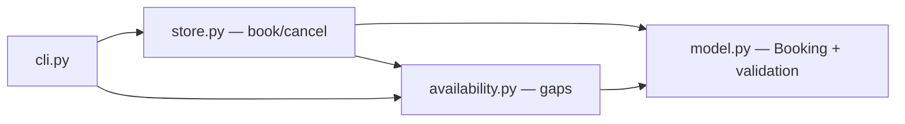

# Design — Room booking

> **The HOW.** Pure business core in memory, no I/O. We lean on the "pure domain +
> in-memory store" pattern (cosmicpython, *Architecture Patterns with Python*, ch. 1-2):
> entities and rules testable without infrastructure. *(For a real feature: design-scout on the real repos.)*

## 1. Architecture overview

Four modules under `src/booking/`:
- `model.py` — `Booking` (dataclass: id, room_id, start, end, holder, status) + INV-2/INV-3 validation + overlap test between two slots.
- `store.py` — in-memory `BookingStore`: `book(...)`, `cancel(id)`, `confirmed(room_id)`. Enforces INV-1 (overlap rejection) by relying on `model`.
- `availability.py` — `availability(store, room_id, window_start, window_end)`: computes gaps from `confirmed` bookings.
- `cli.py` — minimal argparse for a manual demo.

## 2. Reference repositories

| Problem | OSS reference | Borrowed pattern | Link |
|---|---|---|---|
| Pure domain + in-memory store | `cosmicpython/code` | entities/rules without I/O, injected store | ch. 1-2 |
| Overlap detection | standard algorithm | `a.start < b.end and b.start < a.end` (half-open intervals) | — |

## 3. Stack

| Layer | Choice | Justified by |
|---|---|---|
| Runtime | Python 3.12, stdlib only | pure feature, zero runtime dependency |
| Tests/evals | pytest (marker `eval`), `random` with fixed seed for EVAL-2 | lab conventions |

## 4. ADRs

### ADR-1 — Half-open intervals `[start, end)`, time in minutes (int)
- **Status:** accepted
- **Context:** adjacent slots must not count as an overlap (BHV-1a), and we must stay deterministic (no `datetime.now`).
- **Decision:** slots `[start, end)` in minutes since midnight (int 0..1440). Overlap = `a.start < b.end and b.start < a.end`.
- **Anchored on:** standard interval-intersection algorithm.
- **Alternatives:** datetime (rejected: non-deterministic, out of scope NG-2).
- **Consequences:** one day = 0..1440; no multi-day (assumed, NG-2).

### ADR-2 — In-memory store, `status` rather than deletion
- **Status:** accepted
- **Context:** cancelling must free the slot (BHV-3) but keep a trace.
- **Decision:** `cancel` sets `status="cancelled"`; only `confirmed` ones count for overlap and availability.
- **Consequences:** soft-delete; the history stays queryable.

## 5. Contracts & data

- `BookingStore.book(room_id, start, end, holder) -> dict`: `{"status":"confirmed","id":...}` or `{"rejected": <reason>}` (reasons: `invalid_slot`, `too_long`, `overlap`).
- `BookingStore.cancel(booking_id) -> dict`: `{"status":"cancelled"}` or `{"rejected":"not_found"}`.
- `availability(store, room_id, ws, we) -> list[tuple[int,int]]`: sorted, merged gaps.

## 6. Design System & Global Ready

N/A in E2E test (no front end).

## 7. Observability & rollout

N/A in E2E test.

## 8. Risks

| Risk | Prob. | Impact | Mitigation |
|---|---|---|---|
| Boundary bug on adjacency (BHV-1a) | M | M | EVAL-1 EX-3 + EVAL-2 property-based |
| Gaps merged incorrectly in availability | M | L | EVAL-3 adjacent cases |

## 9. Changelog

| Version | Date | Author | Change |
|---|---|---|---|
| 1.0.0 | 2026-06-15 | FDE (simulated) + design-scout | Creation |
| 1.0.1 | 2026-06-18 | translation | English translation (form only, no substance change) |
