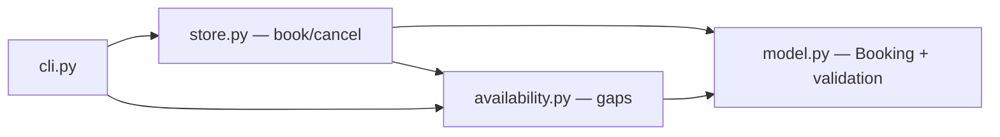

# Design — Réservation de salles

> **Le COMMENT.** Cœur métier pur en mémoire, sans I/O. On s'adosse au pattern « domaine pur +
> store en mémoire » (cosmicpython, *Architecture Patterns with Python*, chap. 1-2) : entités et
> règles testables sans infrastructure. *(Pour une vraie feature LMFR : design-scout sur les repos réels.)*

## 1. Architecture overview

Quatre modules sous `src/booking/` :
- `model.py` — `Booking` (dataclass : id, room_id, start, end, holder, status) + validation INV-2/INV-3 + test de chevauchement entre deux créneaux.
- `store.py` — `BookingStore` en mémoire : `book(...)`, `cancel(id)`, `confirmed(room_id)`. Applique INV-1 (refus overlap) en s'appuyant sur `model`.
- `availability.py` — `availability(store, room_id, window_start, window_end)` : calcule les trous à partir des réservations `confirmed`.
- `cli.py` — argparse minimal pour une démo manuelle.

## 2. Reference repositories

| Problème | Référence OSS | Pattern emprunté | Lien |
|---|---|---|---|
| Domaine pur + store en mémoire | `cosmicpython/code` | entités/règles sans I/O, store injecté | chap. 1-2 |
| Détection de chevauchement | algorithme standard | `a.start < b.end and b.start < a.end` (intervalles demi-ouverts) | — |

## 3. Stack

| Couche | Choix | Justifié par |
|---|---|---|
| Runtime | Python 3.12, stdlib uniquement | feature pure, zéro dépendance runtime |
| Tests/evals | pytest (marker `eval`), `random` à seed fixe pour EVAL-2 | conventions du lab |

## 4. ADRs

### ADR-1 — Intervalles demi-ouverts `[start, end)`, temps en minutes (int)
- **Status :** accepted
- **Context :** il faut que les créneaux adjacents ne comptent pas comme chevauchement (BHV-1a), et rester déterministe (pas de `datetime.now`).
- **Decision :** créneaux `[start, end)` en minutes depuis minuit (int 0..1440). Chevauchement = `a.start < b.end and b.start < a.end`.
- **Anchored on :** algorithme d'intersection d'intervalles standard.
- **Alternatives :** datetime (rejeté : non déterministe, hors scope NG-2).
- **Consequences :** une journée = 0..1440 ; pas de multi-jours (assumé, NG-2).

### ADR-2 — Store en mémoire, `status` plutôt que suppression
- **Status :** accepted
- **Context :** annuler doit libérer le créneau (BHV-3) mais garder une trace.
- **Decision :** `cancel` passe `status="cancelled"` ; seules les `confirmed` comptent pour overlap et availability.
- **Consequences :** soft-delete ; l'historique reste interrogeable.

## 5. Contracts & data

- `BookingStore.book(room_id, start, end, holder) -> dict` : `{"status":"confirmed","id":...}` ou `{"rejected": <raison>}` (raisons : `invalid_slot`, `too_long`, `overlap`).
- `BookingStore.cancel(booking_id) -> dict` : `{"status":"cancelled"}` ou `{"rejected":"not_found"}`.
- `availability(store, room_id, ws, we) -> list[tuple[int,int]]` : trous triés, fusionnés.

## 6. Mozaïc & Adeo Global Ready

N/A en test E2E (pas de front).

## 7. Observability & rollout

N/A en test E2E.

## 8. Risks

| Risque | Prob. | Impact | Mitigation |
|---|---|---|---|
| Bug de borne sur l'adjacence (BHV-1a) | M | M | EVAL-1 EX-3 + EVAL-2 property-based |
| Trous mal fusionnés en availability | M | L | EVAL-3 cas adjacents |

## 9. Changelog

| Version | Date | Auteur | Changement |
|---|---|---|---|
| 1.0.0 | 2026-06-15 | FDE (simulé) + design-scout | Création |
