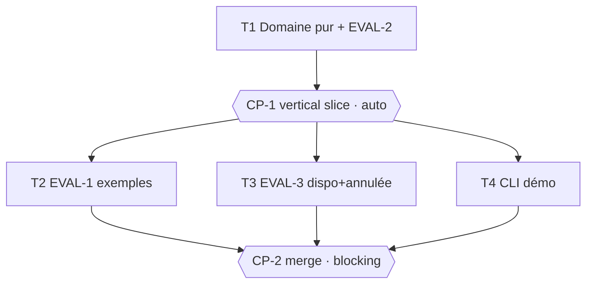

# Tasks — Réservation de salles

> **Le DO.** Généré par `planner` à partir de spec.md v1.0.0 + design.md v1.0.0, à valider par
> l'Owner AVANT exécution. Le domaine est **un cœur pur déterministe** (NG-1/NG-2/NG-3) : `model`
> → `store` → `availability` forment une **chaîne de dépendances de données** (la dispo lit le store,
> le store applique `model`). Le parallélisme réel n'apparaît donc qu'APRÈS le vertical slice : une
> fois le domaine livré et auto-gaté (CP-1), les suites d'évals restantes (EVAL-1, EVAL-3) et la démo
> CLI sont indépendantes (fichiers disjoints) et tournent en une seule vague (groupe B). En cas de
> doute on séquence (règle planner) — d'où T1 qui porte tout le domaine + EVAL-2 (property-based, qui
> exerce déjà l'ensemble) plutôt qu'un découpage model/store/availability artificiellement parallélisé.

## Execution graph

## Tasks

### T1 — Domaine pur : model + store + availability (+ EVAL-2)
- **agent :** implementer · **depends_on :** — · **parallel_group :** A *(point d'entrée)*
- **implements :** [INV-1, INV-2, INV-3, BHV-1, BHV-1a, BHV-1b, BHV-1c, BHV-2, BHV-2a, BHV-2b, BHV-3, BHV-3a, BHV-4, EVAL-2]
- **anchored_on :** ADR-1 (intervalles demi-ouverts `[start, end)`, minutes int) + ADR-2 (store en mémoire, `status` soft-delete)
- **files_touched :** `src/booking/__init__.py`, `src/booking/model.py`, `src/booking/store.py`, `src/booking/availability.py`, `tests/booking_core/`
- **prompt :**
  > Implémente le cœur métier pur, en mémoire, sans I/O, le temps en entrée (jamais `now()`),
  > conformément à spec.md et design.md §1 (ADR-1, ADR-2). Tests AVANT code.
  > - `model.py` : dataclass `Booking(id, room_id, start, end, holder, status)` ; validation INV-2
  >   (`0 ≤ start < end ≤ 1440` → sinon `invalid_slot`) et INV-3 (`end - start ≤ 240` → `too_long`) ;
  >   helper de chevauchement `a.start < b.end and b.start < a.end` (BHV-1a : adjacence `fin==début`
  >   AUTORISÉE, intervalle demi-ouvert).
  > - `store.py` : `BookingStore.book(room_id, start, end, holder) -> dict`, `cancel(id) -> dict`,
  >   `confirmed(room_id)`. INV-1 : refus `overlap` contre les `confirmed` de la MÊME salle (BHV-2),
  >   autre salle autorisée (BHV-2a), `cancelled` ignorée (BHV-2b). `cancel` → `status="cancelled"`
  >   (BHV-3) ou `{"rejected":"not_found"}` (BHV-3a). Contrats exacts : design.md §5.
  > - `availability.py` : `availability(store, room_id, ws, we) -> list[tuple[int,int]]` — trous libres
  >   triés par start, fusionnés, en excluant les `confirmed` (BHV-4).
  > - EVAL-2 (`tests/booking_core/test_eval_2_property.py`, `@pytest.mark.eval`, nom contenant `eval_2`) :
  >   500 séquences de réservations acceptées à **seed fixe** (`random.Random(...)` déterministe) ;
  >   après chaque séquence, vérifier qu'AUCUNE paire de `confirmed` de la même salle ne se chevauche
  >   (INV-1) et que toutes respectent INV-2/INV-3.
  > Écris aussi les tests unitaires des bornes/cas limites sous `tests/booking_core/`. Ne touche à aucun
  > autre fichier (les évals EVAL-1/EVAL-3 et la CLI sont d'autres tâches).
- **done_when :** `uv run pytest -q tests/booking_core` vert ET EVAL-2 collectée + verte (`-m eval`)
- **verify :** `uv run pytest -q tests/booking_core`
- **status :** ☐ pending → ☐ running → ☐ done

### CP-1 — CHECKPOINT : vertical slice du domaine
- **trigger :** auto quand [T1] done
- **validator :** Owner
- **mode :** auto *(vérification mécanique : le domaine pur est entièrement gaté par EVAL-2 — property-based
  sur 500 séquences — + le rapport reviewer ; aucune décision métier, aucune intégration externe, aucune
  donnée réelle (NG-1/NG-2). Si panel ≠ PASS ou évals rouges, bascule automatiquement en blocking.)*
- **reviews :** diff complet de `src/booking/`, EVAL-2, conformité ADR-1/ADR-2, écarts spec éventuels —
  rapport `reviewer` généré dans `.runs/CP-1-review.md`
- **on_reject :** `scripts/reject.sh CP-1 work/salle-booking "raison" [T1]` — T1 rouvre avec la raison,
  le checkpoint se re-présente (max 2 rejets). Trou de spec → amender spec.md d'abord (commit séparé).

### T2 — EVAL-1 : exemples EX-1 à EX-5 (déterministe)
- **agent :** implementer · **depends_on :** [CP-1] · **parallel_group :** B *(∥ T3, T4 : fichiers disjoints)*
- **implements :** [EVAL-1, BHV-1, BHV-1a, BHV-1c, BHV-2, BHV-4]
- **anchored_on :** ADR-1 (bornes/adjacence)
- **files_touched :** `tests/booking_evals/test_eval_1_examples.py`
- **prompt :**
  > Écris EVAL-1 (`@pytest.mark.eval`, fonctions dont le nom contient `eval_1`) qui vérifie EXACTEMENT
  > les exemples EX-1 à EX-5 de spec.md §5 contre `src/booking/` (livré en T1) : EX-1 réservation
  > nominale confirmée (BHV-1), EX-2 chevauchement refusé `overlap` (BHV-2), EX-3 adjacents autorisés
  > (BHV-1a), EX-4 `availability` = `[[480,540],[600,660],[720,780]]` (BHV-4), EX-5 durée 260 min
  > refusée `too_long` (BHV-1c). Valeurs et raisons attendues à l'identique. N'écris que ce fichier.
- **done_when :** EVAL-1 collectée + verte à 100 % (`uv run pytest -q -m eval tests/booking_evals/test_eval_1_examples.py`)
- **verify :** `uv run pytest -q -m eval tests/booking_evals/test_eval_1_examples.py`
- **status :** ☐ pending → ☐ running → ☐ done

### T3 — EVAL-3 : disponibilités fusionnées + annulation (déterministe)
- **agent :** implementer · **depends_on :** [CP-1] · **parallel_group :** B *(∥ T2, T4 : fichiers disjoints)*
- **implements :** [EVAL-3, BHV-4, BHV-3, BHV-2b]
- **anchored_on :** ADR-2 (soft-delete : seules les `confirmed` comptent)
- **files_touched :** `tests/booking_evals/test_eval_3_availability.py`
- **prompt :**
  > Écris EVAL-3 (`@pytest.mark.eval`, noms contenant `eval_3`) contre `src/booking/` : (a) `availability`
  > FUSIONNE les trous adjacents (deux réservations laissant un trou contigu ne produisent qu'un seul
  > intervalle), résultat trié par start (BHV-4) ; (b) après `cancel` d'une réservation `confirmed`
  > (BHV-3), son créneau redevient libre et réapparaît dans `availability` (BHV-2b — l'annulée ne compte
  > plus). N'écris que ce fichier.
- **done_when :** EVAL-3 collectée + verte à 100 % (`uv run pytest -q -m eval tests/booking_evals/test_eval_3_availability.py`)
- **verify :** `uv run pytest -q -m eval tests/booking_evals/test_eval_3_availability.py`
- **status :** ☐ pending → ☐ running → ☐ done

### T4 — CLI de démo manuelle
- **agent :** implementer · **depends_on :** [CP-1] · **parallel_group :** B *(∥ T2, T3 : fichiers disjoints)*
- **implements :** [demo]
- **anchored_on :** ADR-1 (le temps reste une donnée d'entrée — args, jamais `now()`)
- **files_touched :** `src/booking/cli.py`
- **prompt :**
  > `cli.py` : argparse minimal (design.md §1) au-dessus de `store`/`availability` livrés en T1, pour une
  > démo manuelle (`book`, `cancel`, `availability`). Aucune nouvelle règle métier, aucun I/O persistant
  > (NG-1) : le store vit le temps d'une invocation. Le temps est un argument, jamais `now()`. Ne touche
  > pas à `model.py`/`store.py`/`availability.py` ni aux tests.
- **done_when :** `PYTHONPATH=src uv run python -m booking.cli --help` sort en code 0
- **verify :** `PYTHONPATH=src uv run python -m booking.cli --help`
- **status :** ☐ pending → ☐ running → ☐ done

### CP-2 — CHECKPOINT : revue finale & merge
- **trigger :** auto quand [T2, T3, T4] sont done
- **validator :** Owner
- **mode :** blocking *(merge — toujours humain, le plan-lint refuse un CP final `auto`)*
- **reviews :** diff complet, démo CLI locale, suite d'évals EVAL-1/EVAL-2/EVAL-3 vertes, traçabilité
  commits ↔ IDs de spec, écarts spec éventuels — rapport `reviewer` dans `.runs/CP-2-review.md`
- **on_reject :** `scripts/reject.sh CP-2 work/salle-booking "raison" [T2 T3 T4]` — les tâches visées
  rouvrent avec la raison, le checkpoint se re-présente (max 2 rejets, puis arrêt).

## Trigger table — qui déclenche quoi

| Événement | Déclencheur | Action |
|---|---|---|
| tasks.md approuvé (modes des CP compris) | **Owner** | lance T1 |
| Tâche done + verify + evals vertes | **automatique** | commit scopé ; débloque les dépendants ; vague suivante |
| Eval/verify rouge | **automatique** | la tâche repasse `running`, l'agent corrige (max 3, puis escalade) |
| `STATUS: blocked` (trou de spec) | **automatique** | pause du sous-arbre, OQ-n dans spec.md §8, notif Owner |
| CP-1 atteint (auto) | **automatique** | reviewer ; PASS + EVAL-2 verte = validé ; sinon bascule blocking |
| CP-2 atteint (blocking) | **automatique** | rapport reviewer généré, notif Owner, exécution EN PAUSE |
| Checkpoint validé (`approve.sh`) | **Owner** | reprise / merge (CP-2 — jamais automatique) |

## Run log

*Rempli au fil de l'eau par les agents. Audit trail complémentaire du Git log.*

| Date | Tâche | Agent | Résultat | Commit |
|---|---|---|---|---|
| | | | | |
| 2026-06-15 11:41 | T1 | implementer | done, evals vertes (t1) | |
| 2026-06-15 11:43 | CP-1 | owner | checkpoint REJETÉ — Réutilise model.overlaps() dans store.book() au lieu de réimplémenter le test de chevauchement inline. Design §1 : le store applique INV-1 en s'appuyant sur model. Une seule définition de l'invariant, sinon EVAL-2 (qui teste overlaps()) et l'enforcement (la copie) peuvent diverger. | |
| 2026-06-15 11:45 | T1 | implementer | done, evals vertes (t1) | |
| 2026-06-15 11:46 | CP-1 | reviewer | checkpoint auto-validé (PASS, evals vertes) | |
| 2026-06-15 11:47 | T2 | implementer | done, evals vertes (t1) | |
