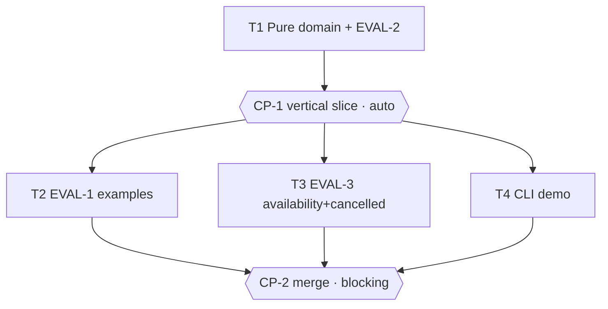

# Tasks — Room booking

> **The DO.** Generated by `planner` from spec.md v1.0.1 + design.md v1.0.1, to be validated by
> the Owner BEFORE execution. The domain is **a pure deterministic core** (NG-1/NG-2/NG-3): `model`
> → `store` → `availability` form a **data dependency chain** (availability reads the store,
> the store applies `model`). Real parallelism therefore only appears AFTER the vertical slice: once
> the domain is delivered and self-gated (CP-1), the remaining eval suites (EVAL-1, EVAL-3) and the CLI
> demo are independent (disjoint files) and run in a single wave (group B). When in doubt we sequence
> (planner rule) — hence T1 carries the whole domain + EVAL-2 (property-based, which already exercises
> the whole thing) rather than an artificially parallelized model/store/availability split.

## Execution graph

## Tasks

### T1 — Pure domain: model + store + availability (+ EVAL-2)
- **agent :** implementer · **depends_on :** — · **parallel_group :** A *(entry point)*
- **implements :** [INV-1, INV-2, INV-3, BHV-1, BHV-1a, BHV-1b, BHV-1c, BHV-2, BHV-2a, BHV-2b, BHV-3, BHV-3a, BHV-4, EVAL-2]
- **anchored_on :** ADR-1 (half-open intervals `[start, end)`, minutes int) + ADR-2 (in-memory store, `status` soft-delete)
- **files_touched :** `src/booking/__init__.py`, `src/booking/model.py`, `src/booking/store.py`, `src/booking/availability.py`, `tests/booking_core/`
- **prompt :**
  > Implement the pure business core, in memory, no I/O, time as input (never `now()`),
  > per spec.md and design.md §1 (ADR-1, ADR-2). Tests BEFORE code.
  > - `model.py`: dataclass `Booking(id, room_id, start, end, holder, status)`; INV-2 validation
  >   (`0 ≤ start < end ≤ 1440` → otherwise `invalid_slot`) and INV-3 (`end - start ≤ 240` → `too_long`);
  >   overlap helper `a.start < b.end and b.start < a.end` (BHV-1a: adjacency `end==start`
  >   ALLOWED, half-open interval).
  > - `store.py`: `BookingStore.book(room_id, start, end, holder) -> dict`, `cancel(id) -> dict`,
  >   `confirmed(room_id)`. INV-1: reject `overlap` against `confirmed` ones of the SAME room (BHV-2),
  >   another room allowed (BHV-2a), `cancelled` ignored (BHV-2b). `cancel` → `status="cancelled"`
  >   (BHV-3) or `{"rejected":"not_found"}` (BHV-3a). Exact contracts: design.md §5.
  > - `availability.py`: `availability(store, room_id, ws, we) -> list[tuple[int,int]]` — free gaps
  >   sorted by start, merged, excluding `confirmed` ones (BHV-4).
  > - EVAL-2 (`tests/booking_core/test_eval_2_property.py`, `@pytest.mark.eval`, name containing `eval_2`):
  >   500 sequences of accepted bookings at a **fixed seed** (`random.Random(...)` deterministic);
  >   after each sequence, verify that NO pair of `confirmed` ones of the same room overlap
  >   (INV-1) and that all respect INV-2/INV-3.
  > Also write the unit tests for the boundary/edge cases under `tests/booking_core/`. Do not touch any
  > other file (the EVAL-1/EVAL-3 evals and the CLI are other tasks).
- **done_when :** `uv run pytest -q tests/booking_core` green AND EVAL-2 collected + green (`-m eval`)
- **verify :** `uv run pytest -q tests/booking_core`
- **status :** ☐ pending → ☐ running → ☐ done

### CP-1 — CHECKPOINT: domain vertical slice
- **trigger :** auto when [T1] done
- **validator :** Owner
- **mode :** auto *(mechanical check: the pure domain is fully gated by EVAL-2 — property-based
  over 500 sequences — plus the reviewer report; no business decision, no external integration, no
  real data (NG-1/NG-2). If panel ≠ PASS or evals red, it automatically switches to blocking.)*
- **reviews :** full diff of `src/booking/`, EVAL-2, ADR-1/ADR-2 compliance, possible spec gaps —
  `reviewer` report generated in `.runs/CP-1-review.md`
- **on_reject :** `scripts/reject.sh CP-1 work/salle-booking "reason" [T1]` — T1 reopens with the reason,
  the checkpoint is re-presented (max 2 rejections). Spec gap → amend spec.md first (separate commit).

### T2 — EVAL-1: examples EX-1 to EX-5 (deterministic)
- **agent :** implementer · **depends_on :** [CP-1] · **parallel_group :** B *(∥ T3, T4: disjoint files)*
- **implements :** [EVAL-1, BHV-1, BHV-1a, BHV-1c, BHV-2, BHV-4]
- **anchored_on :** ADR-1 (boundaries/adjacency)
- **files_touched :** `tests/booking_evals/test_eval_1_examples.py`
- **prompt :**
  > Write EVAL-1 (`@pytest.mark.eval`, functions whose name contains `eval_1`) that verifies EXACTLY
  > examples EX-1 to EX-5 from spec.md §5 against `src/booking/` (delivered in T1): EX-1 nominal
  > confirmed booking (BHV-1), EX-2 overlap rejected `overlap` (BHV-2), EX-3 adjacent allowed
  > (BHV-1a), EX-4 `availability` = `[[480,540],[600,660],[720,780]]` (BHV-4), EX-5 duration 260 min
  > rejected `too_long` (BHV-1c). Expected values and reasons exactly as stated. Write only this file.
- **done_when :** EVAL-1 collected + green at 100% (`uv run pytest -q -m eval tests/booking_evals/test_eval_1_examples.py`)
- **verify :** `uv run pytest -q -m eval tests/booking_evals/test_eval_1_examples.py`
- **status :** ☐ pending → ☐ running → ☐ done

### T3 — EVAL-3: merged availability + cancellation (deterministic)
- **agent :** implementer · **depends_on :** [CP-1] · **parallel_group :** B *(∥ T2, T4: disjoint files)*
- **implements :** [EVAL-3, BHV-4, BHV-3, BHV-2b]
- **anchored_on :** ADR-2 (soft-delete: only `confirmed` ones count)
- **files_touched :** `tests/booking_evals/test_eval_3_availability.py`
- **prompt :**
  > Write EVAL-3 (`@pytest.mark.eval`, names containing `eval_3`) against `src/booking/`: (a) `availability`
  > MERGES adjacent gaps (two bookings leaving a contiguous gap produce a single
  > interval), result sorted by start (BHV-4); (b) after `cancel` of a `confirmed` booking
  > (BHV-3), its slot becomes free again and reappears in `availability` (BHV-2b — the cancelled one no
  > longer counts). Write only this file.
- **done_when :** EVAL-3 collected + green at 100% (`uv run pytest -q -m eval tests/booking_evals/test_eval_3_availability.py`)
- **verify :** `uv run pytest -q -m eval tests/booking_evals/test_eval_3_availability.py`
- **status :** ☐ pending → ☐ running → ☐ done

### T4 — Manual demo CLI
- **agent :** implementer · **depends_on :** [CP-1] · **parallel_group :** B *(∥ T2, T3: disjoint files)*
- **implements :** [demo]
- **anchored_on :** ADR-1 (time stays an input — args, never `now()`)
- **files_touched :** `src/booking/cli.py`
- **prompt :**
  > `cli.py`: minimal argparse (design.md §1) on top of `store`/`availability` delivered in T1, for a
  > manual demo (`book`, `cancel`, `availability`). No new business rule, no persistent I/O
  > (NG-1): the store lives for the duration of one invocation. Time is an argument, never `now()`. Do not touch
  > `model.py`/`store.py`/`availability.py` nor the tests.
- **done_when :** `PYTHONPATH=src uv run python -m booking.cli --help` exits with code 0
- **verify :** `PYTHONPATH=src uv run python -m booking.cli --help`
- **status :** ☐ pending → ☐ running → ☐ done

### CP-2 — CHECKPOINT: final review & merge
- **trigger :** auto when [T2, T3, T4] are done
- **validator :** Owner
- **mode :** blocking *(merge — always human, plan-lint rejects an `auto` final CP)*
- **reviews :** full diff, local CLI demo, eval suite EVAL-1/EVAL-2/EVAL-3 green, commit ↔ spec ID
  traceability, possible spec gaps — `reviewer` report in `.runs/CP-2-review.md`
- **on_reject :** `scripts/reject.sh CP-2 work/salle-booking "reason" [T2 T3 T4]` — the targeted tasks
  reopen with the reason, the checkpoint is re-presented (max 2 rejections, then stop).

## Trigger table — who triggers what

| Event | Trigger | Action |
|---|---|---|
| tasks.md approved (CP modes included) | **Owner** | launches T1 |
| Task done + verify + evals green | **automatic** | scoped commit; unblocks dependents; next wave |
| Eval/verify red | **automatic** | the task goes back to `running`, the agent fixes (max 3, then escalation) |
| `STATUS: blocked` (spec gap) | **automatic** | pause the subtree, OQ-n in spec.md §8, notify Owner |
| CP-1 reached (auto) | **automatic** | reviewer; PASS + EVAL-2 green = validated; otherwise switch to blocking |
| CP-2 reached (blocking) | **automatic** | reviewer report generated, notify Owner, execution PAUSED |
| Checkpoint validated (`approve.sh`) | **Owner** | resume / merge (CP-2 — never automatic) |

## Run log

*Filled in as it goes by the agents. Complementary audit trail to the Git log.*

| Date | Task | Agent | Result | Commit |
|---|---|---|---|---|
| | | | | |
| 2026-06-15 11:41 | T1 | implementer | done, evals green (t1) | |
| 2026-06-15 11:43 | CP-1 | owner | checkpoint REJECTED — Reuse model.overlaps() in store.book() instead of reimplementing the overlap test inline. Design §1: the store enforces INV-1 by relying on model. A single definition of the invariant, otherwise EVAL-2 (which tests overlaps()) and the enforcement (the copy) can diverge. | |
| 2026-06-15 11:45 | T1 | implementer | done, evals green (t1) | |
| 2026-06-15 11:46 | CP-1 | reviewer | checkpoint auto-validated (PASS, evals green) | |
| 2026-06-15 11:47 | T2 | implementer | done, evals green (t1) | |
| 2026-06-15 11:47 | T4 | implementer | done, evals green (t1) | |
| 2026-06-15 11:49 | T3 | implementer | done, evals green (t1) | |
| 2026-06-15 11:53 | CP-2 | owner | checkpoint validated | |
