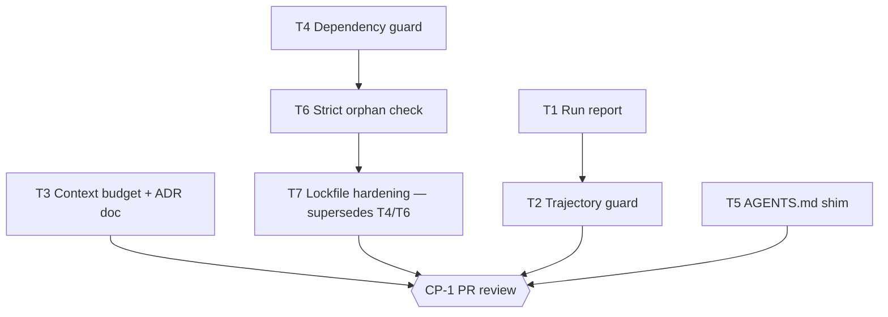

# Tasks — SDLC rework

## Execution graph

## Tasks

### T1 — Run report + shared journal reader
- **agent :** implementer · **depends_on :** — · **parallel_group :** A
- **implements :** [BHV-1, BHV-1a, BHV-1b, INV-1, INV-4, EVAL-1]
- **files_touched :** `lab/engine/journal_io.py`, `lab/engine/run_report.py`, `lab/engine/orchestrate.py`, `justfile`, `tests/sdlc_rework/`
- **prompt :**
  > Implement `journal_io.read_events` and `run_report.py` per spec BHV-1 (+ `--json`),
  > add `verify_fail`/`eval_fail` journal events to `orchestrate.py`, recipe `just report`.
- **done_when :** EVAL-1 green (`uv run pytest -q tests/sdlc_rework -m eval -k report`)
- **verify :** `uv run pytest -q tests/sdlc_rework`

### T2 — Trajectory guard
- **agent :** implementer · **depends_on :** [T1] · **parallel_group :** B
- **implements :** [BHV-2a, BHV-2b, BHV-2c, INV-1, INV-4, EVAL-2]
- **files_touched :** `lab/engine/trajectory_guard.py`, `justfile`, `tests/sdlc_rework/`
- **prompt :**
  > Implement `trajectory_guard.py` per spec BHV-2 (journal + git history, reuse
  > `plan.parse_tasks_md` for files_touched), recipe `just check-trajectory`.
- **done_when :** EVAL-2 green
- **verify :** `uv run pytest -q tests/sdlc_rework`

### T3 — Context budget + static/dynamic ADR doc
- **agent :** implementer · **depends_on :** — · **parallel_group :** A
- **implements :** [BHV-3, INV-1, INV-2, EVAL-4]
- **files_touched :** `lab/engine/context_budget.py`, `lab/models/registry.toml`, `docs/explanation/static-vs-dynamic-context.md`, `justfile`, `tests/sdlc_rework/`
- **prompt :**
  > Implement `context_budget.py` per spec BHV-3 (ADR-2, ADR-4), the `[context]` registry
  > section (commented, no active budget yet), and the explanation doc.
- **done_when :** EVAL-4 green
- **verify :** `uv run pytest -q tests/sdlc_rework`

### T4 — Dependency guard
- **agent :** implementer · **depends_on :** — · **parallel_group :** A
- **implements :** [BHV-4, INV-2, INV-3, EVAL-3]
- **files_touched :** `lab/engine/dep_guard.py`, `lab/engine/dep_allowlist.txt`, `justfile`, `tests/sdlc_rework/`
- **prompt :**
  > Implement `dep_guard.py` per spec BHV-4 (ADR-3), seed the allowlist with the current
  > pyproject deps, wire `check-deps` into `gate` and `gate-ci`.
- **done_when :** EVAL-3 green AND `just gate` green
- **verify :** `uv run pytest -q tests/sdlc_rework`

### T5 — AGENTS.md portability shim
- **agent :** implementer · **depends_on :** — · **parallel_group :** A
- **implements :** [BHV-5, EVAL-5]
- **files_touched :** `AGENTS.md`, `tests/sdlc_rework/`
- **prompt :**
  > Create the root AGENTS.md pointer per ADR-5 (no rule duplication).
- **done_when :** EVAL-5 green
- **verify :** `uv run pytest -q tests/sdlc_rework`

### T6 — Strict orphan check for the dependency guard
- **agent :** implementer · **depends_on :** [T4] · **parallel_group :** B
- **implements :** [BHV-4a, EVAL-6]
- **files_touched :** `lab/engine/dep_guard.py`, `justfile`, `docs/reference/cli.md`, `tests/sdlc_rework/`
- **prompt :**
  > Add `--strict` to dep_guard per spec BHV-4a (orphan allowlist entries fail),
  > recipe `check-deps-strict`, wire it into `gate-ci` (local `gate` stays non-strict).
- **done_when :** EVAL-6 green
- **verify :** `uv run pytest -q tests/sdlc_rework`

### T7 — Lockfile hardening (supersedes T4/T6 — CP-1 review outcome)
- **agent :** implementer · **depends_on :** [T6] · **parallel_group :** C
- **implements :** [BHV-4, INV-3, EVAL-3]
- **files_touched :** `lab/engine/dep_guard.py`, `lab/engine/dep_allowlist.txt`, `justfile`, `docs/reference/cli.md`, `CLAUDE.md`, `tests/sdlc_rework/`
- **prompt :**
  > Per spec 1.2.0: remove dep_guard.py + dep_allowlist.txt (and their tests),
  > switch `install` to `uv sync --locked`, add `check-lock` (`uv lock --check`)
  > to gate and gate-ci, update CLAUDE.md dependency rule and cli.md.
- **done_when :** EVAL-3 green AND `just gate` green
- **verify :** `uv run pytest -q tests/sdlc_rework`

### CP-1 — Final review (human)
- **type :** checkpoint · **mode :** blocking (human — final checkpoint is always human)
- **trigger :** when [T1, T2, T3, T4, T5, T6, T7] are done
- **reviewer :** Jules RUBIN (GitHub PR review)
- **done_when :** PR approved and merged by a human

## Run log

| Date | Node | Agent | Result | Notes |
|---|---|---|---|---|
