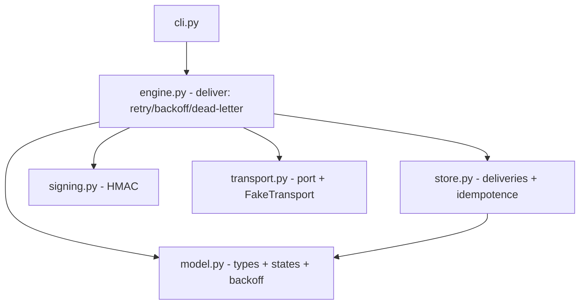

# Design — Service de livraison de webhooks fiable

> **Le COMMENT.** Cœur pur et déterministe : l'intégration externe (POST HTTP vers l'abonné) est
> **abstraite derrière une interface `Transport` injectable**. En test on injecte un `FakeTransport`
> scénarisé ; un `HttpTransport` réel viendra derrière la même interface (NG-1). C'est le pattern
> « port & adapter » : le métier ne connaît que le port, jamais le réseau. L'horloge est injectée de
> même (port `clock`). On s'adosse aux patterns éprouvés de signature/retry de webhooks (Svix /
> Standard Webhooks) et à la discipline domaine-pur (cosmicpython).

## 1. Architecture overview



Six modules sous `src/webhooks/` :
- `model.py` — **fondation** : dataclasses `Subscription`, `Event`, `Delivery` ; constantes d'état
  (`PENDING`/`DELIVERED`/`DEAD_LETTER`) ; `backoff_ms(n, base, cap)` ; validations.
- `transport.py` — **le port externe** : `Transport` (Protocol `send(url, payload, signature) -> bool`)
  + `FakeTransport(results)` qui scénarise succès/échecs et **enregistre les appels** (pour les tests).
- `signing.py` — `sign(secret, payload) -> str` (HMAC-SHA256 hex, `hmac`/`hashlib` stdlib).
- `store.py` — `DeliveryStore` en mémoire : `enqueue` **idempotent** par `(sub_id, event_id)`, `get`, `all`.
- `engine.py` — `deliver(...)` : compose store+signing+transport+model ; boucle de tentatives bornée,
  backoff, lettre morte, court-circuit si déjà `DELIVERED`. **Aucune règle réimplémentée** ailleurs.
- `cli.py` — démo manuelle (un abonné, un événement, un transport simulé en argument).

## 2. Reference repositories

| Problème | Référence | Pattern emprunté | Lien |
|---|---|---|---|
| Signature de webhook | Standard Webhooks / `svix/svix-webhooks` | HMAC du payload, en-tête de signature vérifiable | standardwebhooks.com |
| Retry + backoff + dead-letter | pratique standard files de messages (SQS/Celery) | tentatives bornées, backoff exponentiel capé, DLQ | — |
| Port & adapter (transport injectable) | cosmicpython, *Architecture Patterns with Python* | dépendances aux frontières via interfaces (Protocol) | chap. 2,4,13 |
| Backoff exponentiel capé | algorithme standard | `min(base * 2^(n-1), cap)` | — |

## 3. Stack

| Couche | Choix | Justifié par |
|---|---|---|
| Runtime | Python 3.12, stdlib (`hmac`, `hashlib`, `dataclasses`, `typing.Protocol`) | feature pure, zéro dépendance runtime (NG-2) |
| Tests/evals | pytest (marker `eval`), `random.Random(seed)` fixe pour EVAL-2 | conventions du lab, déterminisme (INV-7) |

## 4. ADRs

### ADR-1 — Transport injectable (port & adapter), jamais de réseau dans le cœur
- **Status :** accepted
- **Context :** INV-7 (déterminisme, pas de réseau réel) + NG-1 (HTTP réel hors scope) + testabilité des
  retries (il faut scénariser les échecs).
- **Decision :** `engine.deliver` reçoit un `Transport` (Protocol `send(url, payload, signature) -> bool`).
  En test : `FakeTransport(results=[...])`. En prod (futur) : `HttpTransport` derrière la même interface.
- **Anchored on :** cosmicpython (port & adapter).
- **Consequences :** le cœur est testable sans réseau ; brancher le vrai HTTP = une classe, zéro changement métier.

### ADR-2 — Horloge injectée (`clock()`), temps logique en ms
- **Status :** accepted
- **Context :** INV-7 (pas de `now()`), INV-3 (backoff calculé), NG-3 (pas de sleep/threads).
- **Decision :** `deliver` reçoit `clock() -> int` (ms, croissant). `next_at = clock() + backoff_ms(n)`.
  En test : une horloge logique (`0, 1000, 2000, …`). Pas de `time.sleep`.
- **Consequences :** retries et `next_at` déterministes et vérifiables ; pas de temps réel.

### ADR-3 — Boucle de tentatives bornée + court-circuit sur état TERMINAL
- **Status :** accepted
- **Context :** INV-1 (au plus une fois), INV-2 (bornage), INV-4 (lettre morte terminale).
- **Decision :** `deliver` : si la `delivery` est déjà dans un **état terminal — `DELIVERED` OU
  `DEAD_LETTER`** → retour immédiat, **aucun `send`**. Sinon `for n in 1..max_attempts`: `sig=sign`;
  `ok=transport.send`; enregistrer ; si `ok` → `DELIVERED`, retour ; sinon `next_at=clock()+backoff_ms(n)`.
  Après la boucle → `DEAD_LETTER`.
- **Anchored on :** pattern DLQ standard.
- **Consequences :** nombre d'appels ≤ max_attempts **sur toute la vie de la delivery, y compris
  après re-livraison** (pas seulement intra-appel) ; INV-2 et INV-4 tenus symétriquement à BHV-7
  (DELIVERED). *(Amendement post-revue CP-2 : l'ADR ne couvrait que `DELIVERED` ; re-livrer un
  `DEAD_LETTER` relançait des tentatives → violait INV-2/INV-4 alors que l'eval gate était verte.)*

## 5. Contracts & data (signatures — pinnées pour le parallélisme)

```python
# model.py
PENDING = "PENDING"; DELIVERED = "DELIVERED"; DEAD_LETTER = "DEAD_LETTER"
@dataclass(frozen=True)
class Subscription: id: str; url: str; secret: str; max_attempts: int   # max_attempts >= 1
@dataclass(frozen=True)
class Event: id: str; payload: str
@dataclass
class Delivery: sub_id: str; event_id: str; state: str; attempts: int; next_at: int; last_error: str
def backoff_ms(attempt: int, base_ms: int, cap_ms: int) -> int: ...     # min(base*2^(n-1), cap)

# transport.py
class Transport(Protocol):
    def send(self, url: str, payload: str, signature: str) -> bool: ...
class FakeTransport:                       # self.calls: list[tuple[url, payload, signature]] (enregistré)
    def __init__(self, results: list[bool]) -> None: ...
    def send(self, url: str, payload: str, signature: str) -> bool: ...
    # renvoie results[i] pour le i-e appel ; une fois `results` épuisée → False (déterministe, JAMAIS d'IndexError)

# signing.py
def sign(secret: str, payload: str) -> str: ...        # hmac-sha256 hex

# store.py
class DeliveryStore:
    # enqueue idempotent par (sub_id, event_id). Une NOUVELLE delivery est initialisée à
    # Delivery(sub_id, event_id, state=PENDING, attempts=0, next_at=0, last_error="").
    def enqueue(self, sub_id: str, event_id: str) -> "Delivery": ...
    def get(self, sub_id: str, event_id: str) -> "Delivery | None": ...
    def all(self) -> list["Delivery"]: ...

# engine.py
# court-circuit si delivery déjà TERMINALE (DELIVERED ou DEAD_LETTER) → aucun send (ADR-3, INV-2/INV-4)
def deliver(store, transport, subscription, event, clock, base_ms: int = 1000, cap_ms: int = 60000) -> "Delivery": ...
```

## 6. Design system & conformité

N/A — service back-end sans front (pas de design system). Conformité : la **signature HMAC** (BHV-6)
est la garantie d'authenticité côté abonné ; le `secret` n'est jamais loggé.

## 7. Observability & rollout

N/A en test E2E. (En vrai : chaque `Delivery` porte `attempts`/`state`/`last_error` → métriques
livré/dead-letter directes ; `deliver` est pur sur entrées injectées → tout incident est rejouable.)

## 8. Risks

| Risque | Prob. | Impact | Mitigation |
|---|---|---|---|
| Double livraison sur succès | M | H | ADR-3 court-circuit + EVAL-2 (INV-1) |
| Dépassement de max_attempts | M | H | ADR-3 boucle bornée + EVAL-2 (INV-2) |
| Backoff non capé (delais explosifs) | M | M | `backoff_ms` capé + EVAL-1 EX-4 |
| Dérive entre modules parallèles | M | H | §5 signatures pinnées + CP-1 sur la fondation |

## 9. Changelog

| Version | Date | Auteur | Changement |
|---|---|---|---|
| 1.0.0 | 2026-06-15 | technique (simulé) + design-scout | Création |
| 1.1.0 | 2026-06-16 | technique (amendement post-revue CP-2) | ADR-3 : court-circuit sur tout état TERMINAL (DELIVERED **et** DEAD_LETTER), pas seulement DELIVERED — sinon re-livrer un dead-letter relance des tentatives (viole INV-2/INV-4). §5 deliver annoté. EVAL-2 (T5) à étendre : rejouer deliver sur un état terminal. |
