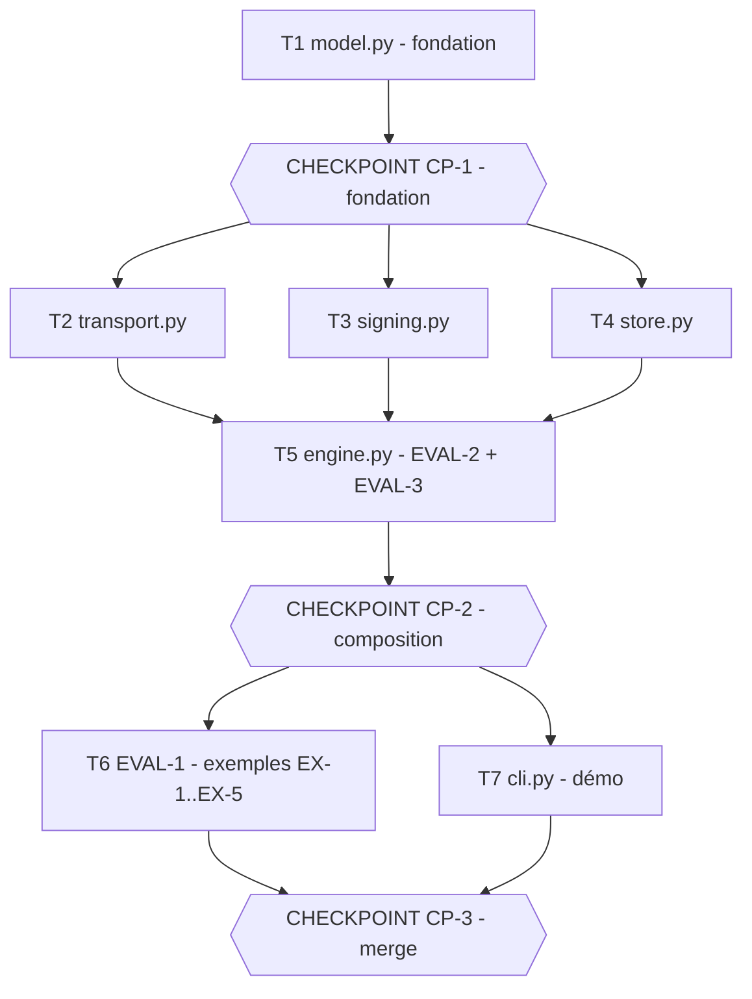

# Tasks — Service de livraison de webhooks fiable

> **Le DO. L'orchestration des agents.** Généré par `planner` à partir de spec.md v1.0.0 +
> design.md v1.0.0, validé par l'Owner AVANT toute exécution.
>
> Lecture du graphe : `model.py` est la **fondation** partagée (signatures pinnées design §5) ;
> `transport.py`/`signing.py`/`store.py` ne dépendent que d'elle et sont mutuellement indépendants
> (vague parallèle, chemins source ET tests disjoints) ; `engine.py` les **compose** (seul niveau où
> la livraison de bout en bout est exerçable → il porte EVAL-2 et EVAL-3) ; enfin EVAL-1 (exemples)
> et `cli.py` dépendent de l'engine et sont mutuellement indépendants (dernière vague parallèle).
> Trois checkpoints : fondation (auto, mécanique), composition (blocking, logique sensible), merge
> (blocking, toujours humain).

## Execution graph

## Tasks

### T1 — Poser la fondation : types, états et barème de backoff
- **agent :** implementer
- **depends_on :** — *(point d'entrée)*
- **parallel_group :** A
- **implements :** [INV-3, INV-7]
- **anchored_on :** design §5 (signatures pinnées), ADR-1, ADR-2
- **files_touched :** `src/webhooks/model.py`, `tests/webhooks/test_model.py`
- **prompt :**
  > Implémente `src/webhooks/model.py` STRICTEMENT conforme aux signatures pinnées de design.md §5 :
  > constantes d'état `PENDING="PENDING"`, `DELIVERED="DELIVERED"`, `DEAD_LETTER="DEAD_LETTER"` ;
  > `@dataclass(frozen=True) Subscription(id, url, secret, max_attempts)` avec `max_attempts >= 1` validé ;
  > `@dataclass(frozen=True) Event(id, payload)` ; `@dataclass Delivery(sub_id, event_id, state, attempts, next_at, last_error)` ;
  > `backoff_ms(attempt: int, base_ms: int, cap_ms: int) -> int` = `min(base_ms * 2^(attempt-1), cap_ms)`,
  > non décroissant en `attempt` (spec.md INV-3, BHV-4/BHV-4a). Aucun `now()`, aucun aléa, aucun réseau (INV-7).
  > Écris les tests AVANT le code dans `tests/webhooks/test_model.py` (couvre le barème de backoff capé
  > et la validation `max_attempts`). Ne touche à aucun autre module.
- **done_when :** `pytest tests/webhooks/test_model.py` vert
- **verify :** `uv run pytest -q tests/webhooks/test_model.py`
- **status :** ☐ pending → ☐ running → ☐ done

### CP-1 — CHECKPOINT : fondation (model.py) validée
- **trigger :** auto quand [T1] done
- **validator :** Owner
- **mode :** auto
- **reviews :** diff de `model.py`, conformité aux signatures pinnées design §5, tests `test_model.py`
  verts — le rapport `reviewer` est généré dans `.runs/CP-1-review.md` avant le checkpoint.
- **on_reject :** `scripts/reject.sh CP-1 webhook-delivery "raison" [T1]` — T1 réouverte, le checkpoint
  se re-présente (max 2 rejets).

### T2 — Port transport + FakeTransport scénarisé
- **agent :** implementer
- **depends_on :** [CP-1]
- **parallel_group :** B *(parallélisable avec T3, T4 : chemins source et test disjoints)*
- **implements :** [INV-7]
- **anchored_on :** design §5, ADR-1 (port & adapter)
- **files_touched :** `src/webhooks/transport.py`, `tests/webhooks/test_transport.py`
- **prompt :**
  > Implémente `src/webhooks/transport.py` conforme à design.md §5 et ADR-1 : `Transport` (Protocol avec
  > `send(self, url: str, payload: str, signature: str) -> bool`) ; `FakeTransport(results: list[bool])`
  > qui renvoie les résultats dans l'ordre et **enregistre chaque appel** dans `self.calls`
  > (url, payload, signature) pour les tests. Aucun réseau réel (INV-7). Écris les tests AVANT le code
  > dans `tests/webhooks/test_transport.py` (séquence de résultats + enregistrement des appels).
  > Importe depuis `webhooks.transport`. Ne touche ni à `engine.py`, ni à `signing.py`, ni à `store.py`.
- **done_when :** `pytest tests/webhooks/test_transport.py` vert
- **verify :** `uv run pytest -q tests/webhooks/test_transport.py`
- **status :** ☐ pending → ☐ running → ☐ done

### T3 — Signature HMAC-SHA256 déterministe
- **agent :** implementer
- **depends_on :** [CP-1]
- **parallel_group :** B *(parallélisable avec T2, T4 : chemins source et test disjoints)*
- **implements :** [INV-6, BHV-6]
- **anchored_on :** design §2 (Standard Webhooks / svix), §5
- **files_touched :** `src/webhooks/signing.py`, `tests/webhooks/test_signing.py`
- **prompt :**
  > Implémente `src/webhooks/signing.py` conforme à design.md §5 : `sign(secret: str, payload: str) -> str`
  > = HMAC-SHA256 hex via `hmac`/`hashlib` stdlib (spec.md INV-6, BHV-6). Déterministe : même entrée →
  > même signature. Ne logge jamais le `secret`. Écris les tests AVANT le code dans
  > `tests/webhooks/test_signing.py` (déterminisme + valeur hex attendue d'un cas connu). Importe depuis
  > `webhooks.signing`. Ne touche ni à `engine.py`, ni à `transport.py`, ni à `store.py`.
- **done_when :** `pytest tests/webhooks/test_signing.py` vert
- **verify :** `uv run pytest -q tests/webhooks/test_signing.py`
- **status :** ☐ pending → ☐ running → ☐ done

### T4 — Store en mémoire avec enqueue idempotent
- **agent :** implementer
- **depends_on :** [CP-1]
- **parallel_group :** B *(parallélisable avec T2, T3 : chemins source et test disjoints)*
- **implements :** [INV-5, BHV-5]
- **anchored_on :** design §5
- **files_touched :** `src/webhooks/store.py`, `tests/webhooks/test_store.py`
- **prompt :**
  > Implémente `src/webhooks/store.py` conforme à design.md §5 : `DeliveryStore` en mémoire avec
  > `enqueue(self, sub_id, event_id) -> Delivery` **idempotent** par `(sub_id, event_id)` (spec.md INV-5,
  > BHV-5 : un 2e enqueue renvoie la même `Delivery`, une seule en store), `get(self, sub_id, event_id) -> Delivery | None`,
  > `all(self) -> list[Delivery]`. Réutilise `Delivery` de `webhooks.model` (ne réimplémente pas le type).
  > Écris les tests AVANT le code dans `tests/webhooks/test_store.py` (enqueue deux fois → une seule
  > delivery, identité retournée). Importe depuis `webhooks.store`. Ne touche ni à `engine.py`, ni à
  > `transport.py`, ni à `signing.py`.
- **done_when :** `pytest tests/webhooks/test_store.py` vert
- **verify :** `uv run pytest -q tests/webhooks/test_store.py`
- **status :** ☐ pending → ☐ running → ☐ done

### T5 — Moteur de livraison : retry/backoff/dead-letter/idempotence (EVAL-2, EVAL-3)
- **agent :** implementer
- **depends_on :** [T2, T3, T4]
- **parallel_group :** C
- **implements :** [BHV-1, BHV-2, BHV-3, BHV-7, INV-1, INV-2, INV-4, EVAL-2, EVAL-3]
- **anchored_on :** ADR-3 (boucle bornée + court-circuit idempotent)
- **files_touched :** `src/webhooks/engine.py`, `tests/webhooks/test_engine.py`, `tests/webhooks/test_eval_2_property.py`, `tests/webhooks/test_eval_3_invariants.py`
- **prompt :**
  > Implémente `src/webhooks/engine.py` conforme à design.md §5 et ADR-3 :
  > `deliver(store, transport, subscription, event, clock, base_ms=1000, cap_ms=60000) -> Delivery`.
  > Compose `webhooks.{store,signing,transport,model}` — ne réimplémente AUCUNE règle déjà portée par
  > ces modules. Algorithme ADR-3 : si la delivery est déjà `DELIVERED` → retour immédiat sans aucun
  > `send` (spec.md INV-1, BHV-7) ; sinon `for n in 1..max_attempts` : `sig = sign(...)` ;
  > `ok = transport.send(url, payload, sig)` ; incrémente `attempts` ; si `ok` → `DELIVERED`, retour ;
  > sinon `next_at = clock() + backoff_ms(n, base_ms, cap_ms)` (INV-3) et `last_error` renseigné ;
  > après la boucle → `DEAD_LETTER` (INV-4). Nombre d'appels ≤ `max_attempts` par construction (INV-2).
  > Couvre BHV-1/BHV-2/BHV-3 dans `tests/webhooks/test_engine.py`.
  > Écris EVAL-2 dans `tests/webhooks/test_eval_2_property.py` : test `@pytest.mark.eval`, fonction
  > `test_eval_2_property` ; 1000 scénarios via `random.Random(SEED)` avec SEED fixe (séquences
  > aléatoires de succès/échec), vérifie à chaque fois INV-1 (≤1 succès, aucun `send` après `DELIVERED`),
  > INV-2 (appels ≤ max_attempts), INV-4 (`DEAD_LETTER` terminal).
  > Écris EVAL-3 dans `tests/webhooks/test_eval_3_invariants.py` : test `@pytest.mark.eval`, fonction
  > `test_eval_3_invariants` ; backoff croissant+capé (INV-3), signature déterministe (INV-6),
  > re-livraison d'un `DELIVERED` = no-op (BHV-7), enqueue idempotent (INV-5). Importe depuis
  > `webhooks.engine`. Ne touche pas à `cli.py`. Horloge logique injectée, aucun `now()`/aléa hors seed/réseau (INV-7).
- **done_when :** `pytest tests/webhooks/test_engine.py` vert + EVAL-2 et EVAL-3 vertes (`pytest -m eval`)
- **verify :** `uv run pytest -q tests/webhooks/test_engine.py tests/webhooks/test_eval_2_property.py tests/webhooks/test_eval_3_invariants.py`
- **status :** ☐ pending → ☐ running → ☐ done

### CP-2 — CHECKPOINT : composition de bout en bout (engine.py)
- **trigger :** auto quand [T5] done
- **validator :** Owner
- **mode :** blocking
- **reviews :** démo locale d'une livraison de bout en bout, diff complet de `engine.py`, evals
  [EVAL-2, EVAL-3], écarts spec éventuels — logique sensible (retries / dead-letter / idempotence /
  au-plus-une-fois). Rapport `reviewer` généré dans `.runs/CP-2-review.md` avant le checkpoint.
- **on_reject :** `scripts/reject.sh CP-2 webhook-delivery "raison" [T5]` — T5 réouverte avec le
  commentaire, le checkpoint se re-présente (max 2 rejets, ensuite arrêt). Si trou de spec → amender
  spec.md d'abord (commit séparé).

### T6 — EVAL-1 : exemples EX-1 à EX-5 vérifiés exactement
- **agent :** implementer
- **depends_on :** [CP-2]
- **parallel_group :** D *(parallélisable avec T7 : chemins source et test disjoints)*
- **implements :** [EVAL-1, BHV-1, BHV-2, BHV-3, BHV-4, BHV-4a, BHV-5]
- **anchored_on :** spec §6 (Examples), spec §7 (Evals)
- **files_touched :** `tests/webhooks/test_eval_1_examples.py`
- **prompt :**
  > Écris EVAL-1 dans `tests/webhooks/test_eval_1_examples.py` : tests `@pytest.mark.eval`, fonctions
  > dont le nom contient l'ID en minuscules (`test_eval_1_...`). Encode EXACTEMENT les 5 exemples de
  > spec.md §6 et vérifie état + nb d'appels + barème de backoff + idempotence :
  > EX-1 (succès immédiat → DELIVERED, 1 appel, BHV-1) ; EX-2 (échec puis succès → DELIVERED, 2 appels,
  > BHV-2) ; EX-3 (toujours échec, max_attempts=3 → DEAD_LETTER, 3 appels, BHV-3) ;
  > EX-4 (`backoff_series` n=[1,2,3,7,20] base=1000 cap=60000 → [1000,2000,4000,60000,60000], BHV-4/BHV-4a) ;
  > EX-5 (enqueue deux fois → 1 delivery en store, BHV-5). Contexte par défaut spec §6 : base_ms=1000,
  > cap_ms=60000, horloge logique 0 puis +1000 par appel. Importe depuis `webhooks.*` (engine, store,
  > transport, model). N'écris AUCUN code source — uniquement le module d'eval. Ne crée pas de module de
  > test homonyme d'un autre. Aucun réseau/aléa/`now()` (INV-7).
- **done_when :** EVAL-1 verte (EX-1..EX-5, 100 %)
- **verify :** `uv run pytest -q -m eval tests/webhooks/test_eval_1_examples.py`
- **status :** ☐ pending → ☐ running → ☐ done

### T7 — CLI de démo manuelle
- **agent :** implementer
- **depends_on :** [CP-2]
- **parallel_group :** D *(parallélisable avec T6 : chemins source et test disjoints)*
- **implements :** [BHV-1, BHV-3]
- **anchored_on :** design §1 (module `cli.py`), ADR-1
- **files_touched :** `src/webhooks/cli.py`, `tests/webhooks/test_cli.py`
- **prompt :**
  > Implémente `src/webhooks/cli.py` conforme à design.md §1 : démo manuelle d'une livraison (un abonné,
  > un événement, un transport simulé passé en argument — ex. une séquence de succès/échec). Compose
  > `webhooks.{engine,store,transport,model,signing}` sans réimplémenter de règle. Doit s'invoquer via
  > `PYTHONPATH=src uv run python -m webhooks.cli --help` (argparse) et afficher l'état final
  > (`DELIVERED`/`DEAD_LETTER`) + le nombre d'appels. Horloge logique, aucun `now()`/réseau réel (INV-7).
  > Écris les tests AVANT le code dans `tests/webhooks/test_cli.py` (scénario succès → DELIVERED ;
  > scénario échec persistant → DEAD_LETTER). N'écris pas d'eval ici. Ne touche pas à `engine.py` ni aux
  > modules de la vague B.
- **done_when :** `pytest tests/webhooks/test_cli.py` vert + `python -m webhooks.cli --help` fonctionne
- **verify :** `PYTHONPATH=src uv run pytest -q tests/webhooks/test_cli.py`
- **status :** ☐ pending → ☐ running → ☐ done

### CP-3 — CHECKPOINT : merge final
- **trigger :** auto quand [T6, T7] done
- **validator :** Owner
- **mode :** blocking
- **reviews :** diff complet de la feature, toutes evals [EVAL-1, EVAL-2, EVAL-3] vertes (merge gate),
  démo CLI, écarts spec. Rapport `reviewer` généré dans `.runs/CP-3-review.md`. Le merge est **humain,
  toujours** (CLAUDE.md hard rules ; le plan-lint refuse un CP final auto).
- **on_reject :** `scripts/reject.sh CP-3 webhook-delivery "raison" [T6, T7]` — tâches réouvertes avec
  le commentaire, le checkpoint se re-présente (max 2 rejets, ensuite arrêt).

## Trigger table — qui déclenche quoi

| Événement | Déclencheur | Action |
|---|---|---|
| tasks.md approuvé (modes des CP compris) | **Owner** (humain) | lance le groupe A (T1) |
| Tâche done + verify + evals vertes | **automatique** (hook) | commit scopé ; débloque les dépendants ; vague suivante |
| Eval rouge ou verify rouge | **automatique** | la tâche repasse `running`, l'agent corrige (max 3 itérations, puis escalade Owner) |
| Agent répond `STATUS: blocked` (trou de spec) | **automatique** | pause du sous-arbre, OQ-n notée dans spec.md §9, notification Owner — les autres branches continuent |
| Tâche failed/blocked | **automatique** | dépendants `skipped` (confinement), le reste du DAG continue |
| CP-1 `auto` atteint | **automatique** | rapport reviewer ; PASS + evals vertes = validé ; sinon bascule blocking |
| CP-2 / CP-3 `blocking` atteint | **automatique** | rapport reviewer généré, notification Owner, exécution EN PAUSE |
| Checkpoint validé (`approve.sh`) | **Owner** (humain) | reprise de l'exécution |
| Checkpoint rejeté (`reject.sh` + raison) | **Owner** (humain) | réouverture des tâches visées, re-présentation (max 2 rejets) |
| CP-3 validé | **Owner** (humain) | merge — jamais automatique, plan-lint le garantit |

## Run log

*Rempli au fil de l'eau par les agents. Audit trail complémentaire du Git log.*

| Date | Tâche | Agent | Résultat | Commit |
|---|---|---|---|---|
| | | | | |
| 2026-06-16 08:26 | T1 | implementer | done, evals vertes (t1) | |
| 2026-06-16 08:31 | CP-1 | owner | checkpoint validé | |
| 2026-06-16 | T4 | implementer | done, 9 tests verts | |
| 2026-06-16 08:32 | T4 | implementer | done, evals vertes (t1) | |
| 2026-06-16 | T2 | implementer | done, 7 tests verts | |
| 2026-06-16 | T3 | implementer | done, 9 tests verts | |
| 2026-06-16 08:33 | T3 | implementer | done, evals vertes (t1) | |
