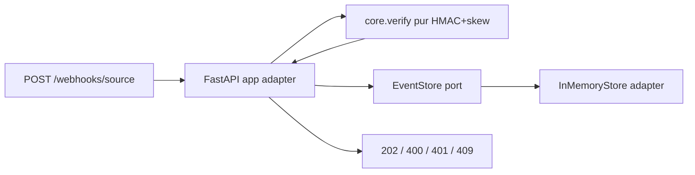

# Design — Webhook Gateway

> **Le COMMENT.** On n'invente pas d'architecture : ports & adapters (cœur pur + adaptateurs
> injectés), transport FastAPI, déterminisme par injection. Conforme à `docs/engineering-rules.md`
> (R-5 cœur pur, R-6 ports&adapters, R-7 déterminisme par injection, R-23 signature, R-31/R-32).

## 1. Architecture overview
Le cœur (`verify` + `model`) est **pur** : il ne connaît ni FastAPI ni le temps réel ni le stockage.
Les routes FastAPI (adaptateur entrant) composent le cœur avec une horloge et un magasin injectés.



## 2. Reference repositories
### 2.1 Repos internes — *(N/A : feature neuve, aucun repo interne ingéré ; design-scout non lancé — cf. threat-model.md)*
### 2.2 Références open source Python
| Problème | Référence OSS | Pattern emprunté |
|---|---|---|
| Structure service + DI | `fastapi/full-stack-fastapi-template` | routeur + dépendances injectées (`Depends`), settings Pydantic |
| Vérif de signature webhook | bibliothèque `stripe`/`svix` (pattern) | `hmac.compare_digest`, signature = `HMAC(secret, f"{ts}.{body}")`, fenêtre de fraîcheur |
| Port de stockage | `repository pattern` (Cosmic Python) | interface `EventStore` + adaptateur mémoire, swap futur Firestore |

## 3. Stack
| Couche | Choix | Justifié par |
|---|---|---|
| Runtime | Python 3.12, FastAPI, Pydantic v2 | §2.1 template |
| Serveur | uvicorn (ASGI) | standard Cloud Run |
| Données | `EventStore` (interface) + `InMemoryStore` (cette version) | §2.2 repository ; NG-1 |
| Sécurité | `hmac`/`hashlib` stdlib, `compare_digest` | INV-2, R-23 |
| Infra | Cloud Run (cf. §7) | `docs/gcp-deployment-standard.md` |

## 4. ADRs
### ADR-1 — Transport FastAPI, cœur pur séparé
- **Status :** accepted
- **Decision :** `src/gateway/verify.py` + `model.py` sont purs (aucun import FastAPI) ; `app.py` est le seul adaptateur HTTP. L'horloge (`now: Callable[[], int]`) et le `EventStore` sont injectés via `Depends` (surchargés dans les tests/evals).
- **Anchored on :** full-stack-fastapi-template (Depends), Cosmic Python (ports&adapters).
- **Consequences :** evals testent le cœur sans réseau ; déploiement n'affecte pas la logique (R-7).

### ADR-2 — Signature canonicalisée `{timestamp}.{raw_body}`
- **Status :** accepted
- **Decision :** la signature couvre l'horodatage ET le corps brut (octets reçus), pas le JSON re-sérialisé (sinon divergence d'encodage). Vérif : recomputer HMAC sur `f"{ts}.".encode()+raw` et `compare_digest` avec l'en-tête `X-Signature` (préfixe `sha256=` retiré).
- **Anchored on :** schéma Stripe/Svix.
- **Consequences :** l'adaptateur doit lire le **corps brut** avant parsing JSON.

### ADR-3 — Idempotence par clé naturelle `event_id`
- **Status :** accepted
- **Decision :** `EventStore.add_if_absent(event_id, payload) -> bool` (atomique pour la version mémoire via un set/dict) ; `False` → 409. Pas de verrou distribué (NG-1) ; l'adaptateur Firestore futur utilisera une écriture conditionnelle.
- **Consequences :** idempotence garantie au sein d'un process ; documentée comme limite avant persistance distribuée.

### ADR-4 — Durcissement de l'adaptateur HTTP *(amendement 1.1.0, suite revue sécurité CP-2)*
- **Status :** accepted
- **Context :** la revue `security-reviewer` (VETO) au CP-2 a relevé sur l'adaptateur : F-1 lecture non authentifiée (IDOR/énumération des payloads), F-2 signature non-ASCII → 500 au lieu de 401, F-3 corps non borné (DoS pré-auth).
- **Decision :**
  - **F-1 (INV-7)** : `GET /events/{id}` exige `X-Read-Token` comparé en temps constant (`hmac.compare_digest`) à un `read_token` **injecté** dans `create_app` ; absent/invalide → 401. Jeton de lecture distinct du secret HMAC d'ingestion.
  - **F-2 (BHV-2)** : avant `verify`, l'adaptateur valide que la signature (après retrait de `sha256=`) est **hexadécimale ASCII** ; sinon 401. (`compare_digest` lève `TypeError` sur non-ASCII — on ne l'atteint jamais.)
  - **F-3 (BHV-8)** : rejet **413** si `Content-Length` > `MAX_BODY (1 MiB)`, et lecture bornée du corps, **avant** tout calcul HMAC.
- **Anchored on :** schéma Stripe/Svix (sig hex), pattern API key header (read token).
- **Consequences :** signature de `create_app` étendue (`read_token`, voir §5) ; ces gardes vivent dans l'adaptateur (`app.py`), le cœur pur reste inchangé.

## 5. Contracts & data (signatures — pinnées pour le ∥)
```python
# src/gateway/model.py
@dataclass(frozen=True)
class WebhookEvent:
    event_id: str
    type: str
    data: dict

MAX_SKEW = 300  # secondes

# src/gateway/verify.py  (PUR — pas de FastAPI, pas de time.time())
def sign(secret: bytes, timestamp: int, raw_body: bytes) -> str: ...        # hex HMAC-SHA256
def verify(secret: bytes, timestamp: int, raw_body: bytes, signature: str, now: int) -> bool:
    """True ssi signature valide (compare_digest) ET |now - timestamp| <= MAX_SKEW."""

# src/gateway/store.py
class EventStore(Protocol):
    def add_if_absent(self, event_id: str, payload: dict) -> bool: ...      # False si déjà présent
    def get(self, event_id: str) -> dict | None: ...

class InMemoryStore:  # adaptateur
    ...

# src/gateway/app.py  (adaptateur FastAPI ; clock + store + read_token injectés)
MAX_BODY = 1 * 1024 * 1024  # 1 MiB (BHV-8)
def create_app(
    secrets: dict[str, bytes],
    store: EventStore,
    now: Callable[[], int],
    read_token: str,                 # 1.1.0 — jeton de lecture (INV-7) ; comparé en temps constant
) -> FastAPI: ...
```
- API : routes `POST /webhooks/{source}` (413 si corps > MAX_BODY), `GET /events/{event_id}` (X-Read-Token requis), `GET /health`.

## 6. Design system & conformité
- **Design system :** N/A (pas de front).
- **Référentiel de conformité :** ☑ gestion des secrets (clé HMAC via Secret Manager en prod) ☑ pas de PII loggée (INV-6) ☑ SAST/secrets (gate R-29).

## 7. Deployment (GCP), observability & rollout
> Règles : `docs/gcp-deployment-standard.md` + `docs/engineering-rules.md`. Feature NON pure (service HTTP).
- **Runtime :** **Cloud Run** (service), `europe-west1`, CPU 1 / mém 512Mi / concurrence 80 / timeout 30s, `min-instances=0`, `max-instances=4` (D-1, D-3).
- **Identité & accès :** compte de service dédié `webhook-gateway-sa` au moindre privilège ; ingress public (un partenaire externe POST) + **Cloud Armor** recommandé ; CI via WIF (D-6, D-7). *Pour la démo : déploiement via gcloud authentifié Owner ; SA dédié = durcissement noté.*
- **Secrets :** clé(s) HMAC par `source` + **jeton de lecture** (`read_token`, INV-7) via **Secret Manager** ; en démo, injectés par env `GATEWAY_SECRET_ACME` / `GATEWAY_READ_TOKEN` (D-9). Jamais en clair dans l'image ni les logs (INV-6).
- **Réseau & données :** pas de VPC connector (pas de dépendance interne) ; magasin en mémoire (NG-1) → **éphémère par instance** (limite assumée pour la démo ; Firestore en cible).
- **CI/CD :** `make ci` vert (lint + tests + evals + sécurité) → **SBOM** (`make sbom`) → build image → Artifact Registry → Cloud Run deploy (D-14, D-15). Image non-root, slim.
- **Observabilité & SLO :** logs structurés sans secret ; SLO indicatif p95 < 300 ms, dispo 99 % ; `/health` = liveness (D-16, D-17).
- **Rollout & rollback :** Cloud Run garde les révisions → rollback = re-router le trafic ; **mise en prod = décision humaine (checkpoint final)** (D-18, D-20).
- **Entrée du service :** `gateway/asgi.py` — **fail-closed** : refuse de démarrer sans `GATEWAY_SECRET_<SOURCE>` ET `GATEWAY_READ_TOKEN` (jamais de défaut ouvert).
- **Checklist du standard GCP :** partiellement cochée (démo).

> **⚠️ Bloqueurs AVANT toute prod réelle (cette démo tourne sur données synthétiques, ingress public, identifiants connus — ne rien y envoyer de réel)** :
> - **B-1 — Anti-rejeu/idempotence en mémoire par instance** : avec `max-instances>1` ou un cold-start, un rejeu (même `event_id`/`ts`/`sig` dans la fenêtre 300 s) peut atterrir sur une autre instance et être ré-accepté (202). Cible : magasin partagé TTL (Firestore/Redis) ou `min=max=1` (béquille). Ferme réellement INV-4/anti-rejeu inter-instances.
> - **B-2 — Secrets** : passer de `--set-env-vars` à **Secret Manager** (`--set-secrets`), supprimer tout défaut d'identifiant, **roter** les valeurs de démo.
> - **B-3 — Ingress** : `--allow-unauthenticated` (requis pour un partenaire externe) ⇒ **Cloud Armor** (rate-limit/WAF) obligatoire ; + SA dédié moindre privilège (D-7), image signée + Binary Auth (D-2/D-14), WIF en CI (D-6).

## 8. Risks
| Risque | P | I | Mitigation |
|---|---|---|---|
| Rejeu inter-instances (magasin mémoire) | **H en prod** | M | **B-1** : magasin partagé TTL ; démo = min=max=1 |
| Identifiants de démo connus + ingress public | **H en prod** | H | **B-2/B-3** : Secret Manager + rotation + Cloud Armor |
| Magasin mémoire perdu au scale/redéploiement | M | M | NG-1 assumé ; Firestore en cible |
| Clé HMAC fuitée | L | H | Secret Manager, rotation, jamais loggée (INV-6) |

## 9. Changelog
| Version | Date | Auteur | Changement |
|---|---|---|---|
| 1.0.0 | 2026-06-16 | Owner + FDE | Création (artefact production-ready) |
| 1.1.0 | 2026-06-16 | Owner + FDE | ADR-4 : durcissement adaptateur (F-1 read-auth INV-7, F-2 sig hex→401, F-3 body 413) suite revue sécurité CP-2 ; `create_app(read_token)` |
| 1.1.1 | 2026-06-16 | FDE | `/healthz` → `/health` : `/healthz` réservé par le Google Front End (404 avant conteneur), constaté en déploiement Cloud Run live |
