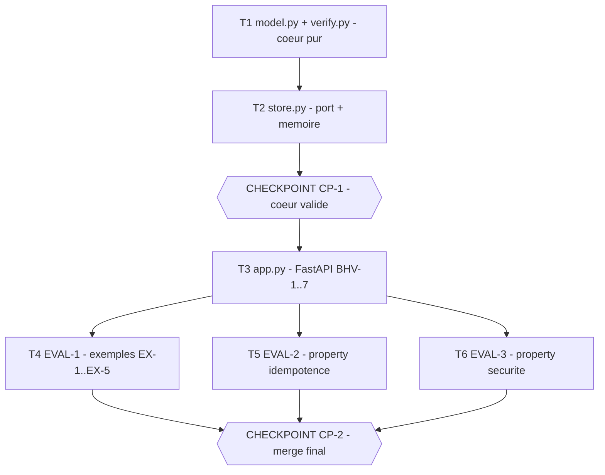

# Tasks — Webhook Gateway (récepteur de webhooks signés)

> **Le DO. L'orchestration des agents.** Généré par `planner` à partir de spec.md v1.0.0 +
> design.md v1.0.0, à valider par l'Owner AVANT toute exécution.
>
> Lecture du graphe : le **cœur pur** (`model.py` + `verify.py`, design §5/ADR-1/ADR-2) est la
> fondation — aucun import FastAPI, horloge et magasin injectés (INV-5). `store.py` (port +
> adaptateur mémoire, ADR-3) s'appuie sur le package du cœur. Un checkpoint **auto** valide ce
> cœur (vérification mécanique : evals/verify + reviewer). L'**adaptateur FastAPI** `app.py`
> compose le cœur avec une horloge et un `EventStore` injectés (BHV-1..7) — seul niveau où le
> flux HTTP de bout en bout est exerçable. Les trois evals (EVAL-1 exemples, EVAL-2 idempotence,
> EVAL-3 sécurité) dépendent de l'app et sont mutuellement indépendantes (chemins de test
> disjoints → dernière vague parallèle). Checkpoint **blocking** au merge (toujours humain).

## Execution graph

## Tasks

### T1 — Cœur pur : types + vérification HMAC/skew
- **agent :** implementer
- **depends_on :** — *(point d'entrée)*
- **parallel_group :** A
- **implements :** [INV-1, INV-2, INV-3, INV-5, INV-6]
- **anchored_on :** design §5 (signatures pinnées), ADR-1 (cœur pur), ADR-2 (canonicalisation `{ts}.{raw}`)
- **files_touched :** `src/gateway/__init__.py`, `src/gateway/model.py`, `src/gateway/verify.py`, `tests/gateway/__init__.py`, `tests/gateway/test_model.py`, `tests/gateway/test_verify.py`
- **prompt :**
  > Crée le package `src/gateway/` (avec `__init__.py`) et le package de tests `tests/gateway/`
  > (avec `__init__.py` — sinon collision pytest avec les autres features). Implémente STRICTEMENT
  > les signatures pinnées de design.md §5 :
  > `src/gateway/model.py` → `@dataclass(frozen=True) WebhookEvent(event_id: str, type: str, data: dict)`
  > et la constante `MAX_SKEW = 300`.
  > `src/gateway/verify.py` (PUR — aucun import FastAPI, aucun `time.time()`, aucun réseau, INV-5) :
  > `sign(secret: bytes, timestamp: int, raw_body: bytes) -> str` = HMAC-SHA256 hex (`hmac`/`hashlib`
  > stdlib) sur `f"{timestamp}.".encode() + raw_body` (ADR-2) ; et
  > `verify(secret, timestamp, raw_body, signature, now) -> bool` qui renvoie True ssi la signature
  > est valide ET `|now - timestamp| <= MAX_SKEW`. INV-2 : la comparaison passe IMPÉRATIVEMENT par
  > `hmac.compare_digest`, jamais `==`. INV-1/INV-6 au niveau cœur : un échec ne renvoie qu'un booléen,
  > sans message qui révèle la cause (pas d'oracle) ; ne logge ni secret, ni signature, ni payload.
  > Accepte le préfixe `sha256=` sur l'en-tête de signature et le retire avant comparaison.
  > Écris les tests AVANT le code : `tests/gateway/test_model.py` (gel du dataclass, valeur de MAX_SKEW)
  > et `tests/gateway/test_verify.py` (signature valide → True ; octet muté → False ; bornes de skew
  > `±MAX_SKEW` acceptées, `±(MAX_SKEW+1)` rejetées ; usage de `compare_digest`). Importe depuis
  > `gateway.model` / `gateway.verify` (pythonpath=src). Ne crée aucun autre module.
- **done_when :** `pytest tests/gateway/test_model.py tests/gateway/test_verify.py` vert
- **verify :** `uv run pytest -q tests/gateway/test_model.py tests/gateway/test_verify.py`
- **status :** ☐ pending → ☐ running → ☐ done

### T2 — Port de stockage + adaptateur mémoire idempotent
- **agent :** implementer
- **depends_on :** [T1]
- **parallel_group :** B
- **implements :** [INV-4]
- **anchored_on :** design §5, ADR-3 (idempotence par clé naturelle `event_id`)
- **files_touched :** `src/gateway/store.py`, `tests/gateway/test_store.py`
- **prompt :**
  > Implémente `src/gateway/store.py` conforme à design.md §5 et ADR-3 : `EventStore` (Protocol) avec
  > `add_if_absent(self, event_id: str, payload: dict) -> bool` (False si `event_id` déjà présent) et
  > `get(self, event_id: str) -> dict | None` ; puis l'adaptateur `InMemoryStore` (dict/set interne).
  > INV-4 : pour un `event_id` donné, l'événement est enregistré AU PLUS UNE FOIS — un 2e
  > `add_if_absent` renvoie False et ne modifie pas le magasin (aucun effet de bord). Aucun réseau,
  > aucune horloge (NG-1 : magasin en mémoire, swap Firestore futur sans changer le cœur). Écris les
  > tests AVANT le code dans `tests/gateway/test_store.py` (ajout neuf → True + `get` renvoie le
  > payload ; ré-ajout du même id → False + magasin inchangé ; `get` d'un id inconnu → None). Importe
  > depuis `gateway.store`. Ne touche ni à `model.py`, ni à `verify.py`, ni à `app.py`.
- **done_when :** `pytest tests/gateway/test_store.py` vert
- **verify :** `uv run pytest -q tests/gateway/test_store.py`
- **status :** ☐ pending → ☐ running → ☐ done

### CP-1 — CHECKPOINT : cœur (model + verify + store) validé
- **trigger :** auto quand [T1, T2] done
- **validator :** Owner
- **mode :** auto
- **reviews :** diff de `model.py`/`verify.py`/`store.py`, conformité aux signatures pinnées design §5,
  usage de `hmac.compare_digest` (INV-2), pureté du cœur (aucun import FastAPI/`time`/réseau, INV-5),
  tests `test_model.py`/`test_verify.py`/`test_store.py` verts. Rapport `reviewer` généré dans
  `.runs/CP-1-review.md` avant le checkpoint. *Mode auto justifié : vérification purement mécanique
  (evals/verify verts + reviewer PASS suffisent à trancher, aucune démo humaine requise).*
- **on_reject :** `scripts/reject.sh CP-1 webhook-gateway "raison" [T1, T2]` — tâches réouvertes avec
  le commentaire, le checkpoint se re-présente (max 2 rejets, ensuite arrêt).

### T3 — Adaptateur FastAPI : routes signées + idempotentes
- **agent :** implementer
- **depends_on :** [CP-1]
- **parallel_group :** C
- **implements :** [BHV-1, BHV-2, BHV-3, BHV-4, BHV-5, BHV-6, BHV-7, INV-1, INV-6]
- **anchored_on :** design §5 (`create_app`), ADR-1 (horloge + store injectés via `Depends`), ADR-2 (corps brut)
- **files_touched :** `src/gateway/app.py`, `tests/gateway/test_app.py`
- **prompt :**
  > Implémente `src/gateway/app.py` conforme à design.md §5 et ADR-1/ADR-2 :
  > `create_app(secrets: dict[str, bytes], store: EventStore, now: Callable[[], int]) -> FastAPI`.
  > Compose `gateway.{model,verify,store}` — ne réimplémente AUCUNE règle déjà portée par le cœur.
  > Routes :
  > • `POST /webhooks/{source}` : lit le CORPS BRUT (octets) AVANT tout parsing JSON (ADR-2) ;
  >   résout `secret = secrets[source]` ; appelle `verify(secret, X-Timestamp, raw, X-Signature, now())`.
  >   Si la source est inconnue ou la signature/horodatage invalides → **401**, RIEN enregistré (INV-1,
  >   BHV-2, BHV-3). Si le JSON est invalide ou s'il manque `event_id`/`type`/`data` → **400**, rien
  >   enregistré (BHV-7). Sinon `add_if_absent(event_id, payload)` : True → **202**
  >   `{"status":"accepted","event_id":...}` (BHV-1) ; False → **409** `{"status":"duplicate","event_id":...}`,
  >   magasin inchangé (BHV-4).
  > • `GET /events/{event_id}` : 200 + payload si connu, 404 sinon (BHV-6).
  > • `GET /healthz` : 200 `{"status":"ok"}` (BHV-5).
  > INV-6 : ne logge jamais secret/signature/payload ; un échec de signature ne révèle pas pourquoi
  > (même réponse 401 que la source inconnue). L'ORDRE de vérification doit garantir qu'aucune écriture
  > n'a lieu avant la validation signature+fraîcheur+parsing. Horloge `now` et `store` INJECTÉS
  > (testables/rejouables, INV-5). Écris les tests AVANT le code dans `tests/gateway/test_app.py` via le
  > client de test FastAPI (`fastapi.testclient.TestClient`, en process, pas de réseau) avec `now` figé
  > et un `InMemoryStore` neuf : couvre BHV-1..7 (codes HTTP + corps + état du magasin). N'écris pas
  > d'eval ici (test_eval_* relèvent de T4/T5/T6). Ne touche pas à `model.py`/`verify.py`/`store.py`.
- **done_when :** `pytest tests/gateway/test_app.py` vert (BHV-1..7 couverts)
- **verify :** `uv run pytest -q tests/gateway/test_app.py`
- **status :** ☐ pending → ☐ running → ☐ done

### T4 — EVAL-1 : exemples EX-1 à EX-5 vérifiés exactement
- **agent :** implementer
- **depends_on :** [T3]
- **parallel_group :** D *(parallélisable avec T5, T6 : chemins de test disjoints)*
- **implements :** [EVAL-1, BHV-1, BHV-2, BHV-3, BHV-4, BHV-6]
- **anchored_on :** spec §6 (Exemples/golds), spec §7 (EVAL-1)
- **files_touched :** `tests/gateway/test_eval_1_examples.py`
- **prompt :**
  > Écris EVAL-1 dans `tests/gateway/test_eval_1_examples.py` : tests `@pytest.mark.eval`, fonctions
  > dont le nom contient l'ID en minuscules (`test_eval_1_...`). Rejoue EXACTEMENT les 5 exemples de
  > spec.md §6 via le client de test FastAPI (en process, pas de réseau), horloge injectée à
  > `now = 1_700_000_000`, `source=acme`, `secret = b"acme-test-key"`, fenêtre 300 s. Vérifie code HTTP
  > ET état du magasin :
  > EX-1 (valide neuf, ts=1_700_000_000, evt-1 → 202, store={evt-1}, BHV-1) ;
  > EX-2 (signature `sha256=deadbeef`, evt-2 → 401, store inchangé, BHV-2) ;
  > EX-3 (ts=1_699_999_000 soit −1000 s, evt-3, signature correcte → 401, store inchangé, BHV-3) ;
  > EX-4 (doublon de EX-1, evt-1 signé+frais → 409, store inchangé, BHV-4) ;
  > EX-5 (`GET /events/evt-1` → 200 + payload, BHV-6).
  > Calcule les signatures correctes via `gateway.verify.sign` (ne hardcode pas d'hex sauf le cas
  > falsifié). Importe depuis `gateway.*`. N'écris AUCUN code source — uniquement le module d'eval. Ne
  > crée pas de module de test homonyme d'un autre.
- **done_when :** EVAL-1 verte (EX-1..EX-5, 100 %)
- **verify :** `uv run pytest -q -m eval tests/gateway/test_eval_1_examples.py`
- **status :** ☐ pending → ☐ running → ☐ done

### T5 — EVAL-2 : property idempotence (INV-4)
- **agent :** implementer
- **depends_on :** [T3]
- **parallel_group :** D *(parallélisable avec T4, T6 : chemins de test disjoints)*
- **implements :** [EVAL-2, INV-4]
- **anchored_on :** spec §7 (EVAL-2), ADR-3 (idempotence par `event_id`)
- **files_touched :** `tests/gateway/test_eval_2_idempotence.py`
- **prompt :**
  > Écris EVAL-2 dans `tests/gateway/test_eval_2_idempotence.py` : test `@pytest.mark.eval`, fonction
  > `test_eval_2_idempotence`. Via `random.Random(42)` (SEED FIXE = 42), génère `N = 500` séquences de
  > livraisons signées+fraîches mêlant des doublons d'un même `event_id` et des `event_id` neufs, jouées
  > sur le client de test FastAPI avec `now` figé et un `InMemoryStore` neuf. Vérifie INV-4 : à la fin le
  > magasin contient EXACTEMENT l'ensemble des `event_id` distincts envoyés ; la première livraison d'un
  > id → 202, et chaque livraison ultérieure du même id → 409 sans modifier le magasin (aucun effet de
  > bord supplémentaire). Aucun réseau ; aléa borné au seed (déterministe/rejouable). Importe depuis
  > `gateway.*` et calcule les signatures via `gateway.verify.sign`. N'écris AUCUN code source. Ne crée
  > pas de module de test homonyme d'un autre.
- **done_when :** EVAL-2 verte (500 séquences, INV-4 tenu)
- **verify :** `uv run pytest -q -m eval tests/gateway/test_eval_2_idempotence.py`
- **status :** ☐ pending → ☐ running → ☐ done

### T6 — EVAL-3 : property sécurité (INV-1, INV-2, INV-3)
- **agent :** implementer
- **depends_on :** [T3]
- **parallel_group :** D *(parallélisable avec T4, T5 : chemins de test disjoints)*
- **implements :** [EVAL-3, INV-1, INV-2, INV-3]
- **anchored_on :** spec §7 (EVAL-3), ADR-2 (signature canonicalisée), INV-2 (`compare_digest`)
- **files_touched :** `tests/gateway/test_eval_3_security.py`
- **prompt :**
  > Écris EVAL-3 dans `tests/gateway/test_eval_3_security.py` : tests `@pytest.mark.eval`, fonctions
  > `test_eval_3_...`. Couvre les trois volets de spec.md §7 :
  > (a) SIGNATURE — pour un échantillon de requêtes valides, toute mutation d'UN octet de la signature
  >   (ou du corps, ou de l'horodatage signé) → **401** et magasin inchangé (INV-1) ;
  > (b) FENÊTRE — la borne est EXACTE : `timestamp = now ± MAX_SKEW` accepté (202), `now ± (MAX_SKEW+1)`
  >   rejeté (401) (INV-3) ;
  > (c) COMPARAISON — la vérification de signature passe par `hmac.compare_digest` et non `==`
  >   (INV-2) : vérifie-le par inspection du source de `gateway/verify.py` (présence de `compare_digest`,
  >   absence d'égalité directe sur la signature) et/ou un auto-test du helper `verify`.
  > Joue (a)/(b) sur le client de test FastAPI (`now` figé, `InMemoryStore` neuf) ; calcule les
  > signatures correctes via `gateway.verify.sign`. Aucun réseau, aléa borné au seed si utilisé. Importe
  > depuis `gateway.*`. N'écris AUCUN code source. Ne crée pas de module de test homonyme d'un autre.
- **done_when :** EVAL-3 verte (volets a/b/c)
- **verify :** `uv run pytest -q -m eval tests/gateway/test_eval_3_security.py`
- **status :** ☐ pending → ☐ running → ☐ done

### CP-2 — CHECKPOINT : merge final
- **trigger :** auto quand [T4, T5, T6] done
- **validator :** Owner
- **mode :** blocking
- **reviews :** diff complet de la feature, toutes evals [EVAL-1, EVAL-2, EVAL-3] vertes (merge gate),
  revue sécurité adversariale (VETO : SSRF côté `source`, oracle de signature, fuite INV-6,
  comparaison constante INV-2), écarts spec. Rapport `reviewer` + `security-reviewer` générés dans
  `.runs/CP-2-review.md`. Le merge est **humain, toujours** (CLAUDE.md hard rules ; le plan-lint refuse
  un CP final auto).
- **on_reject :** `scripts/reject.sh CP-2 webhook-gateway "raison" [T3, T4, T5, T6]` — tâches réouvertes
  avec le commentaire, le checkpoint se re-présente (max 2 rejets, ensuite arrêt). Si trou de spec →
  amender spec.md d'abord (commit séparé), puis passe de cohérence (bump des pointeurs `# version :`).

## Trigger table — qui déclenche quoi

| Événement | Déclencheur | Action |
|---|---|---|
| tasks.md approuvé (modes des CP compris) | **Owner** (humain) | lance le groupe A (T1) |
| Tâche done + verify + evals vertes | **automatique** (hook) | commit scopé ; débloque les dépendants ; vague suivante |
| Eval rouge ou verify rouge | **automatique** | la tâche repasse `running`, l'agent corrige (max 3 itérations, puis escalade Owner) |
| Agent répond `STATUS: blocked` (trou de spec) | **automatique** | pause du sous-arbre, OQ-n notée dans spec.md §8, notification Owner — les autres branches continuent |
| Tâche failed/blocked | **automatique** | dépendants `skipped` (confinement), le reste du DAG continue |
| CP-1 `auto` atteint | **automatique** | rapport reviewer ; PASS + evals vertes = validé ; sinon bascule blocking |
| CP-2 `blocking` atteint | **automatique** | rapports reviewer + sécurité générés, notification Owner, exécution EN PAUSE |
| Checkpoint validé (`approve.sh`) | **Owner** (humain) | reprise de l'exécution |
| Checkpoint rejeté (`reject.sh` + raison) | **Owner** (humain) | réouverture des tâches visées, re-présentation (max 2 rejets) |
| CP-2 validé | **Owner** (humain) | merge — jamais automatique, plan-lint le garantit |

## Run log

*Rempli au fil de l'eau par les agents. Audit trail complémentaire du Git log.*

| Date | Tâche | Agent | Résultat | Commit |
|---|---|---|---|---|
| | | | | |

STATUS: done
| 2026-06-16 10:48 | T1 | implementer | done, evals vertes (t1) | |
| 2026-06-16 | T2 | implementer | done, 7 tests verts (`test_store.py`) | |
| 2026-06-16 10:50 | T2 | implementer | done, evals vertes (t1) | |
| 2026-06-16 10:58 | CP-1 | owner | checkpoint validé | |
| 2026-06-16 11:01 | T3 | implementer | done, evals vertes (t1) | |
| 2026-06-16 11:02 | T5 | implementer | done, evals vertes (t1) | |
| 2026-06-16 11:03 | T4 | implementer | done, evals vertes (t1) | |
